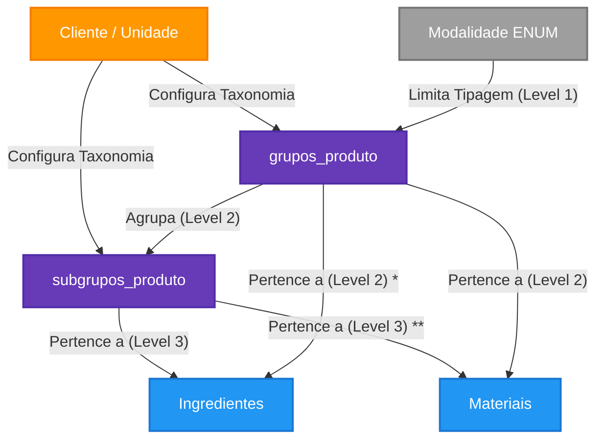

# Taxonomia Geral de Produtos e Insumos

Este documento é a **Fonte Canônica** do módulo de Categorias, ditando as regras de estruturação lógica e arquitetural para estoques, finanças e inventário no sistema.

---

## 1. Topologia de Conceitos (Taxonomia)

Para unificar materiais de construção (manutenção), embalagens, EPIs e alimentos sob a mesma plataforma logística minimizando tabelas esparsas, o sistema de categorias é normalizado em 3 níveis:

| Nível Hierárquico | Tabela de Origem | Flexibilidade | Exemplo |
|-------------------|------------------|---------------|---------|
| **1. Modalidade** | ENUM `modalidade_produto_enum` | Estrita (Sistema) | `ALIMENTOS`, `EMBALAGENS`, `EPI_EPC` |
| **2. Grupo** | `grupos_produto` (antiga *cliente_categorias_produto*) | Dinâmica (Cliente) | Farinhas |
| **3. Subgrupo** | `subgrupos_produto` (antiga *ingredientes_grupos*) | Dinâmica (Cliente) | Farinha de Trigo |

*A razão de a "**Modalidade**" ser estrita e no formato ENUM provém da necessidade de travar certas engrenagens operacionais (ex: Motor Nutricional não pode processar objetos da modalidade EPI).*

---

## 2. Mapa Estrutural (Grafo do Domínio)

**Nota:** Embora a rastreabilidade do subgrupo herde logicamente o grupo, as tabelas finais de Consumíveis (`ingredientes` e `materiais`) gravam a chave `grupo_id` juntamente com a `subgrupo_id` para ganho de performance em *Querying* (Evitando que telas de listagem simples rodem JOINs pesados para apenas exibir "Farinhas").

---

## 3. Integridade Relacional e Análise Arquitetural (Rigor)

Após a refatoração, a malha de dependências foi desenhada para blindar inconsistências através de 3 pilares estruturais rígidos:

### 3.1. Denormalização Controlada (Trade-off de 3NF)
Nas tabelas finais (`ingredientes` e `materiais`), nós armazenamos concomitantemente as chaves `grupo_id` e `subgrupo_id`. 
* **Por quê violamos a Terceira Forma Normal (3NF)?** Teoricamente, o `grupo_id` poderia ser inferido apenas com o JOIN sobre `subgrupos_produto`. Contudo, para listagens no lado Client, exigir joins encadeados pesaria severamente nas consultas Supabase. Gravar a chave primária no item final garante `O(1)` para filtros (Listar tudo da Modalidade ALIMENTOS e Grupo "Farinhas").
* **Opcionalidade de Subgrupos:** Essa modelagem isola o subgrupo mantendo ele flexível, admitindo o cadastro de ingredientes simples cujo `subgrupo_id` seria NULL, sem ferir a categoria master.

### 3.2. Restrições Estáticas vs Dinâmicas
* O topo da pirâmide nativamente usa um **Postgres ENUM** (`modalidade_produto_enum`). Isso blinda o banco e a API contra inputs falhos como acentuação ou grafia ("Alementos", "ALIMENTO"), vital para o cálculo do Custo de CMV correto sem escapes.

### 3.3. Propagação de Constraints Cíclicas
* As dependências `materiais_grupo_id_fkey` e `ingredientes_subgrupo_id_fkey` rodam sobre blocos de restrição nativos (RESTRICT e SET NULL). Ao invés de um CASCADE destrutivo que mataria notas fiscais e controle de lotes, nossa malha foi selada com proteções ativas.

---

## 4. Regras de Negócio (Policies)

### 4.1. Isolamento Multi-Tenant
Todas as configurações de `grupos_produto` e `subgrupos_produto` estão submetidas ao padrão RLS de `cliente_id`.
Não existem grupos nulos ("de sistema") atualmente abertos (exceto as Modalidades, que são de sistema pois rodam via ENUM Postgres).

### 4.2. Soft Delete Preventivo
Nenhuma Categoria ou Subcategoria é excluída fisicamente da estrutura se possuir itens vinculados a ela. Em vez do `DELETE` primitivo, o banco e a API realizam apenas flag inativa (`ativo = false`).
Filtros padrão (`SELECT * WHERE ativo = true`) lidam com a visualização.

### 4.3. Integração com Finanças e Compras
- **Regras Analíticas:** As classificações em "Grupo" guiam motores analíticos como curvas ABC de Custo de Mercadorias Vendidas (CMV).
- **Lista de Compras UAN:** A ordenação da lista de compras da cotação usa predominantemente o agrupamento por Modalidade (`ALIMENTOS`) e então o `grupo_id` para entregar uma pauta ordenada para os cotadores/chefes de cozinha.

---

## 5. Dicionário de Dados

### Tabela: `grupos_produto`
| Campo | Tipo | Obrigatoriedade | Descrição |
|-------|------|-----------------|-----------| 
| `id` | UUID | Sim | Chave primária. |
| `cliente_id` | UUID | Sim | Isolamento lógico por tenant. |
| `modalidade` | `modalidade_produto_enum` | Sim | Classe raiz do sistema (ALIMENTOS, EMBALAGENS, etc). |
| `nome` | String | Sim | Identificação da pasta raiz de controle. |
| `ativo` | Boolean | Não (Default: True)| Controle visual de ativação/Soft Delete. |

### Tabela: `subgrupos_produto`
| Campo | Tipo | Obrigatoriedade | Descrição |
|-------|------|-----------------|-----------| 
| `id` | UUID | Sim | Chave primária. |
| `cliente_id` | UUID | Sim | Isolamento lógico por tenant. |
| `grupo_id` | UUID | Sim | FK apontando para `grupos_produto`. |
| `nome` | String | Sim | Identificação refinada do card. |
| `ativo` | Boolean | Não (Default: True)| Controle visual de ativação/Soft Delete. |

---

## 6. Histórico e Conformidade
*Refatoração Massiva (ABR 2026): A estrutura foi unificada para abolir o texto livre nas modalidades dos antigos *`cliente_categorias_produto`* e remover a especificidade falha da palavra "ingrediente" na tabela genérica de grupos (`ingredientes_grupos`). O schema atual unificou as entidades para suportar de forma limpa as áreas Físicas, EPIs, Manutenção e Nutrição.*

