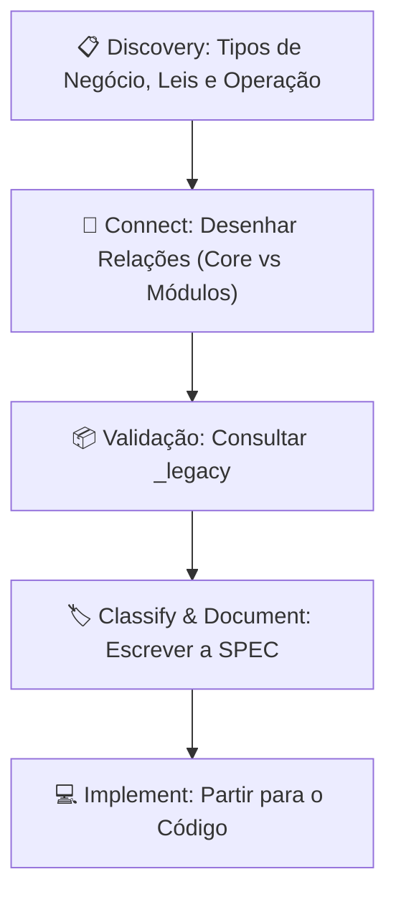

# 🔬 Análise da Transcrição — Scope Interview (03/08/2026)

> **Fonte**: [Reunião 2026_08_03 14:31](../../Reuni%C3%B5es/Reuni%C3%A3o%20iniciada%20%C3%A0s%202026_08_03%2014_31%20GMT-03_00%20-%20Anota%C3%A7%C3%B5es%20do%20Gemini.md)
> **Participante**: José Augusto (Founder / Consultor de Alimentos)
> **Duração**: ~40 minutos
> **Método**: CyberAlchemy — 5 Âncoras + DomainSpec Classify/Connect preparatório

---

## CyberAlchemy — 5 Âncoras Extraídas

| Âncora | Conteúdo Extraído |
|---|---|
| **Objective** | Construir um ecossistema SaaS multi-tenant de gestão, comunicação e compliance alimentício que integre todos os setores de um negócio de alimentação em uma plataforma única, auditável e escalável. |
| **Output Artifact** | Documentação completa DomainSpec (SPEC.md + aspect docs) para cada tipo de negócio, precedida por uma fase de **Discovery** que mapeie: tipos de negócio → base legal → operação ponta-a-ponta → módulos → regras de negócio. |
| **Discovery** | Investigar cada vertical de negócio, mapear base legal e operação ponta-a-ponta. Identificar o que são "features primárias/universais" (ex: ingredientes, setores) vs. "módulos específicos". Desenhar como eles se relacionam *durante* a pesquisa. |
| **Tension** | Escopo potencialmente imenso. Risco de overengineering. Perfis híbridos complicam classificação. Risco de viés prematuro se olharmos o código legado antes de entender o novo domínio. |
| **Route** | 1. Discovery (Tipos → Leis → Operação → Relacionamentos/Core vs Módulos) → 2. Consultar `_legacy` (apenas para validar o modelo teórico) → 3. Escrever Spec (DomainSpec). |

---

## 1. Síntese Temática — O Que Foi Dito

### 1.1 Essência do Produto

José Augusto define o Nutridev como um **"ecossistema de gestão, comunicação e compliance para empresas de alimentação"**. Os três pilares são:

- **Gestão**: financeiro, estoque, produção, expedição, recursos humanos
- **Comunicação**: integração de dados entre setores (a ficha técnica que serve qualidade, produção E financeiro)
- **Compliance**: auditabilidade total, conformidade com ANVISA, legislações estaduais/municipais, sem hard-delete

A **dor principal** que ele identifica no mercado: **fragmentação de dados**. Hoje, a ficha técnica da qualidade não é a mesma da produção, que não é a mesma do financeiro. Cada setor trabalha com sua própria planilha/livro/sistema, gerando retrabalho e inconsistência.

> [!IMPORTANT]
> O diferencial competitivo declarado é a **integração ponta-a-ponta dos setores**, algo que nenhum concorrente faz. Food Checker foca em checklists; outras ferramentas focam em tabela nutricional. Nenhum integra a cadeia completa.

### 1.2 Hierarquia de Tenancy (Confirmada e Expandida)

A transcrição confirma e expande o modelo do [PROJECT-OVERVIEW.md](../PROJECT-OVERVIEW.md):

```
Super Admin (José Augusto / Nutridev)
  └── Consultor (Tenant Pai) — carteira de clientes
        └── Empresa / Unidade (Tenant Filho) — pode ter MÚLTIPLAS unidades
              ├── Dono / Gerente — acesso global à sua empresa
              ├── Funcionário Ativo (Usuário) — executa ações no sistema
              │     ex: Estoquista, Chefe de Cozinha, RT
              └── Colaborador Passivo (Não-Usuário) — existe no sistema mas não opera
                    ex: Manipulador sem acesso, para registros de treinamento/ASO
```

> [!NOTE]
> **Novidade na transcrição**: A distinção explícita entre **Funcionário Ativo** (tem conta, executa ações) e **Colaborador Passivo** (existe para fins de registro de treinamento, ASO, vinculação a setor, mas não tem login). Isso impacta o modelo de `Entity` para colaboradores.

### 1.3 Verticais de Negócio (Tipos de Unidade)

José Augusto listou as seguintes verticais, que precisam de investigação:

| Grupo | Subtipos Mencionados | Características Distintivas |
|---|---|---|
| **Serviço de Alimentação** | Restaurante Comercial, À la Carte, Por Quilo, Dark Kitchen, Delivery, Padaria, Confeitaria | Foco em manipulação, planilhas diárias, produção sob demanda |
| **Catering** | Eventos, Fornecimento contínuo (ex: empresas) | Expedição é central; pode ter perfil híbrido |
| **Cozinha Institucional** | Escolar (PNAE), Trabalhador (PAT), Hospitalar (dietoterapia), Refeitório Corporativo | Legislações específicas por programa; cardápios obrigatórios |
| **Indústria / Fabricação** | Confeitarias industriais, processadores | Rotulagem, BPF, HACCP, rastreabilidade de lote |

> [!WARNING]
> **Perfis Híbridos**: Uma empresa pode ter MAIS DE UM perfil ao mesmo tempo. Ex: uma confeitaria que produz (Indústria) E fornece alimentação aos trabalhadores (Institucional). O sistema precisa suportar isso desde a arquitetura de dados.

> [!NOTE]
> José Augusto cogitou incluir **Supermercado/Varejo** mas hesitou. Isso ficou em aberto como decisão futura. No [PROJECT-OVERVIEW.md](../PROJECT-OVERVIEW.md) original, Varejo aparece como uma das 3 verticais. **Tensão**: manter ou postergar?

### 1.4 Framework Legislativo

Hierarquia declarada de legislação:

```
Municipal (mais específica, prevalece se existir)
  ↑ complementa
Estadual
  ↑ complementa  
Federal (base, abraça tudo)
```

**Legislações citadas explicitamente:**

| Âmbito | Legislação | Escopo |
|---|---|---|
| Federal | **RDC 216** (ANVISA) | Boas Práticas para Serviços de Alimentação |
| Federal | **RDC 275** (ANVISA) | Boas Práticas de Fabricação (BPF) |
| Estadual (SP) | **CVS-1** (atual CVS-5/2013) | Centro de Vigilância Sanitária de SP |
| Municipal (SP) | **Portaria 2619** | Regulamento de Boas Práticas na cidade de SP |
| Federal | **PNAE** | Programa Nacional de Alimentação Escolar |
| Federal | **PAT** | Programa de Alimentação do Trabalhador |

**Mecanismo de resolução**: O **CEP** da empresa determina automaticamente qual conjunto de legislações aplicar. Municipal → Estadual → Federal (cascata de complementaridade).

> [!IMPORTANT]
> **Decisão arquitetural crítica**: A legislação muda ao longo do tempo. José Augusto enfatiza que "normalmente as mudanças vão mudar muito em parâmetros" (faixas de temperatura, prazos), mas o sistema precisa estar preparado para mudanças em regras de negócio também. Isso implica um **motor de regras parametrizável** (Policy pattern no DomainSpec).

### 1.5 Infraestrutura Física (Setores, Equipamentos, Locais)

Conceitos de mapeamento do "chão de fábrica":

| Conceito | Descrição | Relacionamentos |
|---|---|---|
| **Setor** | Área funcional da unidade (Cozinha Quente, Câmara Fria, Recebimento, Banheiro, Salão) | Contém Equipamentos, contém Colaboradores |
| **Equipamento** | Geladeira, Freezer, Estufa, Ar Condicionado, Coifa, Balança, Termômetro | Vinculado a Setor; pode SER também um Local de Armazenamento |
| **Local de Armazenamento** | Conceito lógico que pode coincidir com Equipamento | Tem modalidades: Alimentos, EPI, Uniformes, Produtos de Limpeza |
| **Fornecedor** | Empresa externa que fornece insumos ou serviços | Homologação, controle de documentos, vínculo com equipamentos |
| **Prestador de Serviço** | Tipo de fornecedor que executa serviços (manutenção, calibração, controle de pragas) | Vinculado a tipo de serviço → tipo de equipamento |

> [!NOTE]
> **Dualidade Equipamento ↔ Local de Armazenamento**: "Um local de armazenamento pode ser ao mesmo tempo um equipamento" (ex: uma câmara fria é um equipamento COM temperatura monitorada E um local que armazena alimentos). Isso já existia no sistema legado.

### 1.6 Módulos e Funcionalidades Mencionados

> [!IMPORTANT]
> **Core (Universal) vs. Módulos Específicos**: José Augusto destacou que algumas features são "elementares" ou "primárias" (ex: Cadastro de Ingredientes, Equipamentos, Setores). Elas funcionam como um "plano básico" presente em qualquer tipo de negócio. Os demais módulos se conectam a esse núcleo.

| Módulo / Funcionalidade | Status | Observações |
|---|---|---|
| **Qualidade** (Auditorias, Checklists, Planilhas) | Core — MVP | Primeiro módulo do consultor |
| **Controle de Temperatura** (Equipamentos + Alimentos) | Core — MVP | Inclui alertas automáticos |
| **Estoque** (Recebimento, Inventário, FIFO/FEFO) | Core — Mencionado | Integrado com produção e financeiro |
| **Produção** (Fichas Técnicas, Planejamento, Desperdício) | Core — Mencionado | Ficha técnica é o "nexo" de dados |
| **Financeiro** (Contas, NF, Cotações) | Mencionado | Automatização via API de NF |
| **Compras** (Cotação com fornecedores) | Mencionado | Automação de cotação |
| **Gestão de Documentos** (Alvarás, AVCB, Contratos) | Core — Mencionado | Central de documentos com vencimento |
| **Controle de Funcionários** (ASO, Treinamentos, Acidentes) | Mencionado | Colaboradores ativos e passivos |
| **Gestão de Processos e Tarefas** | Mencionado (legacy) | Controle de atividades do consultor |
| **Receitas e Fichas Técnicas** | Core — Mencionado | Gerencial + Operacional + Nutricional |
| **Tabela Nutricional / Rotulagem** | Mencionado | Derivado da ficha técnica |
| **Cardápio** (Geração automática) | Mencionado | Modelo matemático no projeto anterior |
| **Homologação de Fornecedores** | Mencionado | Processo de aprovação com documentos |
| **Controle de Pragas** | Mencionado | Via prestadores de serviço + documentos |
| **Dashboard / BI** | Mencionado | Centralizar indicadores para dono |
| **IA Integrada** (Consulta a legislação) | Mencionado como futuro | Estilo Notion AI |
| **Permissões Granulares** | Core | Painel de controle por módulo/ação |
| **Alertas e Notificações** | Core | Temperatura fora, documentos vencendo |
| **IoT / Hardware** | Futuro | Termômetros conectados para monitoramento ao vivo |

### 1.7 Princípios Arquiteturais Declarados

1. **Modular e Acoplável** — módulos independentes mas interconectados ("clopagem")
2. **Escalável** — múltiplos consultores × múltiplos clientes × múltiplas unidades
3. **Auditável** — sem hard-delete, tudo rastreável (GxP compliance)
4. **Parametrizável** — legislação como parâmetro, não como código hardcoded
5. **Incremental** — implementação por camadas, provando valor a cada módulo
6. **Perfil Híbrido** — uma unidade pode ter múltiplos perfis de negócio simultâneos

---

## 2. Mapa de Unknowns (Unknowns Registry — CyberAlchemy)

### 🔴 Blockers (Precisam ser resolvidos antes de qualquer spec)

| ID | Unknown | Impacto | Caminho de Resolução |
|---|---|---|---|
| **U1** | Quais são os tipos de negócio exatos e seus subtipos? | Define toda a arquitetura de regras | Discovery: pesquisa + entrevista |
| **U2** | Qual a base legal completa para cada tipo de negócio? | Define o motor de regras | Discovery: pesquisa legislativa |
| **U3** | Como é a operação ponta-a-ponta de cada tipo? | Define os módulos e workflows | Discovery: mapeamento de processos |
| **U4** | Varejo entra ou não no escopo? | Define escopo e complexidade | Decisão do José Augusto |

### 🟡 Non-Blockers (Podem ser resolvidos durante o desenvolvimento)

| ID | Unknown | Impacto |
|---|---|---|
| **U5** | Modelo de bonificação para consultores que indicam módulos | Comercial, não técnico |
| **U6** | Integração com APIs de NF (quais provedores?) | Módulo Financeiro |
| **U7** | Quais relatórios são críticos? | "Depende da estrutura" — José Augusto |
| **U8** | IoT / termômetros conectados — quando e como? | Futuro, não MVP |
| **U9** | IA integrada — escopo e modelo | Futuro, não MVP |

### 🟢 Assumptions (Coisas assumidas que precisam de validação)

| ID | Assumption | Evidência | Confiança |
|---|---|---|---|
| **A1** | Legislação muda principalmente em parâmetros, não em regras | Declaração do José Augusto | `hypothesized` — precisa validação com advogado/legislação |
| **A2** | CEP é suficiente para determinar legislação aplicável | Declaração do José Augusto | `hypothesized` — pode ter exceções |
| **A3** | O sistema legado tem estruturas reutilizáveis | Declaração do José Augusto | `stated` — precisa inspeção do `_legacy` |
| **A4** | Módulos podem ser verdadeiramente independentes mas conectados | Declaração do José Augusto | `hypothesized` — tensão entre independência e integração |

---

## 3. Tensões Identificadas (Structured Tension — CyberAlchemy)

| # | Tensão | Risco | Mitigação Proposta |
|---|---|---|---|
| **T1** | **Escopo vs. Viabilidade** — José Augusto listou ~18 módulos/funcionalidades. Implementar todos sem priorização é inviável. | Overengineering, nunca lançar | Priorizar por vertical: começar com Food Service + módulo Qualidade. Cada vertical adiciona módulos incrementalmente. |
| **T2** | **Perfil Híbrido** — Uma unidade pode ser Catering + Institucional ao mesmo tempo. | Explosão combinatória de regras | Modelar perfis como composição (Strategy Pattern), não herança. Uma unidade TEM perfis, cada perfil CARREGA suas regras. |
| **T3** | **Legislação Dinâmica** — Leis mudam, parâmetros mudam, novas portarias surgem. | Regras hardcoded viram dívida técnica | Motor de regras separado do código. Parâmetros em tabelas (Policy Entity), regras como Specifications avaliáveis. |
| **T4** | **Dualidade Equipamento ↔ Local** — Um freezer é equipamento E local de armazenamento. | Confusão de modelagem | Modelar como composição: Equipamento pode TER papel de LocalDeArmazenamento. Não são a mesma entidade, mas podem ser vinculados. |
| **T5** | **Colaborador Ativo vs. Passivo** — Dois "tipos" de pessoas no sistema com capacidades radicalmente diferentes. | Modelo de permissões complexo | Colaborador é a Entity base. "Usuário" é uma capability adicionada (tem login, tem permissões). Nem todo Colaborador é Usuário. |
| **T6** | **Integração Total vs. Privacidade** — O consultor deve ver o financeiro do cliente? | Conflito de interesses | Permissões granulares já planejadas. Cada contrato consultor↔empresa define o escopo de acesso. |

---

## 4. Próximos Passos Declarados pelo José Augusto

O próprio José Augusto ajustou claramente a sequência desejada:

1. **Discovery do Domínio** — Investigar tipos de negócio, base legal e operação ponta-a-ponta.
2. **Desenho de Relações (Connect)** — Durante a pesquisa, começar a desenhar como os módulos, processos e "features primárias" se interconectam.
3. **Validação com `_legacy`** — Somente com o domínio entendido e o plano pronto, consultar o código legado para verificar se o que foi projetado faz sentido e aproveitar o que for útil.
4. **Escrever a Spec** — Documentar formalmente as regras e módulos.
5. **Codificar** — Partir para o código com base na spec e no legado validado.

> [!TIP]
> Essa correção de rota se alinha perfeitamente ao **CyberAlchemy** ("Intent Before Machinery" / evitar viés prematuro) e ao **DomainSpec Stage 2 (Connect)** (desenhar os relacionamentos de domínio antes de escrever a spec ou olhar código velho).

---

## 5. Recomendação de Rota (Route — CyberAlchemy)

Com base na análise, a rota recomendada é:



**Próximo passo imediato**: Iniciar a Discovery estruturada dos tipos de negócio, mapeando para cada um:
- Definição e características
- Base legal aplicável
- Setores típicos
- Equipamentos típicos
- Fluxo operacional ponta-a-ponta
- Módulos necessários
- Regras e parâmetros específicos

---

> **Owner**: José Augusto (validação) + Agente DomainSpec (execução)
> **Blocker para avançar**: Validação desta análise pelo José Augusto antes de iniciar a Discovery.
