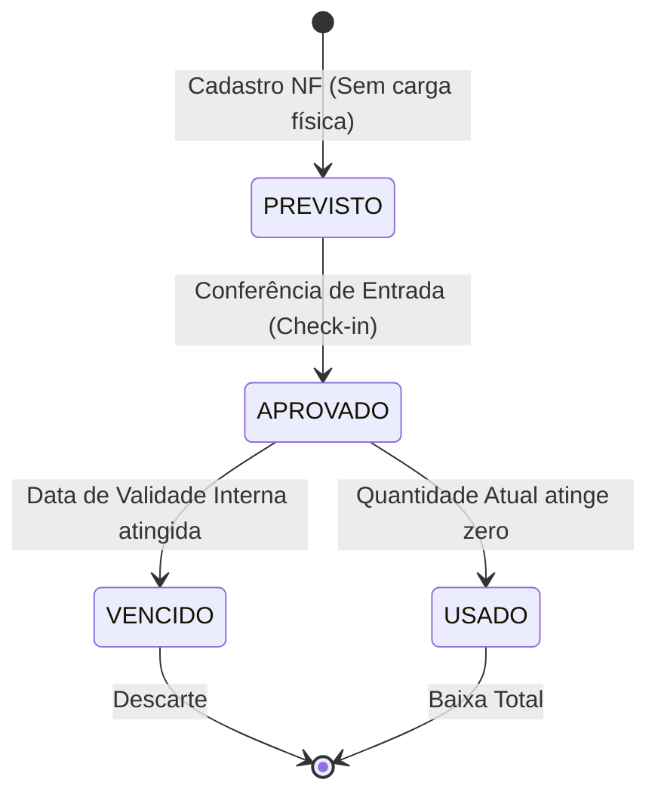

# Gestão de Lotes e Rastreabilidade

Este documento detalha o funcionamento técnico e as regras de negócio aplicadas aos lotes de estoque, garantindo a rastreabilidade total (da recepção ao consumo).

---

## 1. Regras de Negócio (Business Logic)

### 1.1. Ciclo de Vida do Lote (State Machine)
O lote transita por estados que determinam sua disponibilidade para a produção:

*   **PREVISTO**: Lote originado de um pedido de compra ou OCR de NF, mas que ainda não chegou fisicamente.
*   **APROVADO**: Lote disponível para consumo.
*   **VENCIDO**: Bloqueado automaticamente para qualquer uso.

### 1.2. Motor de Validade Híbrido
O sistema aplica a **regra da menor validade** entre três fatores:
1.  **Rótulo do Fabricante:** A validade original do produto fechado.
2.  **Instrução pós-aberto:** Prazos específicos após a abertura da embalagem.
3.  **Legislação Sanitária:** Regras municipais/estaduais baseadas na temperatura de armazenamento (Ex: Frios fatiados @ 4°C = 3 dias).

### 1.3. Lote Interno Automático
Sempre que um produto chega sem um lote de fabricante legível, o sistema gera obrigatoriamente um **Lote Interno**. Isso garante que nenhum grama de insumo circule no sistema sem uma identidade única.

---

## 2. Implementação Técnica (How it Works)

### 2.1. Tabela Principal: `estoque_lotes`
| Campo | Tipo | Descrição |
|-------|------|-----------|
| `numero_lote_fabricante` | String | Identificação original do fabricante. |
| `data_validade_interna` | Timestamp | **Deadline calculado** (pode ser menor que a do rótulo). |
| `quantidade_atual_g_ml` | Numeric | Saldo atualizado em tempo real. |
| `status` | Enum | `status_lote_estoque` (ver State Machine). |
| `is_lote_interno` | Boolean | Sinaliza se foi gerado pelo sistema. |

### 2.2. Automação: Geração de Lote Interno
Implementado via trigger Postgres `fn_gerar_lote_interno_automatico`.
- **Lógica:** Se `numero_lote_fabricante` é nulo/vazio, o sistema gera um código no padrão: `INT-YYYYMMDD-UUID4`.
- **Arquivo:** `supabase/migrations/20260420_init_wms_triggers.sql`

### 2.3. Calculadora de Validade
A lógica reside no helper `lib/legislacao/calculadoraValidade.ts`.
- **Input:** Categoria do Alimento, Data Original, Temperatura de Armazenamento.
- **Workflow:** Realiza um `SELECT` na tabela `regras_validade_sanitaria` filtrando por temperatura e prioridade (Municipal > Estadual > Federal).

### 2.4. Identificação IoT (Thermal Labels)
O sistema gera etiquetas térmicas dinâmicas para impressoras Zebra/Argox.
- **Formato:** ZPL (Zebra Programming Language).
- **Código:** `lib/iot/zplGenerator.ts`.
- **Integração:** O componente `EtiquetaPrinter.tsx` converte os metadados do lote (ID, Nome, Validade Final) em um comando ZPL enviado via Bluetooth ou Proxy IP.

---

## 3. Segurança e Conformidade
- **Trilha de Auditoria:** Qualquer alteração no `status` do lote dispara um log na tabela de auditoria GxP.
- **Consumo Zero:** Quando `quantidade_atual_g_ml` chega a 0, o lote é omitido das telas de "Estoque Ativo", mas permanece no banco para rastreabilidade histórica.

