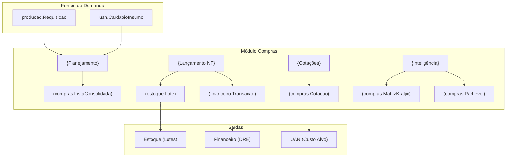

---
tags:
  - feature/compras
feature: compras
title: "Compras e Suprimentos"
status: brownfield-translated
translation-mode: brownfield
translation-date: 2026-05-19
brownfield-bootstrapped: true
discovery_source: app/compras/ + lib/utils/nf-parser.ts + components/PreCadastroFornecedorDialog.tsx
evidence-confidence: observed
---

> [!NOTE] Ancestry
> ⬆️ **Parent**: [[spec-architecture]]

---

# Feature: Compras e Suprimentos

> Gestão do ciclo completo de aquisição de insumos e materiais: desde a inteligência de cotações e planejamento de necessidades (MRP/Par Level), passando pelo lançamento de notas fiscais com geração automática de lotes e despesas financeiras, até a análise estratégica de suprimentos (Matriz de Kraljic).

## What This Module Owns

O módulo de Compras gerencia o **ciclo de aquisição** completo:

1. **Cotações (Orçamentos):** Matriz de preços de mercado por fornecedor × insumo, com detecção de vigência/defasagem e conversão automática Embalagem → Kg/L.
2. **Planejamento de Necessidades:** Consolidação de demandas de Produção (OP) + UAN (Cardápios) em uma lista de compras com margem de segurança e sugestão baseada em Par Level.
3. **Lançamento de Notas Fiscais:** Entrada de NFs (manual + OCR/XML) que gera simultaneamente lotes de estoque e transações financeiras.
4. **Inteligência de Suprimentos:** Matriz Estratégica de Kraljic + Calculadora de Par Level para gestão de ressuprimento.
5. **Gestão de Fornecedores:** Cadastro com homologação sanitária, categorias de compras, lead time, e vinculação granular a itens/grupos fornecidos.

## Module Map

## Capabilities

| Capability | What | Key Aspects | Detail |
| --- | --- | --- | --- |
| [Gestão de Cotações](#gestão-de-cotações) | Matriz de preços vigentes | Quadro comparativo, vigência, conversão embalagem | 3 ops, 1 entity |
| [Planejamento de Compras](#planejamento-de-compras) | Consolidação de necessidades | OP + UAN, margem de segurança, Par Level | 2 ops, 1 view |
| [Lançamento de Notas](#lançamento-de-notas-fiscais) | Entrada de NFs e geração de lotes | OCR/XML, vinculação, financial bridge | 3 ops, 2 entities |
| [Inteligência de Suprimentos](#inteligência-de-suprimentos) | Análise estratégica | Kraljic, Par Level, risco | 2 analyses |
| [Gestão de Fornecedores](#gestão-de-fornecedores) | Cadastro e homologação | CNPJ, sanitário, categorias, lead time | 3 ops, 1 entity |

### Gestão de Cotações

Permite o registro e atualização de cotações de preços enviadas por fornecedores homologados. A interface principal é um **Quadro Comparativo** (data grid) que cruza insumos × fornecedores, segmentado por modalidade (ALIMENTOS, EMBALAGENS, LIMPEZA etc.) e agrupado por Categoria → Subgrupo.

| Aspect | Concept | Summary |
| --- | --- | --- |
| Operation | AtualizarCotacao | Atualiza preço unitário (R$/Kg/L) com timestamp de vigência |
| Operation | CotacaoEmLote | Salva múltiplos preços de uma vez via Quadro Comparativo |
| Operation | ExcluirCotacao | Remove cotação individual (hard delete) |
| Query | ConsultaCotacoesAtivas | Retorna matriz do menor preço vigente por insumo |
| Rule | VigenciaAutomatica | Cotações com > 7 dias recebem tag "Defasado" |
| Rule | ConversaoEmbalagem | `preco_por_kg_l = preco_embalagem / (unidades × peso_unitario)` |

### Planejamento de Compras

Consolida demandas de compras de três fontes: requisições de Produção (OP com falta de estoque), necessidades de cardápios UAN (multiplicação de fichas técnicas × comensais × dias), e estoque mínimo (Par Level). Aplica margens de segurança configuráveis (global ou por insumo).

| Aspect | Concept | Summary |
| --- | --- | --- |
| Operation | ConsolidarDemandas | Agrega OP + UAN + Par Level em lista única |
| Operation | MarcarComprado | Atualiza `status_compras` de pendente para comprado |
| Query | ListaConsolidadaSugestao | `sugestão = (demanda + estoque_minimo) - estoque_fisico` |
| Rule | MargemSeguranca | Modo global (% por cardápio/OP) ou detalhado (% por insumo) |

### Lançamento de Notas Fiscais

Entrada de notas fiscais de compra que gera simultaneamente:
- **Lotes de estoque** (`estoque_lotes`) com status `PREVISTO` (aguardando check-in)
- **Transação financeira** (`fin_transacoes`) com `origem_modulo = 'ESTOQUE'` e lançamento na conta USAR correspondente

| Aspect | Concept | Summary |
| --- | --- | --- |
| Operation | LancarNotaFiscal | Cria lotes + transação financeira em uma transação lógica |
| Operation | ImportarNFAutomática | Parse de XML/PDF/Imagem via OCR para pré-preenchimento |
| Operation | EditarLoteHistorico | Corrige valores/quantidades de lotes já lançados |
| Operation | ExcluirNF | Soft delete de todos os lotes de uma NF |
| Rule | FinanceiroBridge | Valor total da NF gera `fin_transacoes` + `fin_lancamentos` automáticos |
| Rule | CategorizacaoAutomatica | Modalidade (ALIMENTOS/LIMPEZA/etc.) determina conta USAR no DRE |

### Inteligência de Suprimentos

Ferramentas analíticas para gestão estratégica:

| Aspect | Concept | Summary |
| --- | --- | --- |
| Analysis | MatrizKraljic | Classifica insumos em 4 quadrantes (Alavancagem, Estratégico, Rotineiro, Gargalo) baseado em risco de fornecimento × impacto no lucro |
| Analysis | CalculadoraParLevel | Calcula nível ideal de ressuprimento baseado em consumo médio × lead time × dias de cobertura |

### Gestão de Fornecedores

| Aspect | Concept | Summary |
| --- | --- | --- |
| Operation | CadastrarFornecedor | Registro completo com CNPJ, licença sanitária, contato qualidade |
| Operation | HomologarFornecedor | Workflow PENDENTE → APROVADO → BLOQUEADO |
| Operation | VincularCategoria | Associa fornecedor a categorias/grupos/itens específicos |
| Rule | GranularidadeFornecimento | Fornecedor pode atender: toda a modalidade (atacadista), grupos específicos, ou itens individuais |

## Aspect Docs

| Aspect | File | Status |
|---|---|---|
| Domain Model | [[domain/domain-compras]] | brownfield-translated |
| Brownfield Discovery | [[discovery/brownfield-orcamentos]] | observed |
| Brownfield NF Discovery | [[discovery/brownfield-lancamentos]] | observed |
| Brownfield Planejamento | [[discovery/brownfield-planejamento]] | observed |
| Operations | [[technical/ops-compras]] | brownfield-translated |
| States | [[technical/states-compras]] | brownfield-translated |
| Interfaces | [[technical/interfaces-compras]] | brownfield-translated |

## Legacy Lineage & Ontology

| Local Concept | Registry ID | Meta-Type | Origem / Discovery |
|---|---|---|---|
| `Cotacao` | `compras.Cotacao` | Entity | [[discovery/brownfield-orcamentos]] |
| `CampanhaCotacao` | `compras.CampanhaCotacao` | Aggregate Root | Planejamento da Cesta de Compras |
| `CampanhaFornecedor` | `compras.CampanhaFornecedor` | Entity | Pacote segmentado para Portal do Fornecedor || `MatrizKraljic` | `compras.MatrizKraljic` | Value Object | [[discovery/brownfield-orcamentos]] |
| `ListaConsolidada` | `compras.ListaConsolidada` | Aggregate View | [[discovery/brownfield-planejamento]] |
| `ParLevel` | `compras.ParLevel` | Value Object | observed from `inteligencia/components/ParLevelSetup.tsx` |
| `NotaFiscalEntrada` | `compras.NotaFiscalEntrada` | Process | [[discovery/brownfield-lancamentos]] |
| `Fornecedor` | `suprimentos.Fornecedor` | Entity | [[domain/domain-compras]] |

## Concept Registry

| Concept | ID | Type |
| --- | --- | --- |
| [Cotacao](domain/domain-compras.md#comprascotacao) | compras.Cotacao | Entity |
| [ListaConsolidada](domain/domain-compras.md#compraslistaconsolidada) | compras.ListaConsolidada | Aggregate View |
| [MatrizKraljic](domain/domain-compras.md#comprasmatrizkraljic) | compras.MatrizKraljic | Value Object |
| [ParLevel](domain/domain-compras.md#comprasparlevel) | compras.ParLevel | Value Object |
| [NotaFiscalEntrada](domain/domain-compras.md#comprasnotafiscalentrada) | compras.NotaFiscalEntrada | Process |
| [Fornecedor](domain/domain-compras.md#suprimentosfornecedor) | suprimentos.Fornecedor | Entity |

## Feature Concept Graph

| From | Edge | To | Evidence | Notes |
| --- | --- | --- | --- | --- |
| compras.Cotacao | queries | suprimentos.Fornecedor | orcamentos/page.tsx | Quem oferta o preço |
| compras.Cotacao | queries | ingrediente.Ingrediente | orcamentos/page.tsx | O que está sendo precificado |
| compras.Cotacao | calculates | financeiro.CMVProjetado | dashboardDataService.ts | Base para projetar custos futuros |
| compras.Cotacao | validates | uan.CustoAlvo | cardapio-uan edge fn | Viabilidade financeira do cardápio |
| compras.ListaConsolidada | aggregates | producao.Requisicao | page.tsx | Demandas de OP com falta de estoque |
| compras.ListaConsolidada | aggregates | uan.CardapioInsumo | page.tsx | Demandas de cardápios UAN |
| compras.NotaFiscalEntrada | creates | estoque.Lote | lancamentos/page.tsx | Lote PREVISTO para check-in |
| compras.NotaFiscalEntrada | creates | financeiro.Transacao | lancamentos/page.tsx | Despesa com origem_modulo = ESTOQUE |
| suprimentos.Fornecedor | categorizes | compras.Cotacao | orcamentos/page.tsx | Filtro por modalidade |

## Implementation Files (Observed)

| File | Layer | Purpose |
|---|---|---|
| `app/compras/page.tsx` | Interface | Planejamento de Compras (OP + UAN + Consolidado) |
| `app/compras/orcamentos/page.tsx` | Interface | Quadro Comparativo de Cotações (data grid) |
| `app/compras/lancamentos/page.tsx` | Interface | Lançamento de NF + Histórico |
| `app/compras/inteligencia/page.tsx` | Interface | Hub: Kraljic + Par Level |
| `app/compras/inteligencia/components/KraljicMatrix.tsx` | Component | Visualização 4-quadrantes |
| `app/compras/inteligencia/components/ParLevelSetup.tsx` | Component | Calculadora de ressuprimento |
| `components/PreCadastroFornecedorDialog.tsx` | Component | Quick-add de fornecedores |
| `components/QuickIngredienteDialog.tsx` | Component | Quick-add de ingredientes (vinculação NF) |
| `components/QuickMaterialDialog.tsx` | Component | Quick-add de materiais (vinculação NF) |
| `lib/utils/nf-parser.ts` | Service | Parser de XML/PDF/Imagem de NF |

## Cross-Feature Dependencies

| Depends On | Relationship | Evidence |
|---|---|---|
| Supabase Auth (RLS) | `enforced-by` | Queries filtram por `cliente_id` + `unidade_id` |
| `ingredientes` | `queries` | Insumos para cotação e vinculação de NF |
| `materiais` | `queries` | Materiais não-alimentares (limpeza, EPI, etc.) |
| `fornecedores` | `queries` | Origem das cotações e NFs |
| `grupos_produto` | `queries` | Agrupamento de insumos no Quadro Comparativo |
| `subgrupos_produto` | `queries` | Sub-categorias para filtro de cotações |
| `producao_requisicoes` | `queries` | Faltas de estoque em Ordens de Produção |
| `cardapios_uan` | `queries` | Demandas de cardápios para planejamento |
| `composicao_fichas_uan` | `queries` | Necessidade bruta por ficha técnica |
| `fin_contas` | `queries` | Conta USAR para categorização automática da despesa |

## Depended By (Produces For)

| Consumer | Consumes Capability | Via | What |
| --- | --- | --- | --- |
| financeiro | Lançamento de NF | `fin_transacoes` insert | Despesa automática com `origem_modulo = 'ESTOQUE'` |
| financeiro | Gestão de Cotações | Query `compras_orcamentos` | Preços mais atuais para CMV Projetado no DRE |
| estoque | Lançamento de NF | `estoque_lotes` insert | Lote PREVISTO para inspeção de recebimento |
| uan | Gestão de Cotações | Query `compras_orcamentos` | Preços para validação do custo alvo (NSGA-II) |
| qualidade | Lançamento de NF | `estoque_inspecoes_recebimento` | Check-in de lotes (pós-recebimento) |

## Database Tables (Observed)

| Table | Rows | Owner Module | Notes |
|---|---|---|---|
| `compras_orcamentos` | 0 | Compras | Matriz de cotações (preço/Kg por fornecedor) |
| `fornecedores` | 15 | Compras/Shared | Cadastro de fornecedores com homologação |
| `estoque_lotes` | 0 | Estoque (bridge) | Lotes criados por Compras com `financeiro_processado` flag |
| `producao_requisicoes` | 10 | Produção (bridge) | `status_compras` + `comprado_em` gerenciados por Compras |
| `uan_compras_monitoramento` | 0 | UAN (bridge) | Tracking de compras por cardápio UAN |
| `uan_cardapio_insumos_config` | 1 | UAN (bridge) | Margem de erro por insumo/cardápio |

## Stories

N/A

## Change History

- **2026-05-15:** SPEC inicial criado com foco apenas em Cotações.
- **2026-05-19:** Brownfield translation completa: expandido para 5 capabilities, mapeamento de todas as páginas, tabelas e fluxos de integração financeira.

## References

- [Discovery: Brownfield Cotações](discovery/brownfield-orcamentos.md)
- [Discovery: Brownfield Lançamento de Notas](discovery/brownfield-lancamentos.md)
- [Discovery: Brownfield Planejamento](discovery/brownfield-planejamento.md)
- [Domain: Compras e Suprimentos](domain/domain-compras.md)
