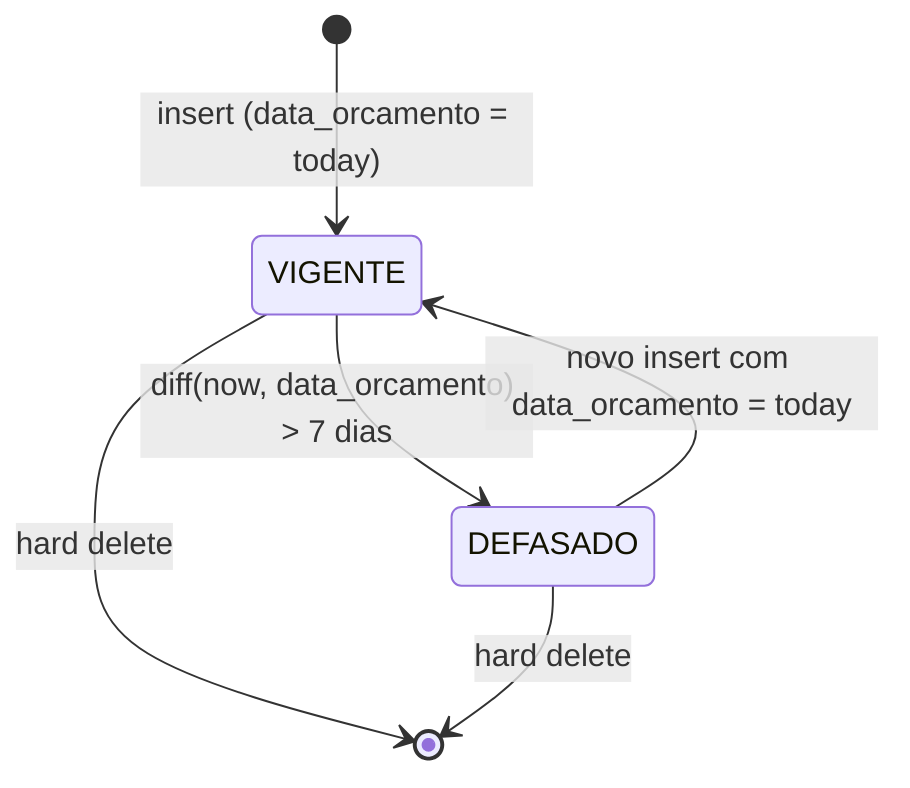
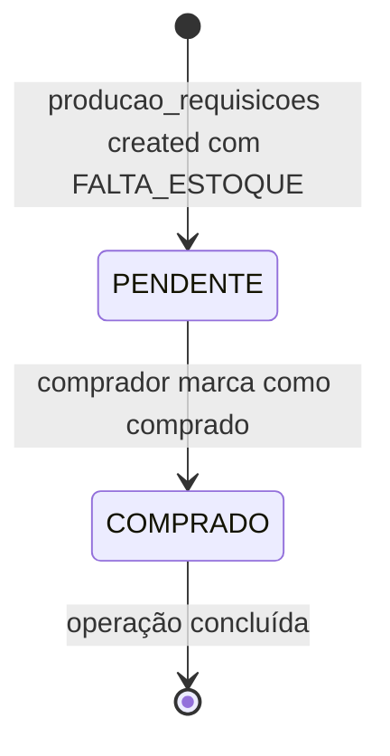
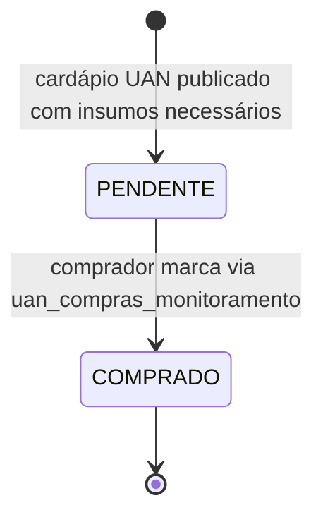
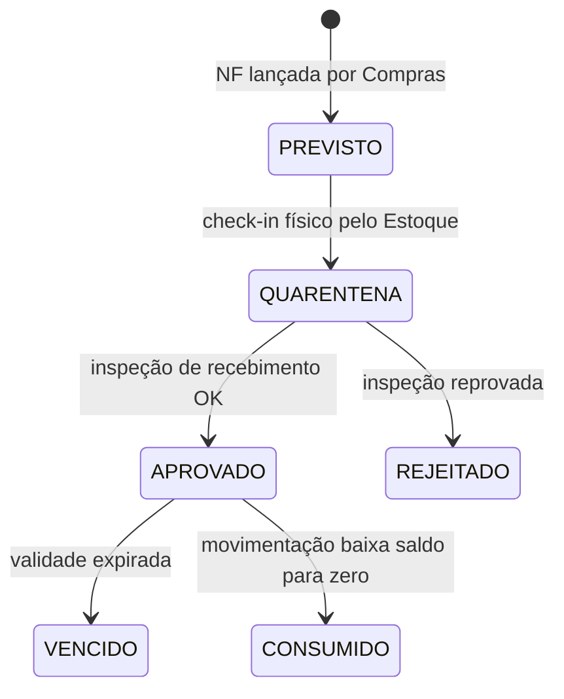
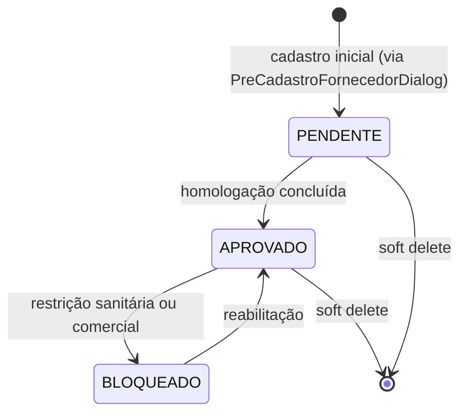
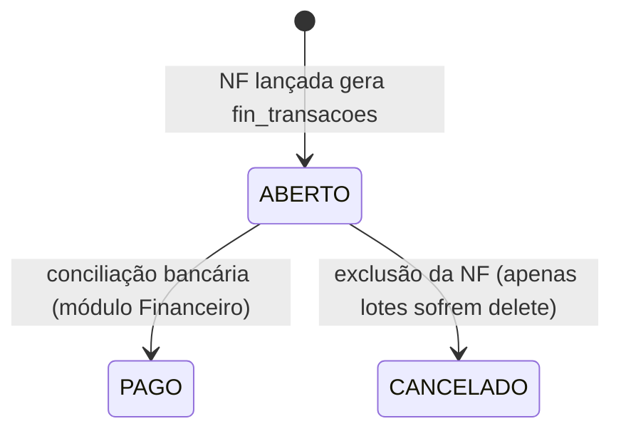

---
tags:
  - feature/compras
node_type: technical
status: brownfield-translated
created_by: brownfield-translation
created: 2026-05-19
feature: compras
---

---

> [!NOTE] Ancestry
> ⬆️ **Parent**: [[spec-compras]]

---

# State Machines: Módulo Compras

## 1. Cotação (Vigência)

**Notas:**
- Não há campo `status` na tabela — a vigência é calculada no frontend via `differenceInDays()`.
- Múltiplas cotações do mesmo fornecedor/ingrediente coexistem — apenas a mais recente por `data_orcamento` é relevante.

---

## 2. Requisição de Compra (via OP)

**Campo:** `producao_requisicoes.status_compras`
**Transição:** Apenas PENDENTE → COMPRADO (sem rollback no fluxo atual)

---

## 3. Monitoramento UAN

**Campo:** `uan_compras_monitoramento.status_compras`
**Transição:** Upsert com `status_compras = 'COMPRADO'`

---

## 4. Lote de Estoque (criado por Compras)

**Campo:** `estoque_lotes.status`
**Nota:** Compras **apenas cria** lotes no estado PREVISTO. A transição PREVISTO → QUARENTENA → APROVADO é responsabilidade do módulo Estoque/Qualidade.

---

## 5. Fornecedor (Homologação)

**Campo:** `fornecedores.status_homologacao`
**Nota:** Fornecedor BLOQUEADO deveria ser excluído de novas cotações (regra de negócio não 100% implementada no frontend).

---

## 6. Transação Financeira (criada por Compras)

**Nota:** A exclusão de NF faz soft delete nos lotes mas **não remove** a `fin_transacoes` correspondente — gap identificado.
