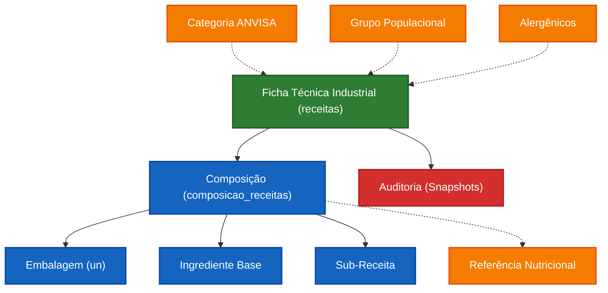
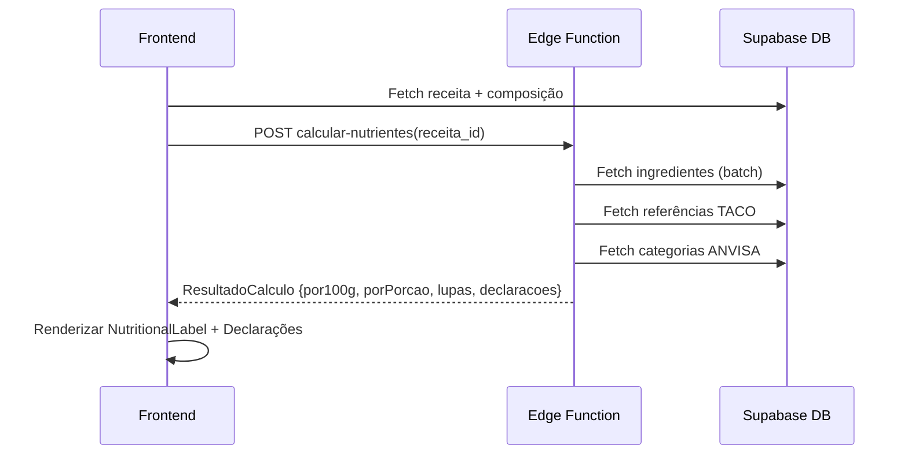

---

> [!NOTE] Ancestry
> ⬆️ **Parent**: [[spec-industria]]

---

# Fichas Técnicas — Indústria (Rotulagem GxP)

Este documento especifica a arquitetura, regras de negócio e infraestrutura do módulo de **Fichas Técnicas (Indústria)**. Atua de forma simbiótica ao [[features/ingredientes/discovery/ingredientes]], centralizando a inteligência de precificação, cálculo nutricional regulatório ([[legislacao/RDC_429_2020_IN_75_2020]]) e roteamento de sub-receitas para rotulagem.

---

## 1. Visão Geral e Topologia de Conceitos

| Entidade | Meta-Tipo | Descrição |
|----------|-----------|-----------|
| **Módulo Industrial (`receitas`)** | `Entity` | Receituário com foco em Rotulagem Nutricional, Lupa Frontal (IN 75), Alergênicos e vida de prateleira (GxP). |
| **Módulo UAN (`fichas_tecnicas_uan`)** | `Entity` | *Não coberto aqui*. Veja documentação específica de UAN. |
| **Composição (Insumos)** | `Value Object` | Relação NxN entre receita e elementos atômicos (`ingredientes`). Sofre Fator de Correção e Índice de Cocção. |
| **Material / Embalagem** | `Value Object` | Insumos não-comestíveis. Contribuem apenas para custo, sem impacto nutricional. |

---

## 2. Mapa Estrutural (Grafo de Domínio)



---

## 3. Regras de Negócio (Policies)

### 3.1. Recursividade em Árvore de Receitas

Uma Ficha pode conter *N* Sub-Receitas (ex: `Bolo Mestre` incorpora `Recheio Doce de Leite`).
- O sistema "achata" (flatten) as receitas filhas até sua unidade atômica (ingredientes).
- Multiplica proporcionalmente a participação, calculando contribuição nutricional e de custo.
- **Rastreio alergênico se propaga hierarquicamente para cima.**

### 3.2. Motor de Cálculo Edge (Deno)

A Edge Function `calcular-nutrientes` é o coração nutricional:

- **Batching:** Varre todos os `item_id` das composições e faz fetch único (`WHERE id IN (...)`).
- **Override de Referência:** Se `referencia_id` presente na linha → sobrescreve macros com dados TACO/TBCA. Se ausente → usa dados do ingrediente base.
- **Invariante de Segurança:** Alergênicos e Transgênicos vêm **sempre** do cadastro original do ingrediente, nunca da referência override.

### 3.3. Configuração Regulatória e Lupa Frontal

🔗 Detalhes completos em [[legislacao/hub-mestre]] e [[features/ingredientes/spec-rotulagem]].

### 3.4. Alergênicos e Contaminação

- **Nativos:** Adquiridos automaticamente pela árvore de insumos e sub-receitas.
- **Risco Cruzado:** Lançados manualmente na aba "Riscos". Policy impede duplicidade: risco cruzado não pode ser declarado se o alérgeno já é nativo.

### 3.5. Embalagens

Alimentada por `materiais` com filtro `tipo_material === 'EMBALAGEM'`. Unidade fixa em `un`. Custo contribui apenas para variável financeira.

---

## 4. Gestão de Custos

```text
Custo Ingrediente = (Peso Líquido na Ficha / Peso Unitário Comprado) × Preço Mestre
Custo Embalagem   = Quantidade Usada × Preço de Custo
```

---

## 5. Auditoria e Snapshot (Imutabilidade GxP)

### 5.1. Snapshot Deep Copy

A tabela `receitas_versoes` armazena JSONB com cópia exata da Receita + Composição + Tabela Nutricional no momento da aprovação. Garante rastreabilidade jurídica. Campos: `composicao_snapshot`, `tabela_nutricional_snapshot`, `nome_snapshot`, `versao`, `aprovado_por`, `data_aprovacao`, `motivo_alteracao`.

### 5.2. Bloqueio de Aprovação Fantasma

O `<ReceitaHeader />` verifica se o rascunho é idêntico ao último snapshot. Se sim, bloqueia o botão de aprovar para evitar salvamentos passivos.

---

## 6. Interface do Usuário (Frontend)

### 6.1. Arquitetura de Componentes

- **`app/receitas/[id]/page.tsx`** — Container Mestre. Fetcher global e despachador de propriedades.
- **`<ReceitaHeader />`** — Controle de estado + modal de versões (assinatura eletrônica).
- **`<ComposicaoDisplayList />`** — Lista visual com Chips de tipo (aditivo) e Tags de referência Override.
- **`<TabParametros />`** — Campos de Preparo/Reconstituição (`is_preparo`, `peso_pronto`, `instrucoes`).
- **`<RotulagemTab />`** — Consumidor de dados calculados. Aplica travas de ocultação em instruções se `is_preparo` inativo.
- **`<NutritionalLabel />`** — Renderização pura do rótulo. Suporta layouts: Vertical, Horizontal, Linear.

### 6.2. Fluxo de Dados



---

## 7. Legislação Aplicável

| Tema | Spec de Engenharia | Fonte Original |
|------|-------------------|----------------|
| Tabela Nutricional e Lupa | [[legislacao/RDC_429_2020_IN_75_2020]] | [[legislacao/fontes/RDC_429_IN75_Original]] |
| Alergênicos e Regras Gerais | [[legislacao/RDC_727_2022]] | [[legislacao/fontes/RDC_727_Original]] |
| Alegações Nutricionais (INC) | [[legislacao/RDC_54_2012_IN_75_2012_INC]] | [[legislacao/fontes/RDC_54_Original]] |
| Rotulagem Frontal (FOP) | [[features/ingredientes/spec-rotulagem]] | — |

---

## 8. Hub de Conformidade

🔗 [[legislacao/hub-mestre]]
