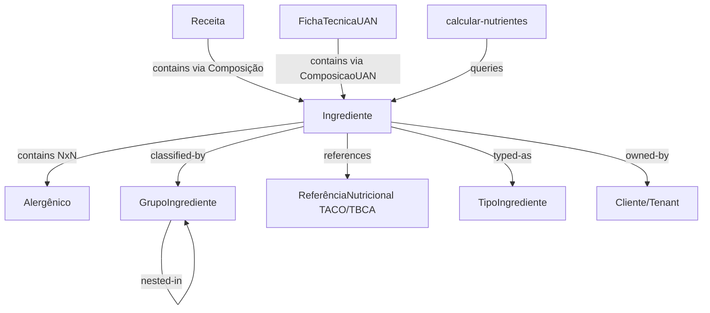

# Domain Model — Ingredientes

## Entities

### Ingrediente

> Insumo primário, composto ou aditivo com rastreabilidade nutricional e taxonomia sanitária.

| Field | Type | Required | Description |
|---|---|---|---|
| `id` | UUID | yes | Chave primária |
| `nome` | string | yes | Nome descritivo do insumo |
| `cliente_id` | UUID | no | Se presente, ingrediente privado do tenant. Se NULL, ingrediente de sistema (read-only) |
| `tipo_ingrediente` | TipoIngrediente | yes | `SIMPLES` / `COMPOSTO` / `ADITIVO` |
| `fonte` | string | no | Marca ou fonte do dado |
| `is_transgenico` | boolean | no | Flag de transgenia (Selo T na rotulagem) |
| `especie_transgenica` | string | no | Nome da espécie transgênica |
| `especie_doadora` | string | no | Organismo doador do gene |
| `transgenicos` | JSONB[] | no | Array de `{especie, doador}` para múltiplos transgênicos |
| `declaracao_ingredientes_fornecedor` | string | no | Lista de ingredientes quando COMPOSTO |
| `contem_gluten` | boolean | no | Flag de glúten (Lei 10674/2003) |
| `classificacao_nova` | integer | no | Grau NOVA (1-4, USP/Nupens) |
| `referencia_id` | UUID | no | FK para referência nutricional TACO/TBCA |
| `referencia_nutricional_id` | UUID | no | FK alternativa para referência nutricional |
| `grupo_estoque_id` | UUID | no | FK para grupo de configuração de estoque |
| `categoria_produto_id` | UUID | no | FK para categoria hierárquica de produto |
| `grupo_id` | UUID | no | FK para grupo de produto |
| `energia_kcal` | decimal | no | Valor energético por 100g — campo crítico de completude |
| `carboidrato_g` | decimal | no | Carboidratos por 100g |
| `proteina_g` | decimal | no | Proteínas por 100g |
| `lipideos_g` | decimal | no | Gorduras totais por 100g |
| `gordura_saturada_g` | decimal | no | Gorduras saturadas por 100g |
| `gordura_trans_g` | decimal | no | Gorduras trans por 100g |
| `fibra_alimentar_g` | decimal | no | Fibra alimentar por 100g |
| `sodio_mg` | decimal | no | Sódio por 100g (miligramas) |
| `acucar_total_g` | decimal | no | Açúcares totais por 100g |
| `acucar_adicionado_g` | decimal | no | Açúcares adicionados por 100g |
| `lactose_g` | decimal | no | Lactose por 100g — crítico para regra de omissão |
| `deleted_at` | timestamp | no | Soft delete (GxP) |
| `created_by` | UUID | no | Autoria para audit trail |
| `updated_by` | UUID | no | Última atualização para audit trail |

> Há ~30 campos adicionais de micronutrientes (vitaminas e minerais) documentados no dicionário completo.

### GrupoIngrediente

> Classificação hierárquica para agrupamento de estoque e categorias.

| Field | Type | Required | Description |
|---|---|---|---|
| `id` | UUID | yes | PK |
| `nome` | string | yes | Nome do grupo |
| `cliente_id` | UUID | yes | Tenant owner |
| `categoria_id` | UUID | no | FK para grupo-pai (aninhamento) |

## Value Objects

### Alergênico

> Propriedade sanitária vinculada à ANVISA. Relação NxN com Ingrediente via tabela pivô `ingrediente_alergenicos`.

| Field | Type | Description |
|---|---|---|
| `id` | integer | PK (tabela mestre ANVISA) |
| `nome` | string | Nome do alergênico (ex: "Leite", "Soja", "Trigo") |

### InfoNutricional

> Matriz de macros e micronutrientes por 100g. Representada como campos flat na tabela `ingredientes`, não como tabela separada.

Campos: `energia_kcal`, `carboidrato_g`, `proteina_g`, `lipideos_g`, `gordura_saturada_g`, `gordura_trans_g`, `fibra_alimentar_g`, `sodio_mg`, `acucar_total_g`, `acucar_adicionado_g`, `lactose_g`, + ~25 micronutrientes.

## Enums

### TipoIngrediente

| Value | Label | Regulatory Impact |
|---|---|---|
| `SIMPLES` | In natura / minimamente processado | Nome direto na lista. Se GMO → sufixo com espécie doadora |
| `COMPOSTO` | Produto industrializado com lista própria | Lista entre parênteses. GMO → sem alteração (info vem do fornecedor) |
| `ADITIVO` | Substância com função tecnológica | Declarado como "Função (Nome/INS)". GMO → campos limpos automaticamente |

### ClassificacaoNova

| Value | Label | Color |
|---|---|---|
| 1 | G1 — In Natura / Minimamente Processado | 🟢 #4CAF50 |
| 2 | G2 — Ingrediente Culinário Processado | 🔵 #2196F3 |
| 3 | G3 — Alimento Processado | 🟡 #FF9800 |
| 4 | G4 — Ultraprocessado | 🔴 #F44336 |

## Concept Graph

