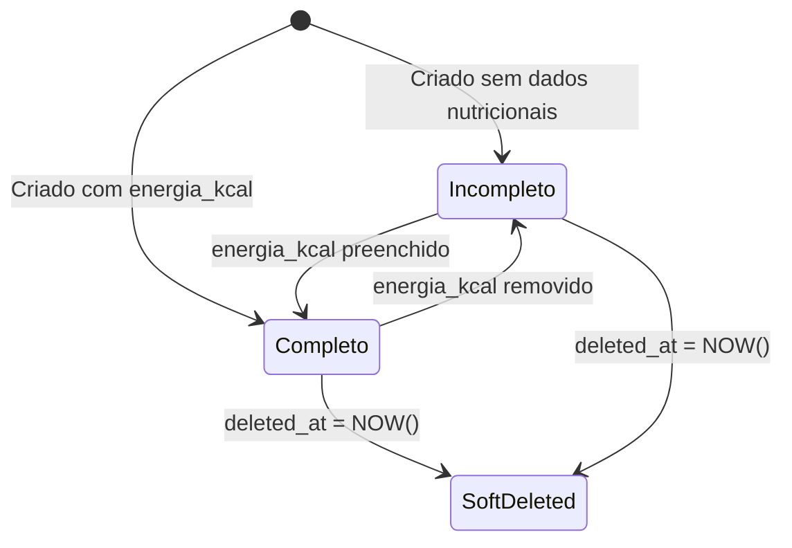

# States — Ingredientes

## Ingrediente Completude (Implicit State)

> O módulo Ingredientes **não possui state machine formal** — não existe um enum `StatusIngrediente`. Porém, há um **estado implícito de completude** que afeta comportamento downstream.

| State | Condition | Impact |
|---|---|---|
| **Completo** | `energia_kcal IS NOT NULL` | Pode participar de cálculos em fichas técnicas |
| **Incompleto** | `energia_kcal IS NULL` | Chip "Cadastro Incompleto" exibido. Pode corromper somas em fichas técnicas se usado |
| **SoftDeleted** | `deleted_at IS NOT NULL` | Invisível em listagens e queries |

### Transition Rules

| From | To | Trigger | Guard |
|---|---|---|---|
| — | Incompleto | Insert sem `energia_kcal` | — |
| — | Completo | Insert com `energia_kcal` | — |
| Incompleto | Completo | Update com `energia_kcal` preenchido | — |
| Completo | Incompleto | Update com `energia_kcal` nulificado | — |
| * | SoftDeleted | SoftDelete | `cliente_id IS NOT NULL` (não pode deletar ingredientes de sistema) |

### Invariants

1. Um ingrediente de sistema (`cliente_id IS NULL`) não pode ser deletado, editado ou transferido
2. Um ingrediente ADITIVO nunca pode ter campos GMO preenchidos (limpos automaticamente no `handleSalvar`)
3. `transgenicos` é sempre um array, nunca `null`, `undefined` ou `0`

---

## Governance Gap (Observed)

> [!WARNING]
> **GAP-STATES-001**: O estado de completude é **calculado em runtime** no frontend (`energia_kcal === null`), não persistido no banco. Isso significa que:
> - Não há como filtrar incompletos via query SQL pura
> - Não há trigger ou computed column que garanta consistência
> - O comportamento pode divergir entre componentes que calculam a completude diferentemente
>
> **Recomendação**: Considerar adicionar um campo `status` ou uma computed column no PostgreSQL.
