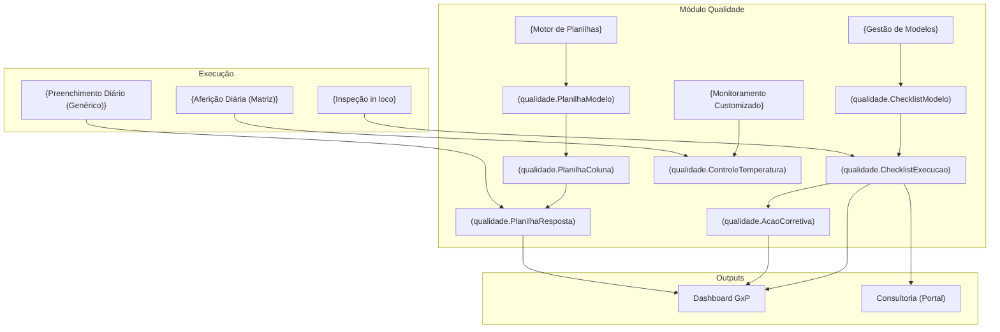

---
tags:
  - feature/qualidade
feature: qualidade
title: "Qualidade GxP"
status: brownfield-translated
translation-mode: brownfield
translation-date: 2026-06-10
brownfield-bootstrapped: true
discovery_source: app/qualidade/
evidence-confidence: observed
---

> [!NOTE] Ancestry
> 🔼 **Parent**: [[spec-architecture]]

---

# Feature: Qualidade GxP

> Gestão centralizada de conformidade sanitária, abrangendo a criação e execução de modelos de auditoria (checklists), gestão do ciclo de vida de planos de ação (não-conformidades), e um motor de planilhas dinâmicas para controle diário de produção (monitoramento de temperaturas operacionais, qualidade da água, equipamentos, etc.).

## What This Module Owns

O módulo de Qualidade gerencia o **ciclo de auditoria, monitoramento e controles diários**:

1. **Gestão de Modelos de Checklist:** Molde estrutural versionável para auditorias (PPHO, BPF) com seções e itens classificados.
2. **Execução de Auditorias:** Instanciamento de checklists para preenchimento in loco com validação de fotos, assinaturas eletrônicas e cálculo de score.
3. **Planos de Ação (Ações Corretivas):** Trilha de resolução de desvios gerados em auditorias, do apontamento até a verificação da eficácia.
4. **Dashboard e Relatórios Analíticos:** Visão executiva e gráfica do nível de conformidade das unidades, com matriz de desempenho.
5. **Monitoramento GxP (Controle de Produção):** Motor de formulários dinâmicos baseados no banco (`qual_planilha_modelos`, `qual_planilha_colunas`) que organizam os registros diários obrigatórios em categorias, além de telas customizadas em formato de matriz para medição contínua (ex: Temperaturas de Equipamentos).

## Module Map

## Capabilities

| Capability | What | Key Aspects | Detail |
| --- | --- | --- | --- |
| [Gestão de Modelos](#gestão-de-modelos) | Templates de auditoria | Criação hierárquica (seções, itens), inativação | 3 ops, 3 entities |
| [Execução de Auditorias](#execução-de-auditorias) | Preenchimento in loco | Respostas, fotos, assinatura, pontuação | 5 ops, 2 entities |
| [Planos de Ação](#planos-de-ação) | Gestão de NCs | Vinculação, plano de ação, verificação | 3 ops, 1 entity |
| [Relatórios e Visões](#relatórios-e-visões) | Painéis de Conformidade | Visualização executiva, analítica, assinaturas | 4 views |
| [Controle de Produção (Planilhas)](#controle-de-produção) | Motor Dinâmico de Registros | Hub categorizado por abas, geração dinâmica de UI com base em colunas do DB | 4 ops, 3 entities |
| [Monitoramento GxP (Custom)](#monitoramento-gxp-custom) | Telas Customizadas | Grid em matriz para equipamentos x horários (legacy/custom flow) | 2 ops, 1 entity |

### Gestão de Modelos
Criação e edição estrutural de formulários que servirão de base para as auditorias.

| Aspect | Concept | Summary |
| --- | --- | --- |
| Operation | CriarModelo | Cria novo modelo de checklist com hierarquia de seções e itens. |
| Operation | EditarModelo | Edita a estrutura de um modelo existente. |
| Operation | InativarModelo | Soft-delete do modelo, preservando o histórico de quem já usou. |

### Execução de Auditorias
O coração do módulo: o ato de instanciar um modelo e inspecionar a unidade.

| Aspect | Concept | Summary |
| --- | --- | --- |
| Operation | IniciarAuditoria | Instancia uma `ChecklistExecucao` a partir de um modelo. |
| Operation | ResponderItem | Respostas por item: CONFORME, NAO_CONFORME, N.A., FOTO, TEXTO, VALOR. |
| Operation | FinalizarAuditoria | Trava a auditoria, calcula a pontuação e exige assinatura. |
| Rule | ObrigatóriosCompletos | Itens obrigatórios devem ter valor ou N.A. marcado. |
| Rule | FotoObrigatória | Exigência de evidência fotográfica configurada no modelo. |

### Planos de Ação
Tratamento das não-conformidades levantadas nas auditorias.

| Aspect | Concept | Summary |
| --- | --- | --- |
| Operation | RegistrarAcaoCorretiva | Abertura automática ao marcar item como NAO_CONFORME. |
| Operation | ConcluirAcao | Resolução da NC com apontamento do que foi feito. |
| Rule | RastroAuditoria | Link entre a auditoria que gerou a NC e a auditoria que validou sua eficácia. |

### Relatórios e Visões
Output gerencial das auditorias realizadas.

| Aspect | Concept | Summary |
| --- | --- | --- |
| View | RelatorioExecutivo | Visão em formato de planilha para impressão formal. |
| View | RelatorioAnalitico | Gráficos donut/bar com score por seção e faixas de desempenho. |
| Calculation | ConformidadeGeral | `(conformes / (conformes + nao_conformes)) * 100` (N.A. excluído). |

### Controle de Produção
Interface de Hub (`/qualidade/controle-producao`) contendo as planilhas dinâmicas organizadas por guias (Tabs) de categorias. Quando o usuário acessa uma planilha genérica, o sistema a monta via motor de UI baseado no DB (`/qualidade/planilhas/[id]`).

| Aspect | Concept | Summary |
| --- | --- | --- |
| Operation | HubCategorizado | Renderiza cards baseados na categoria selecionada em abas horizontais no Hub. |
| Operation | RenderizarPlanilhaDinamica | Busca colunas do DB (`qual_planilha_colunas`) e monta o formulário. |
| Operation | ResponderPlanilha | Preenchimento dinâmico gravado como JSON no formato `{coluna_id: valor}`. |
| Rule | RoteamentoPersonalizado | Certos modelos têm redirecionamentos hardcoded para páginas customizadas (ex: Temperatura). |

### Monitoramento GxP (Custom)
Logs diários exigidos pela RDC 216/275 gerenciados através de telas projetadas nativamente com layout otimizado, como a `temperatura/page.tsx`.

| Aspect | Concept | Summary |
| --- | --- | --- |
| Operation | RegistrarTemperaturaMatriz | Log visual de equipamento x horários. |
| Rule | FaixaIdeal | Destaca visualmente se a aferição estiver fora dos parâmetros do equipamento (`temp_ideal_min`/`max`). |

## Aspect Docs

| Aspect | File | Status |
|---|---|---|
| Domain Model | [[domain/domain-qualidade]] | brownfield-translated |
| Operations | [[technical/ops-qualidade]] | brownfield-translated |
| States | [[technical/states-qualidade]] | brownfield-translated |

## Database Tables (Observed)

| Table | Owner Module | Notes |
|---|---|---|
| `checklist_modelos` | Qualidade | Modelos de checklist |
| `checklist_secoes` | Qualidade | Seções dos modelos |
| `checklist_itens` | Qualidade | Itens das seções |
| `checklist_execucoes` | Qualidade | Instâncias de execução |
| `checklist_respostas` | Qualidade | Respostas da execução |
| `acoes_corretivas` | Qualidade | NCs geradas das auditorias |
| `controle_temperatura` | Qualidade | Logs imutáveis diários (Matriz customizada) |
| `qual_planilha_modelos` | Qualidade | Cabeçalho/Template das planilhas dinâmicas |
| `qual_planilha_colunas` | Qualidade | Colunas que compõem uma planilha dinâmica |
| `qual_planilha_respostas`| Qualidade | Respostas enviadas para os modelos genéricos |

## Change History

- **2026-06-06:** Brownfield translation inicial (Bootstrapped).
- **2026-06-10:** Atualização Brownfield (Controle de Produção, Abas, Motor Dinâmico de Planilhas e Layouts Customizados).
