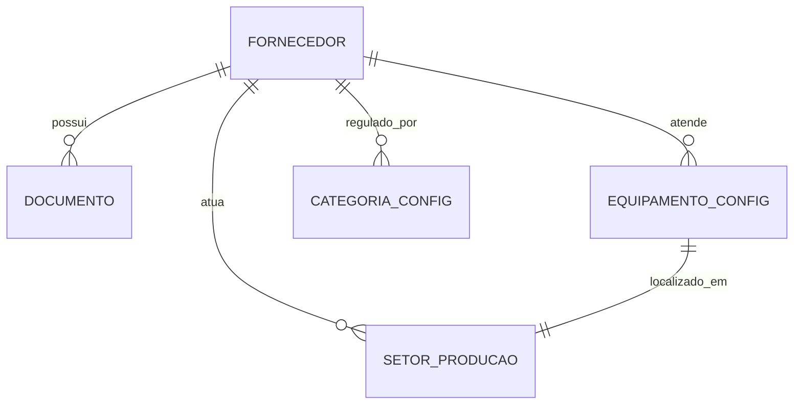

> [!NOTE] Ancestry
> ⬆️ **Parent**: [[spec-suprimentos]]

---

# Especificação Mestre: Módulo de Serviços (Versão Asset-Based)

## 1. Visão Geral
O Módulo de Serviços é redefinido como um sistema de gestão de conformidade de terceiros focado em **Ativos (Equipamentos)** e **Áreas (Setores)**. Diferente de fornecedores de insumos, os prestadores de serviço são qualificados com base no escopo técnico de manutenção e operação de infraestrutura.

### Objetivos Principais
- Qualificação técnica baseada no parque tecnológico (equipamentos) do cliente.
- Rastreabilidade de intervenções por setor de produção.
- Automação de conformidade documental (GED) vinculada à modalidade de serviço.

### 2.1 Taxonomia e Escopo Reativo

O escopo de atuação de um prestador não é fixo, mas sim **herdado das configurações de suas categorias**.

1.  **Configuração de Categoria**: No módulo de configurações, cada categoria de serviço define seu `Tipo de Escopo`:
    -   **Geral / Unidade**: Sem exigência de vínculo técnico (ex: Consultoria).
    -   **Vínculo com Equipamentos**: Exige seleção de ativos (ex: Manutenção de Ar Condicionado).
    -   **Vínculo com Setores**: Exige seleção de áreas físicas (ex: Controle de Pragas).
2.  **Interface Dinâmica**: O formulário do prestador exibe apenas os seletores (Equipamentos ou Setores) habilitados pelas categorias selecionadas. No caso de múltiplas categorias, o sistema exibe a **união** das exigências.

---

## 2. Paradigma de Vínculos (Asset-Based Compliance)

Diferente do módulo de fornecedores, que utiliza uma taxonomia de produtos, o módulo de serviços utiliza um **Grafo de Ativos/Áreas**:

- **Vínculo com Equipamentos**: Permite listar quais máquinas (ex: Exaustores, Fornos, Câmaras Frias) o prestador está autorizado a realizar manutenção (preventiva ou corretiva).
- **Vínculo com Setores**: Define as áreas físicas (ex: Cozinha Quente, Açougue) onde o prestador realiza serviços recorrentes (ex: Controle de Pragas, Limpeza Técnica).

### Diagrama de Relações (Mermaid)

---

## 3. Estrutura de Especialização

| Contexto | Filtro / Vínculo | Tabela de Origem |
| :--- | :--- | :--- |
| **Categorização** | Modalidade de Serviço | `categorias_config (tipo='SERVICO')` |
| **Escopo Técnico** | Equipamentos Atendidos | `equipamentos_config` |
| **Escopo Geográfico** | Setores de Atuação | `setores_producao` |

---

## 4. Engenharia de Automação (GED)

A automação documental permanece agnóstica ao vínculo físico, baseando-se na **Categoria de Serviço**:

1. Ao selecionar "Manutenção de Refrigeração", o Database Trigger busca em `categorias_config` as obrigações para essa categoria.
2. O sistema gera automaticamente placeholders como "Certificado de Calibragem" ou "ART de Instalação".
3. A governança garante que o prestador só seja considerado "HOMOLOGADO" após a validade desses documentos ser confirmada.

---

## 5. Dicionário de Dados de Extensão

| Coluna | Tipo | Descrição |
| :--- | :--- | :--- |
| `tipo` | `text` | Fixo em 'SERVICO'. |
| `equipamentos_vinculados` | `uuid[]` | IDs de ativos em `equipamentos_config`. |
| `setores_vinculados` | `uuid[]` | IDs de áreas em `setores_producao`. |
| `categorias_compras` | `text[]` | Categorias de serviço para automação GED. |

---

## 6. Governança e RLS

- **Isolamento de Unidade**: Como equipamentos são vinculados a unidades (`unidade_id`), o prestador herdará a visibilidade contextual das máquinas da unidade em que está sendo cadastrado.
- **Segurança GxP**: Alterações no escopo de atuação do prestador (adição de novos equipamentos) geram logs de auditoria automatizados.

---
**Documento Auditável - Versão 2.0 (Foco em Ativos)**
