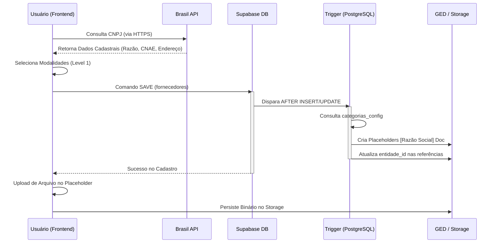

> [!NOTE] Ancestry
> ⬆️ **Parent**: [[spec-suprimentos]]

---

# Especificação Mestre: Módulo de Fornecedores

Esta documentação detalha o funcionamento holístico do módulo de Fornecedores, desde a captura de dados externos até a automação de conformidade documental no banco de dados. Este módulo é crítico para a garantia de qualidade (GxP) e rastreabilidade da UAN.

---

## 1. Visão de Fluxo (End-to-End)

O diagrama abaixo descreve a jornada de um fornecedor no sistema, destacando os pontos de automação e validação.

---

## 2. Ontologia e Taxonomia Rigorosa

O módulo utiliza um sistema de **Taxonomia Progressiva** para garantir que o fornecedor esteja vinculado aos itens corretos de estoque sem ambiguidades.

### 2.1. Níveis de Classificação
| Nível | Nome Técnico | Tipo | Referência | Descrição |
|---|---|---|---|---|
| **Level 1** | `categorias_compras` | `text[]` | `categorias_config` | Define a macro-natureza (ex: ALIMENTOS). Dispara as regras de GED. |
| **Level 2** | `grupos_fornecidos` | `uuid[]` | `grupos_produto` | Sub-categorias de estoque (ex: Carnes, Hortifruti). |
| **Level 3** | `subgrupos_fornecidos`| `uuid[]` | `subgrupos_produto` | Refinamento para substituição (ex: Bovinos, Aves). |
| **Level 4** | `itens_fornecidos` | `uuid[]` | `ingredientes` | O SKU específico que o fornecedor está autorizado a entregar. |

---

## 3. Lógica de Engenharia (Deep Dive)

### 3.1. Frontend: Componentes e Estado
*   **Página Principal (`fornecedores/[id]/page.tsx`)**:
    *   Gerencia o estado unificado do fornecedor e os dados da Brasil API.
    *   **Hook `fetchPortfolioData`**: Realiza uma busca reativa sempre que o Level 1 é alterado, carregando todos os Grupos, Subgrupos e Itens do `cliente_id` para formar as opções de seleção em cascata.
    *   **Filtragem de Itens**: Implementa lógica `Array.filter` no cliente para garantir que apenas itens das modalidades selecionadas sejam exibidos, evitando poluição visual.

*   **Componente GED (`DocumentosFornecedor.tsx`)**:
    *   Consome a prop `entidadeId` (match com `fornecedores.id`).
    *   **Query de Busca**: Prioriza registros no banco onde `entidade_id` é igual ao ID do fornecedor, caindo no fallback ILIKE de nome apenas para dados legados.

### 3.2. Backend: O Motor de Automação (`tr_gerar_placeholders_ged_fornecedor`)
Função implementada em PL/pgSQL que garante que o fornecedor nunca fique "orfão" de documentos obrigatórios:

1.  **Iteração de Categorias**: Varre o array `categorias_compras`.
2.  **Lookup de Configurações**: Para cada categoria, busca a sub-lista de documentos em `categorias_config.documentos_obrigatorios`.
3.  **Prevenção de Duplicatas**: Antes de inserir um placeholder em `documentos_arquivos`, o motor verifica se já existe um registro com a mesma `entidade_id` e nome similar na pasta destino.
4.  **Vínculo Atômico**: Todos os novos registros recebem a `entidade_id` do fornecedor, permitindo que o frontend os localize instantaneamente sem depender de busca por texto.

---

## 4. Governança, Segurança e RLS

### 4.1. Isolamento Multi-Tenant
A segurança é garantida no nível do banco de dados (Infra-level security):
*   **Tabela `fornecedores`**: Possui política RLS `Fornecedores Isolados por Cliente`.
    *   *Regra*: `cliente_id IN (SELECT cliente_id FROM app_user_memberships WHERE usuario_id = auth.uid())`.
    *   *Consequência*: Um usuário da "Empresa A" não consegue listar, ver ou editar fornecedores da "Empresa B", mesmo via API direta.

*   **Tabela `documentos_arquivos`**: Segue o mesmo rigor.
    *   Documentos vinculados a um fornecedor herdam indiretamente a proteção, pois sua visibilidade na UI do módulo de fornecedores depende da leitura autorizada do `fornecedor_id`.

---

## 5. Integração Brasil API

O sistema integra-se ao serviço público via proxy/frontend para preenchimento automático:
*   **Campos Sincronizados**: `razao_social`, `nome_fantasia`, `logradouro` (completo), `email`, `ddd_telefone_1`, `cnae_fiscal`, `descricao_situacao_cadastral`.
*   **Tratamento de Estado**: Quando o CNPJ é buscado, o sistema mapeia a "Situação Cadastral" (ex: ATIVA, BAIXADA). O frontend exibe isso visualmente com cores de alerta, auxiliando na decisão de homologação.

---

## 6. Dicionário Técnico de Dados (Full)

### Tabela: `fornecedores` (Principal)
| Propriedade | Tipo | Obrigatório | Descrição / Regra |
|---|---|---|---|
| `id` | UUID | Sim | Chave Primária. |
| `cliente_id` | UUID | Sim | ID do Tenant. |
| `razao_social` | string | Sim | Nome oficial da entidade. |
| `cnpj` | string | Sim | Único por cliente. Máscara: `00.000.000/0000-00`. |
| `status_homologacao`| ENUM | Sim | `PENDENTE`, `APROVADO`, `REJEITADO`. |
| `tipo` | string | Sim | `FORNECEDOR` ou `SERVICO`. |
| `pasta_documentos_id`| UUID | Não | FK para GED (Pasta Raiz). |

### Tabela: `documentos_arquivos` (Relacional)
| Propriedade | Tipo | Obrigatório | Descrição / Regra |
|---|---|---|---|
| `entidade_id` | UUID | Sim* | ID do fornecedor ao qual o documento pertence (Garantia de Vínculo). |
| `nome_arquivo` | string | Sim | Padrão: `[RAZÃO SOCIAL] Nome do Documento`. |
| `url_storage` | string | Não | Path no Supabase Storage. Se `null`, é um placeholder aguardando upload. |
| `data_validade` | date | Não | Data crítica para conformidade. |

---

## 7. Dependências Futuras

1.  **Gestão de Tarefas**: O campo `status_homologacao` será movido para um fluxo de State Machine controlado por tarefas de conferência documental.
2.  **Módulo de Compras**: Bloqueio de emissão de Pedidos para fornecedores com status `REJEITADO` ou `PENDENTE` (Regra a ser implementada na fase de Compras).

---

> [!NOTE]
> Esta documentação é o contrato técnico oficial do módulo. Qualquer alteração no Trigger de banco de dados ou na estrutura de taxonomia deve ser refletida aqui imediatamente para manter a veracidade GxP do sistema.
