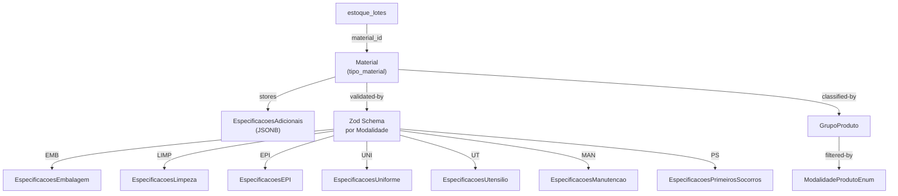

---
tags:
  - feature/taxonomia-materiais
feature: taxonomia-materiais
aspect: domain
status: brownfield-translated
evidence: observed + regulatory-research
---

---

> [!NOTE] Ancestry
> ⬆️ **Parent**: [[spec-taxonomia-materiais]]

---

# Domain Model — Taxonomia de Materiais

> [!IMPORTANT] Ontology Reference
> Este modelo técnico formaliza os conceitos de negócio e regulatórios documentados no
> Discovery Source: [`discovery/brownfield-materiais-taxonomy.md`](discovery/brownfield-materiais-taxonomy.md).

## Entities

### Material

> Item não-alimentar utilizado na operação de uma UAN. Discriminado por `tipo_material`, que determina o schema de `especificacoes_adicionais`.

| Field | Type | Required | Description |
|---|---|---|---|
| `id` | UUID | yes | Chave primária |
| `nome` | string | yes | Nome descritivo do material |
| `marca` | string | no | Marca do fabricante |
| `tipo_material` | string | yes | Discriminador de modalidade (ex: `EMBALAGEM`, `LIMPEZA`, `EPI_EPC`) |
| `material_base` | string | no | Material base (PP, PE, inox, etc.) |
| `dimensoes` | string | no | Dimensões físicas (LxAxP) |
| `capacidade` | string | no | Capacidade (volume/peso) |
| `cor` | string | no | Cor principal |
| `sustentavel` | boolean | no | Flag de sustentabilidade |
| `apropriado_alimentos` | boolean | no | Aprovado para contato com alimentos |
| `descricao_tecnica` | string | no | Descrição técnica livre |
| `ficha_tecnica` | JSONB | no | Ficha técnica estruturada |
| `especificacoes_adicionais` | JSONB | no | **Dados específicos por modalidade — validados via Zod** |
| `peso_unitario_g` | decimal | no | Peso unitário em gramas |
| `cliente_id` | UUID | yes | Tenant owner |
| `grupo_id` | UUID | no | FK → `grupos_produto` |
| `deleted_at` | timestamp | no | Soft delete |
| `created_at` | timestamp | yes | Criação |
| `updated_at` | timestamp | no | Última atualização |

**Operations:** [CadastrarMaterial](technical/operations.md#cadastrarmaterial), [AtualizarEspecificacoes](technical/operations.md#atualizarespecificacoes)

---

### GrupoProduto

> Nível 2 da hierarquia de classificação. Compartilhada entre ingredientes e materiais via coluna `modalidade`.

| Field | Type | Required | Description |
|---|---|---|---|
| `id` | UUID | yes | PK |
| `nome` | string | yes | Nome do grupo |
| `modalidade` | [ModalidadeProdutoEnum](#modalidadeprodutoenum) | yes | Filtra o grupo por contexto |
| `cliente_id` | UUID | yes | Tenant owner |
| `created_at` | timestamp | yes | Criação |

---

## Value Objects

### EspecificacoesEmbalagem

> Schema de `especificacoes_adicionais` quando `tipo_material = 'EMBALAGEM'`.
> **Regulamentação:** RDC 843/2024, IN 281/2024, PNRS (Lei 12.305/2010).

| Field | Type | Constraint |
|---|---|---|
| `material_base` | enum: `PP`, `PE`, `PET`, `VIDRO`, `ALUMINIO`, `PAPEL`, `ISOPOR`, `OUTRO` | required |
| `apropriado_alimentos` | boolean | required |
| `capacidade` | string (ex: "500ml") | required |
| `dimensoes` | string (LxAxP) | optional |
| `cor` | string | optional |
| `sustentavel` | boolean | optional |
| `reciclavel` | boolean | optional |
| `temperatura_max_uso` | number (°C) | required |
| `certificado_contato_alimentos` | string (nº/ref) | required |
| `tipo_fechamento` | enum: `TAMPA_ROSCA`, `SELO`, `PRESS_CLIP`, `ENCAIXE`, `SEM_FECHAMENTO`, `OUTRO` | optional |

**Equality:** Comparação por `material_base` + `capacidade` + `certificado_contato_alimentos`.

---

### EspecificacoesLimpeza

> Schema de `especificacoes_adicionais` quando `tipo_material = 'LIMPEZA'`.
> **Regulamentação:** ABNT NBR 14725:2023 (FDS), RDC 59/2010 (saneantes), RDC 216/2004 §4.1.

| Field | Type | Constraint |
|---|---|---|
| `principio_ativo` | string | required |
| `concentracao_principio_ativo` | string (ex: "0,5%") | required |
| `diluicao_recomendada` | string (ex: "1:200") | required |
| `tempo_contato_min` | integer (minutos) | required |
| `registro_anvisa_ms` | string | required |
| `fds_disponivel` | boolean | required |
| `fds_url` | string (URL) | optional |
| `classe_risco_ghs` | enum: `CORROSIVO`, `IRRITANTE`, `TOXICO`, `INFLAMAVEL`, `OXIDANTE`, `GAS_PRESSURIZADO`, `RISCO_SAUDE`, `RISCO_AMBIENTAL`, `NAO_CLASSIFICADO` | required |
| `pictogramas_ghs` | string[] | optional |
| `frases_h` | string[] (Hazard statements) | optional |
| `frases_p` | string[] (Precautionary statements) | optional |
| `superficies_compativeis` | string[] (inox, polímero, piso, etc.) | optional |
| `pH` | number | optional |
| `incompatibilidades` | string | required |

**Equality:** Comparação por `principio_ativo` + `registro_anvisa_ms`.

---

### EspecificacoesEPI

> Schema de `especificacoes_adicionais` quando `tipo_material = 'EPI_EPC'`.
> **Regulamentação:** NR-6 (MTE), Portaria MTE 11.437/2020.

| Field | Type | Constraint |
|---|---|---|
| `numero_ca` | string | required |
| `validade_ca` | date (ISO 8601) | required |
| `fabricante_importador` | string | required |
| `tipo_epi` | enum: `LUVA`, `BOTA`, `AVENTAL`, `OCULOS`, `PROTETOR_AURICULAR`, `TOUCA`, `MASCARA`, `PROTETOR_FACIAL`, `MANGOTE`, `OUTRO` | required |
| `tamanho` | string (P/M/G/GG ou numérico) | required |
| `material_composicao` | string | optional |
| `nr_aplicavel` | string[] (ex: ["NR-6", "NR-9"]) | optional |
| `riscos_protegidos` | enum[]: `TERMICO`, `QUIMICO`, `MECANICO`, `BIOLOGICO`, `ELETRICO`, `ERGONOMICO` | optional |
| `lote_fabricacao` | string | optional |
| `controle_individual` | boolean | required |
| `descartavel` | boolean | optional |
| `vida_util_dias` | integer | optional |

**Equality:** Comparação por `numero_ca` + `tamanho`.

---

### EspecificacoesUniforme

> Schema de `especificacoes_adicionais` quando `tipo_material = 'UNIFORME'`.
> **Regulamentação:** RDC 216/2004 §4.6, NR-6 (quando EPI).

| Field | Type | Constraint |
|---|---|---|
| `tipo_peca` | enum: `DOLMA`, `CALCA`, `AVENTAL`, `TOUCA`, `SAPATO`, `LUVA_TERMICA`, `CAMISETA`, `BERMUDA`, `OUTRO` | required |
| `tamanho` | string (P/M/G/GG/XG ou numérico) | required |
| `cor` | string | required |
| `tecido_composicao` | string (ex: "65% Poliéster / 35% Algodão") | optional |
| `gramatura_gm2` | number | optional |
| `antiderrapante` | boolean (calçados) | optional |
| `impermeavel` | boolean (calçados) | required |
| `lavabilidade` | enum: `MAQUINA_INDUSTRIAL`, `MAQUINA_DOMESTICA`, `MANUAL` | optional |
| `temperatura_lavagem_max` | number (°C) | optional |
| `vida_util_lavagens` | integer | optional |
| `numero_ca` | string (quando classificado como EPI) | optional |

**Equality:** Comparação por `tipo_peca` + `tamanho` + `cor`.

---

### EspecificacoesUtensilio

> Schema de `especificacoes_adicionais` quando `tipo_material = 'UTENSILIO'`.
> **Regulamentação:** RDC 216/2004 §4.1, RDC 854/2024.

| Field | Type | Constraint |
|---|---|---|
| `tipo_utensilio` | enum: `TABUA_CORTE`, `FACA`, `PANELA`, `GN`, `FORMA`, `ESPATULA`, `CONCHA`, `COLHER`, `BANDEJA`, `OUTRO` | required |
| `material_base` | enum: `INOX_304`, `INOX_316`, `POLIETILENO`, `POLIPROPILENO`, `SILICONE`, `MADEIRA`, `VIDRO`, `ALUMINIO`, `OUTRO` | required |
| `apropriado_alimentos` | boolean | required |
| `cor_segregacao` | enum: `VERMELHO`, `AZUL`, `VERDE`, `AMARELO`, `BRANCO`, `MARROM`, `NA` | required |
| `termoresistencia_max_c` | number (°C) | optional |
| `autoclavavel` | boolean | optional |
| `vida_util_estimada` | string (ex: "12 meses") | optional |
| `criterio_descarte` | string | optional |
| `dimensoes` | string | optional |

**Equality:** Comparação por `tipo_utensilio` + `material_base` + `cor_segregacao`.

---

### EspecificacoesManutencao

> Schema de `especificacoes_adicionais` quando `tipo_material = 'MANUTENCAO'`.
> **Regulamentação:** RDC 216/2004 §4.1.2, NBR 5462.

| Field | Type | Constraint |
|---|---|---|
| `tipo_item` | enum: `PECA_REPOSICAO`, `FERRAMENTA`, `CONSUMIVEL`, `LUBRIFICANTE`, `OUTRO` | required |
| `modelo_numero_serie` | string | optional |
| `equipamento_compativel` | string[] | required |
| `especificacao_tecnica` | string | optional |
| `grau_alimentar` | boolean (NSF H1/H2) | optional |
| `criticidade` | enum: `ALTA`, `MEDIA`, `BAIXA` | optional |
| `frequencia_troca` | string (ex: "A cada 3 meses") | optional |

**Equality:** Comparação por `tipo_item` + `modelo_numero_serie`.

---

### EspecificacoesPrimeirosSocorros

> Schema de `especificacoes_adicionais` quando `tipo_material = 'PRIMEIROS_SOCORROS'`.
> **Regulamentação:** NR-7 (PCMSO), RDC 16/2013.

| Field | Type | Constraint |
|---|---|---|
| `tipo_item` | enum: `CURATIVO`, `ANTISSEPTICO`, `INSTRUMENTO`, `MEDICAMENTO_TOPICO`, `DESCARTAVEL`, `OUTRO` | required |
| `registro_anvisa_ms` | string | optional |
| `principio_ativo` | string | optional |
| `esteril` | boolean | optional |
| `descartavel` | boolean | required |
| `quantidade_minima_kit` | integer | optional |
| `frequencia_verificacao` | enum: `MENSAL`, `TRIMESTRAL`, `SEMESTRAL` | optional |

**Equality:** Comparação por `tipo_item` + `registro_anvisa_ms`.

---

## Enums

### ModalidadeProdutoEnum

| Value | Description |
|---|---|
| `ALIMENTOS` | Ingredientes alimentares → roteado para tabela `ingredientes` |
| `EMBALAGENS` | Embalagens para contato com alimentos |
| `EPI_EPC` | Equipamentos de Proteção Individual/Coletiva |
| `LIMPEZA` | Produtos de limpeza e saneantes |
| `MANUTENCAO` | Peças, ferramentas e consumíveis de manutenção |
| `UTENSILIOS` | Utensílios de cozinha e serviço |
| `UNIFORMES` | Uniformes e vestimentas profissionais |
| `PRIMEIROS_SOCORROS` | Itens de kit de primeiros socorros |
| `OUTROS` | Categorias não classificadas |

### TipoMaterialMap

> Mapeamento `categoriaPrincipal` (UI) → `tipo_material` (DB).

| categoriaPrincipal (UI) | tipo_material (DB) |
|---|---|
| `EMBALAGENS` | `EMBALAGEM` |
| `EPI_EPC` | `EPI_EPC` |
| `LIMPEZA` | `LIMPEZA` |
| `MANUTENCAO` | `MANUTENCAO` |
| `UTENSILIOS` | `UTENSILIO` |
| `UNIFORMES` | `UNIFORME` |
| `PRIMEIROS_SOCORROS` | `PRIMEIROS_SOCORROS` |
| `OUTROS` | `OUTRO` |

## Concept Graph

