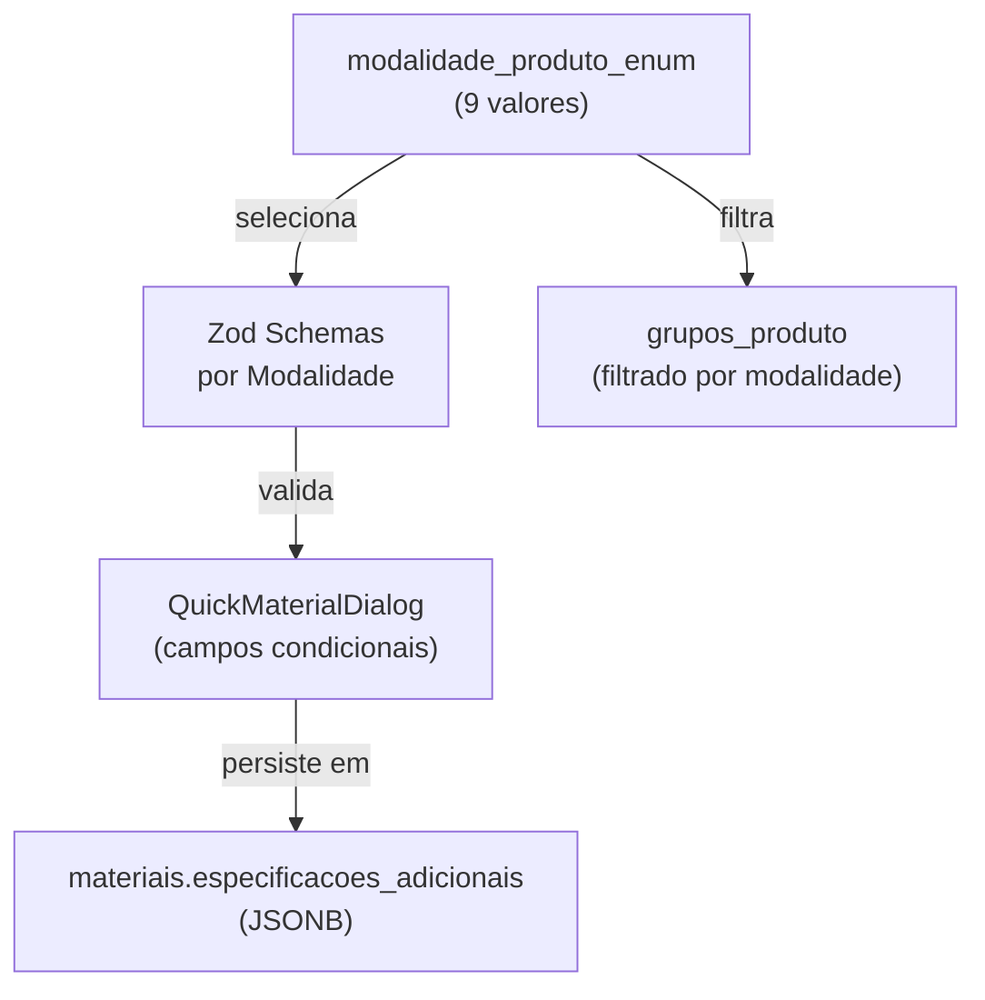

---
tags:
  - feature/taxonomia-materiais
feature: taxonomia-materiais
title: "Taxonomia de Materiais — Campos Específicos por Modalidade"
status: brownfield-translated
translation-mode: brownfield
translation-date: 2026-05-14
brownfield-bootstrapped: true
discovery_source: components/QuickMaterialDialog.tsx + lib/database.types.ts + supabase/migrations/20260418235000
evidence-confidence: observed
---

# Feature: Taxonomia de Materiais — Campos Específicos por Modalidade

> Extensão do cadastro mestre de materiais com coleta de dados regulatórios e operacionais específicos por modalidade (Embalagens, Limpeza, EPI, Uniformes, Utensílios, Manutenção, Primeiros Socorros), usando schemas Zod validados armazenados no campo JSONB `especificacoes_adicionais`.

## What This Module Owns

Este módulo é responsável pela **coleta, validação e persistência** de dados específicos por tipo de material em UANs. Cada modalidade do enum `modalidade_produto_enum` possui um schema de dados distinto, refletindo requisitos regulatórios brasileiros (NR-6, NBR 14725:2023, RDC 843/2024, RDC 216/2004, NR-7) e operacionais do setor de alimentação coletiva.

## Module Map

## Capabilities

| Capability | What | Key Aspects | Detail |
|---|---|---|---|
| CadastroMaterialPorModalidade | Coleta campos regulatórios por tipo de material | Operations: CadastrarMaterial, AtualizarEspecificacoes | 7 schemas Zod, ~80 campos totais |
| FiltragemGruposPorModalidade | Filtra grupos e subgrupos por modalidade selecionada | Queries: ListarGruposPorModalidade | 1 query com filtro enum |
| ValidacaoRegulatoriaCondicional | Valida campos obrigatórios por regulamentação | Rules: ValidarEPI_NR6, ValidarLimpeza_FDS, ValidarEmbalagem_RDC843 | 7 schemas de validação |

## Domain Concepts

| Concept | Type | Key Constraints |
|---|---|---|
| [Material](domain/domain.md#material) | Entity | `tipo_material` discrimina schema de `especificacoes_adicionais` |
| [GrupoProduto](domain/domain.md#grupoproduto) | Entity | `modalidade` filtra agrupamento por contexto |
| [ModalidadeProdutoEnum](domain/domain.md#modalidadeprodutoenum) | Enum | 9 valores, imutável no DB |
| [EspecificacoesEmbalagem](domain/domain.md#especificacoesembalagem) | Value Object | RDC 843/2024 |
| [EspecificacoesLimpeza](domain/domain.md#especificacoeslimpeza) | Value Object | NBR 14725:2023 (FDS) |
| [EspecificacoesEPI](domain/domain.md#especificacoesepi) | Value Object | NR-6 (CA obrigatório) |
| [EspecificacoesUniforme](domain/domain.md#especificacoesuniforme) | Value Object | RDC 216/2004 |
| [EspecificacoesUtensilio](domain/domain.md#especificacoesutensilio) | Value Object | RDC 854/2024 |
| [EspecificacoesManutencao](domain/domain.md#especificacoesmanutencao) | Value Object | RDC 216/2004 §4.1.2 |
| [EspecificacoesPrimeirosSocorros](domain/domain.md#especificacoesprimeirossocorros) | Value Object | NR-7 |

## Aspect Docs

| Aspect | File | Status |
|---|---|---|
| Domain Model | [[domain-taxonomia-materiais]]|domain.md]] | translated |
| Operations | [[technical/operations|operations.md]] | translated |

## Implementation Files (Planned)

| File | Layer | Purpose |
|---|---|---|
| `lib/schemas/materiais-modalidade.ts` | Domain | Schemas Zod por modalidade |
| `components/QuickMaterialDialog.tsx` | Interface | Formulário condicional por modalidade |
| `components/QuickIngredienteDialog.tsx` | Interface | Filtro de grupos por modalidade ALIMENTOS |
| `components/GerenciarGruposDialog.tsx` | Interface | CRUD de grupos com filtro de modalidade |

## Cross-Feature Dependencies

| Depends On | Relationship | Evidence |
|---|---|---|
| `ingredientes` | `co-owned-by` | Compartilha `grupos_produto` e `subgrupos_produto` |
| Supabase Auth (RLS) | `enforced-by` | Query usa `cliente_id` + RLS policies |
| `grupos_produto` | `queries` | Grupos filtrados por `modalidade` |

## Depended By

| Feature | Relationship | Evidence |
|---|---|---|
| Estoque / Lotes | `tracks` via `estoque_lotes` | `material_id` FK |
| Compras / Lançamentos | `queries` | Busca materiais por modalidade |

## Related Discovery
- [[discovery/brownfield-materiais-taxonomy|Brownfield: Taxonomia de Materiais]]
- [[discovery/categorias|Mapeamento de Categorias]]
