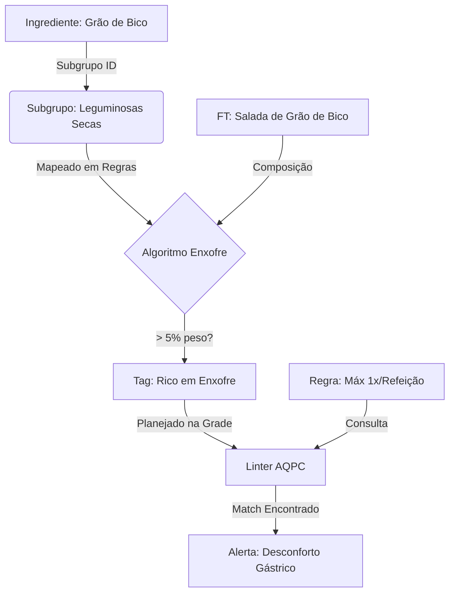

---
> [!NOTE] Ancestry
> ⬆️ **Parent**: [[spec-uan]]
---

layer: domain
nature: reference, technical
status: consolidated
veracidade: high
convicção: high
modulo: uan
version: 1.0.0
last_updated: 2026-04-17
tags:
  - feature/uan
  - dominio/uan
  - dominio/cardapios
  - dominio/planejamento
  - dominio/comensais
edges:
  - contains: "[[spec-uan]]"
  - queries: "[[features/uan/discovery/research/_uan]]"
  - produces: "[[features/uan/discovery/research/lista_compras]]"
  - contextualizes: "[[shared/spec-architecture]]"
  - derives-from: "[[legislacao/RDC_216_2004]]"
  - refines: "[[registry#uan.CardapioUAN]]"


# Cardápios UAN — Planejamento de Ciclos e Grade Operacional

> **Contexto:** O módulo de Cardápios gerencia ciclos mensais de planejamento alimentar para UANs. Um cardápio define **quando**, **quantas pessoas** e **quais preparações** serão servidas — e é o ponto de partida obrigatório para gerar a [[features/uan/discovery/research/lista_compras]].

---

## 1. Modelo de Dados

### 1.1. Tabela `cardapios_uan` (CardapioUAN — Entidade Master)

| Coluna | Tipo | Obrig. | Descrição |
|---|---|---|---|
| `id` | uuid PK | ✅ | Chave primária |
| `cliente_id` | uuid FK | ✅ | Multi-tenancy → `clientes(id)` |
| `nome_ciclo` | varchar | ✅ | Nome descritivo do ciclo (ex: "Maio 2026 — Lote 2") |
| `data_inicio` | date | ✅ | 1º dia do período (gerado como primeiro dia do mês) |
| `data_fim` | date | ✅ | Último dia do período (gerado como último dia do mês via UTC) |
| `status` | varchar | ✅ | Estado atual do ciclo (ver State Machine §3) |
| `comensais_estimados_dia` | integer | ✅ | Meta padrão de comensais/dia (usado como fallback) |
| `dias_funcionamento` | jsonb | ✅ | Array: dias da semana que a UAN opera (0=Dom, 1=Seg...6=Sáb) |
| `refeicoes_oferecidas` | jsonb | ✅ | Array de refeições do ciclo (ex: `["Almoço","Jantar"]`) |
| `comensais_modelo` | jsonb | ✅ | Mapa: `{"1":{"Almoço":120,"Jantar":80}, "6":{"Almoço":60}}` (por dia_semana → refeição → qtd) |
| `config_excecoes_dias` | jsonb | ❌ | Override por data específica: `{"2026-05-01":{"comensais":{"Almoço":0}}}` |
| `horario_refeicoes` | jsonb | ❌ | Horários de atendimento por refeição: `{"Almoço":{"inicio":"11:30","fim":"13:00"}}` |
| `setor_producao_id` | uuid FK | ❌ | Setor de produção padrão (filtrado por `unidade_id`) → [[features/industria/discovery/setores_producao]] |
| `created_at` | timestamptz | auto | Timestamp de criação |

> [!WARNING]
> A interface TypeScript `CardapioUAN` declara `unidade_id: string` e `setor_producao_id?: string`, mas ambos podem estar ausentes na DDL do banco. Verificar e criar migration formal se necessário.

---

### 1.2. Tabela `cardapio_dias_uan` (Grade — Value Object)

Representa cada célula da grade: **um dia × uma refeição × uma ficha técnica**.

| Coluna | Tipo | Obrig. | Descrição |
|---|---|---|---|
| `id` | uuid PK | ✅ | Chave primária |
| `cardapio_id` | uuid FK | ✅ | → `cardapios_uan(id)` |
| `data_consumo` | date | ✅ | Data específica do consumo (não dia_semana — data real) |
| `tipo_refeicao` | varchar | ✅ | `'Almoço'`, `'Jantar'`, `'Ceia'`, `'Desjejum'`, etc. |
| `ficha_uan_id` | uuid FK | ✅ | → `fichas_tecnicas_uan(id)` |
| `fator_multiplicador` | numeric | ✅ | Ajuste de escala (default: 1). Permite variações do rendimento base. |

> Uma ficha técnica pode aparecer **N vezes** na grade (ex: Arroz Branco toda segunda-feira no Almoço), com um registro separado em `cardapio_dias_uan` para cada ocorrência.

---

## 2. Fluxo de Criação (Wizard)

O processo de criação segue duas etapas sequenciais:

```
Etapa 1 — Parâmetros do Ciclo          Etapa 2 — Grade do Cardápio
┌──────────────────────────────┐        ┌────────────────────────────────────────┐
│ Nome do ciclo                │        │                                        │
│ Mês de referência            │   ──►  │  Grade: Dia × Refeição × Ficha        │
│ Dias da semana               │        │  (arrastar fichas para células)        │
│ Refeições oferecidas         │        │                                        │
│ Comensais por dia/refeição   │        └────────────────────────────────────────┘
│ Horários de funcionamento    │
│ Setor de produção padrão     │
└──────────────────────────────┘
```

Após salvar a Etapa 1, o sistema redireciona para `/uan/cardapios/{id}/grade`.

### 2.1. Rotas Frontend

| Rota | Arquivo | Função |
|---|---|---|
| `/uan/cardapios` | `app/uan/cardapios/page.tsx` | Listagem com status e ações |
| `/uan/cardapios/novo` | `app/uan/cardapios/novo/page.tsx` | Wizard Etapa 1 — Parâmetros |
| `/uan/cardapios/[id]/grade` | `app/uan/cardapios/[id]/grade/page.tsx` | Grade visual dia×refeição (39.9 KB) |
| `/uan/cardapios/[id]/editar` | `app/uan/cardapios/[id]/editar/` | Edição dos parâmetros do ciclo |

---

## 3. State Machine — `uan.StatusCardapio`

```
Rascunho ──► Em Planejamento ──► Aprovado ──► Enviado para Compras ──► Em Execução
                                    │
                                    └──► (rejeitado → volta para Rascunho)
```

| Status | Significado | Ação Possível |
|---|---|---|
| `Rascunho` | Criado mas incompleto | Editar grade |
| `Em Planejamento` | Em construção ativa | Editar grade, alterar parâmetros |
| `Aprovado` | Validado pelo nutricionista | Enviar para compras |
| `Enviado para Compras` | Lista de compras gerada | Aguardar recebimento |
| `Em Execução` | Período de atendimento ativo | Somente leitura |

> [!NOTE]
> A transição de estados **não está implementada** como State Machine formal no frontend atual. O status é salvo diretamente na tabela. A automação das transições é um débito técnico a endereçar.

---

## 4. Modelo de Comensais (Regras de Cálculo)

O sistema usa uma hierarquia para determinar a quantidade de comensais em um dia/refeição:

```
1. Verificar config_excecoes_dias[data_real]      (mais específico)
   └─► se tiver override → usar esse valor

2. Verificar comensais_modelo[dia_semana]
   └─► dict{"Almoço": N, "Jantar": M}

3. Fallback: comensais_estimados_dia              (mais genérico)
```

**Exemplo prático** para uma segunda-feira com almoço:
- `comensais_modelo["1"]["Almoço"] = 120` → base semanal
- `config_excecoes_dias["2026-05-01"]["comensais"]["Almoço"] = 0` → feriado, sem atendimento

> [!IMPORTANT]
> Esta lógica de resolução de comensais é executada na Edge Function `calcular-cardapio-uan` — não no frontend. O frontend apenas **persiste** o modelo; a **resolução** happens server-side para garantir consistência.

---

## 5. Grade do Cardápio (`cardapio_dias_uan`)

A grade é o coração operacional do módulo. Cada linha representa uma alocação:

```
Data        | Refeição | Ficha Técnica          | Fator
------------|----------|------------------------|-------
2026-05-05  | Almoço   | Arroz Branco           | 1.0
2026-05-05  | Almoço   | Frango Grelhado        | 1.0
2026-05-05  | Almoço   | Salada Verde Refogada  | 1.0
2026-05-05  | Almoço   | Suco de Laranja        | 0.5   ← metade das porções
2026-05-05  | Jantar   | Arroz Branco           | 1.0
```

**Uma ficha pode aparecer múltiplas vezes** na mesma grade (ex: Arroz Branco toda segunda), gerando registros separados.

O `fator_multiplicador` permite ajustar o rendimento sem alterar a ficha base — útil para cardápios onde uma mesma preparação é servida em escala reduzida em determinados dias.

---

## 6. Conexões do Grafo

```
uan.CardapioUAN     ──contains──►  uan.CardapioDiaUAN
uan.CardapioDiaUAN  ──queries───►  uan.FichaTecnicaUAN
uan.CardapioUAN     ──produces──►  uan.ListaCompraUAN
uan.StatusCardapio  ──transitions──  Em Planejamento → Aprovado → Em Execução
edge.calcularCardapioUAN ──queries──► uan.CardapioUAN
edge.calcularCardapioUAN ──queries──► uan.CardapioDiaUAN
uan.CardapioUAN     ──checked-by──► uan.LinterAQPC
```

---

## 7. Sistema de Validação e Linter (AQPC)

O sistema conta com um motor de validação em tempo real que analisa a grade à medida que o nutricionista planeja. As regras seguem a metodologia **AQPC (Avaliação Qualitativa das Preparações do Cardápio)**, garantindo equilíbrio sensorial e nutricional.

### 7.1. Arquitetura do Linter
O linter é executado localmente no frontend, consumindo metadados injetados durante o `fetch` da grade. Ele compara a alocação atual contra as instâncias da tabela `cardapio_regras_variedade`.

### 7.2. Regras de Variedade e Monotonia
Existem três níveis de regras automatizadas:

#### A. Regras de Família Proteica (Detecção Automática)
- **Motor:** O sistema identifica a "Proteína Dominante" de cada ficha técnica analisando sua composição de ingredientes.
- **Hierarquia:** Atualmente mapeia 7 grandes famílias (Aves, Bovinos, Suínos, Pescados, Ovos, Embutidos, Exóticas).
- **Validação:** 
  - **MAX_SEMANAL_FAMILIA:** Limita quantas vezes a mesma família proteica aparece no ciclo.
  - **GAP_DIAS:** Garante um intervalo mínimo entre repetições.

#### B. Parâmetros Cromáticos Bimodais (AQPC)
O sistema utiliza uma paleta de 10 cores (`Branco`, `Marrom`, `Verde`, `Vermelho`, `Amarelo`, `Laranja`, `Roxo`, `Preto`, `Bege`, `Misto`) com controle em dois escopos:
- **Limite por Refeição (MAX_REFEICAO_COR):** Foca no contraste visual da bandeja (evita "prato monocromático").
- **Limite por Dia (MAX_DIARIO_COR):** Foca na variedade de fitoquímicos e diversidade nutricional nas 24h.

#### C. Controle de Digestibilidade (Enxofre/Flatulência)
Motor de detecção algorítmica que elimina a dependência de marcação manual:
- **Mapeamento:** O nutricionista vincula **Subgrupos** da taxonomia ao perfil de enxofre em uma interface de acordeão.
- **Threshold de 5%:** Ingredientes flatulentos só disparam alerta se somarem >= 5% do peso bruto da receita (filtros automáticos para minorar temperos).
- **Exceção de Prato Base:** Preparações na categoria "Prato Base" com "Feijão" no nome são ignoradas por adaptação cultural.
- **Linter Bimodal:** Valida limites por **Refeição** (conforto imediato) e por **Dia** (balanço total).

## 8. Interface de Parâmetros e Taxonomia

As configurações de regras são centralizadas na aba "Regras e Restrições", integrando a taxonomia do sistema:

- **Grade de Proteínas:** Gerencia severidade e limites por família (Vinculado a `grupos_produto`).
- **Seletor de Digestibilidade:** Interface que permite mapear subgrupos específicos como flatulentos via taxonomia direta utilizando componentes de Acordeão para organizar Grupos e Subgrupos.
- **Configuração de Limiares:** Permite ajustar o percentual de relevância (default 5%) diretamente na UI para ajuste fino da sensibilidade do motor.
- **Persistência:** Todas as regras são salvas em `cardapio_regras_variedade` com o `parametro_alvo` apontando para o ID da taxonomia correspondente.

---

## 9. Fluxo de Dados: Da Taxonomia ao Alerta

O diagrama ilustra como os metadados de ingredientes alimentam a inteligência do cardápio:



---

## 10. Débitos Técnicos

| Item | Prioridade | Descrição |
|---|---|---|
| State Machine formal | Média | Transições de status sem validação de guards e sem audit trail |
| Soft Delete | Alta | Cardápios excluídos via `DELETE` físico |
| Verificar `unidade_id` no banco | Alta | Campo no TypeScript mas possivelmente ausente no schema SQL. **Nota: Todos os setores agora exigem este campo.** |
| Automação status → Enviado | Baixa | Ao gerar lista de compras, status não é atualizado automaticamente |
| Página de edição de parâmetros | Média | Rota `/[id]/editar` existe mas não foi auditada completamente |
| `CUSTO_MAX_REFEICAO` no CSP | Média | O Linter (frontend) valida esta regra, mas o CSP Solver (`uan-csp-generator`) **não a implementa**. A IA pode gerar cardápios que violam o teto de custo por refeição. O nutricionista verá o alerta apenas após a geração, via Linter. Corrigir adicionando o bloco de validação em `checkValidAssignment()`. |

---

## 11. Evolução Planejada — Features Avançadas

> [!NOTE]
> **NSGA-II implementado em 2026-04-22.** O solver evolutivo coexiste com o CSP Backtracking original. O nutricionista escolhe entre "⚡ Rápido (CSP)" e "🧬 Otimizado (NSGA-II)" na grade. Funções: `uan-csp-generator` (fallback) e `uan-nsga-solver` (evolutivo).

> [!NOTE]
> Os itens restantes abaixo representam evolução de **longo prazo**. As features serão priorizadas conforme maturidade do produto.

| Feature | Ref | Descrição | Pré-requisitos |
|---|---|---|---|
| **Validação PAT Nutricional** | 04 §1 | Cálculo de VET (600-800 kcal), distribuição de macros (60/15/25%), NDpCal (6-10%), fibras e sódio como constraints do cardápio | Análise nutricional TACO/TBCA completa por ficha |
| **Dashboard AQPC com Score** | 04 §2.3 | Score consolidado do ciclo (Ótimo/Bom/Regular/Ruim/Péssimo) baseado em % de aspectos positivos | Linter já gera alertas; falta agregar em score |
| **Custo Real Efetivo (Cre)** | 07 §2.2 | `Cre = (Custo_aquisição × FC) / FCOC + Custos_marginais` em vez de preço bruto simples | FC e IC já calculados; falta internalizar no custo |
| **Previsão de Preços Sazonais** | 07 §3 | Modelos preditivos (Holt-Winters, ML) para antecipar variações de custo de insumos | Histórico de preços de compra; módulo de cotações |
| **Restrição de Armazenagem (V_max)** | 07 §4.2 | Impedir cardápios cuja demanda de insumos exceda capacidade da câmara fria/almoxarifado | Módulo de estoque com volumetria por local |
| **Integração com Estoque Real** | 07 §4.3 | Descontar estoque real (`estoque_lotes`) da necessidade de compra | Módulo de estoque operacional |
| **Controle de Perecibilidade** | 07 §4.4 | Forçar uso FIFO/LSFO; penalizar expiração de lotes parados | Shelf-life por lote no estoque |
| **Receitas Flexíveis (Reuso)** | 07 §5.2 | Grafo de reuso de sobras limpas do dia `t` como ingrediente no dia `t+1` | Rastreamento de sobras + shelf-life |
| **Lotes Discretos de Compra** | 07 §5.3 | Compras em múltiplos inteiros de embalagem B2B (não kg fracionário) | Cadastro de unidade de embalagem por fornecedor |
| **Otimização Multiobjetivo (MOO)** | 07 §6.2 | Fronteira de Pareto: custo × nutrição × sensorial simultâneos | Solver avançado (NSGA-II ou similar) |
| **Goal Programming** | 08 §2.3 | Metas tolerantes com desvios d+/d- e pesos `w_k` configuráveis | Reformulação do solver |
| **NSGA-II / PSO / Simulated Annealing** | 07 §6.5, 09 §2 | Metaheurísticas evolucionárias para explorar espaço NP-completo de forma mais eficiente que backtracking puro | Infraestrutura de compute mais robusta |
| **Lógica Fuzzy para Aceitabilidade** | 07 §6.5 | Severidade contínua [0,1] em vez de binária (SOFT/HARD); permite trade-offs suaves | Reformulação do modelo de regras |
| **Previsão de Demanda (XGBoost)** | 09 §3 | ML para prever nº real de comensais com base em histórico, dia da semana, clima, etc. | Dados históricos de consumo acumulados |
| **CMV Teórico vs Real** | 13 §2 | Dashboard: `Desvio = CMV Real - CMV Teórico` com drill-down de causas | Módulo financeiro + inventário |
| **Precificação Contratual (Markup)** | 13 §3 | Cálculo de preço de venda sugerido e ponto de equilíbrio (break-even) | Módulo financeiro |

