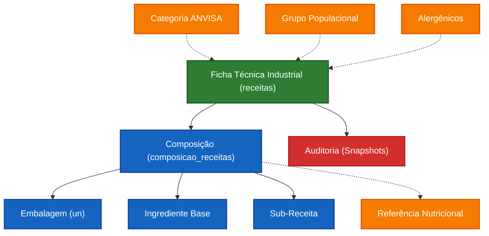

# Domínio: Indústria - Fichas Técnicas (Rotulagem GxP)

Este documento especifica a arquitetura, regras de negócio e infraestrutura do módulo de **Fichas Técnicas (Indústria)**. Ele atua de forma complementar e simbiótica ao [Módulo de Ingredientes](../ingredientes/INGREDIENTES.md), centralizando a inteligência de precificação base, cálculo nutricional regulatório (RDC 429) e roteamento de sub-receitas para fins de rotulagem.

---

## 1. Visão Geral e Topologia de Conceitos

No ecossistema do Food Service, o conceito de "Ficha Técnica" se ramifica em duas frentes atuando em bases isoladas. Este documento aborda a Ficha Técnica Industrial.

| Entidade                               | Meta-Tipo      | Descrição Regulatória e Sistêmica                                                                                                                                                                                                                                            |
| -------------------------------------- | -------------- | ---------------------------------------------------------------------------------------------------------------------------------------------------------------------------------------------------------------------------------------------------------------------------- |
| **Módulo Industrial (`receitas`)**     | `Entity`       | Receituário desenhado com foco estrito em **Rotulagem Nutricional**, Lupa Frontal (IN 75), Alergênicos e vida de prateleira (Auditoria GxP). Lida tanto com Sólidos quanto Líquidos, mapeando peso e densidade final para gerar Informação Nutricional em gramaturas legais. |
| **Módulo UAN (`fichas_tecnicas_uan`)** | `Entity`       | *Divergência Arquitetural*. Esse módulo orbita em volta do Controle de Custo de Refeição Diária, focando nos per capitas e planejamento do mapa térmico do refeitório corporativo/hospitalar, mas não emite Tabela Nutricional ao consumidor final. *Não coberto aqui*.      |
| **Composição (Insumos)**               | `Value Object` | Relação NxN entre a receita raiz e elementos atômicos do banco (`ingredientes`). Sofre os impactos físicos de *Fator de Correção* (perda bruta de limpeza) e *Índice de Cocção* (perdas ou ganhos hídricos no cozimento).                                                    |
| **Material / Embalagem**               | `Value Object` | Agregador estrito em custo físico e rastreio. Insumos não-comestíveis, fixados no sistema e calculados apenas por unidade monetária, blindando o volume da embalagem na nutrição.                                                                                            |

---

## 2. Mapa Estrutural (Grafo de Domínio e Relacionamentos)

A Ficha Técnica é um nó de intersecção massivo no sistema, sugando dados atômicos de tabelas de Master Data e tabelas auxiliares da ANVISA.



---

## 3. Comportamento Sistêmico e Regras de Negócio (Policies)

A infraestrutura de cálculo e renderização responde a pesadas políticas logísticas.

### 3.1. Recursividade em Árvore de Receitas
Uma Ficha pode portar *N* outras "Sub-Receitas" (ex: Ficha `Bolo Mestre` incorpora Ficha `Recheio Doce de Leite`).
- **Comportamento Mágico**: O sistema "achata" (flat) as receitas filhas até sua unidade atômica (ingredientes). Multiplica proporcionalmente a participação do `Recheio` dentro do `Bolo`, calculando a nova contribuição hídrica e matemática para que macros e custos fiquem precisos no nodo pai. Todo o rastreio alergênico se propaga hierarquicamente para cima.

### 3.2. Motor de Cálculo Edge (Deno)
O coração nutricional (`supabase/functions/calcular-nutrientes`) orbita na Edge Network para evitar engasgos do cliente.
- **Prevenção de N+1 Queries (Batching):** O motor varre e sumariza todos os `item_id` das composições e solicita ao banco de dados um *fetch array* amplo de uma vez só (`WHERE id IN (...)`). 
- **Decaimento e Sobrescrita (Override):** Qual tabela (TACO/IBGE/Fornecedor) determina os macros daquele elemento?
  1. Se a interface mandar o `referencia_id` associado na linha do item (ex: Fritou um alimento que é originalmente assado), os macronutrientes serão **sobrescritos** usando o id estipulado da Ficha.
  2. Fallback: Caso ausente, utiliza-se a Referência/Lógica originada passivamente pelo Ingrediente Base no estoque.

### 3.3. Configuração Regulatória e Lupa Frontal
- A inteligência das Tabelas, Categorias, IN 75 e disparo de Lupas FoP migrou integralmente para seu próprio universo legislativo.
- 🔗 **Consulte a especificação arquitetônica completa em:** [Legislação ANVISA: Rotulagem RDC 429 / IN 75](../legislacao/ROTULAGEM_RDC_ANVISA.md)

### 3.4. Mecânica de Alergênicos e Contaminação
Dividiu-se a gestão de Alergênicos em Áreas Primárias e Secundárias:
- **Alergênicos da Composição (Nativos)**: Adquiridos de forma "invisível" pelas árvores dos Insumos.
- **Risco Cruzado (Secundário)**: Lançados na 'Aba Riscos' manualmente. A *Policy* inibe duplicidade: Um risco não pode ser declarado se ele *já faz parte do preparo endógeno* nativamente. Prevenindo o sistema de exibir "Alérgicos: Contém Leite, Pode conter: Leite".

### 3.5. A Régua Restrita de Embalagens
A "Aba Embalagens" blinda o usuário de imputações químicas acidentais:
- É alimentada estritamente pela origem `materiais`, com filtro estrito de `tipo_material === 'EMBALAGEM'`.
- Subtrai a necessidade da variável "Volumétrica"; a interface padroniza a unidade permanentemente para `un` (Unidades), de modo que seu custo contribui *unicamente para a variável financeira*, passando em branco perante a Deno Edge de cálculos.

---

## 4. Gestão de Custos (Precificação Base)

As modelagens matemática lidam com as bases logísticas de custo do usuário sobre o estoque. O custo flui baseado nos `Preço Última Compra`.

**Lógica de Atribuição (Custo Global da Ficha)**:
```text
(Peso Líquido do Insumo na Ficha / Peso Unitário Comprado no Estoque) * Preço Mestre do Insumo Original
```
*   *Ex*: Manteiga cadastrada à R$40/kilo (1000g). A receita consome 250g Líquidos. `(250 / 1000) * 40 = R$10`. 
*   **Embalagens:** Tratadas cruamente apenas pela multiplicação quantitativa. `(2 Unidades usadas * Preço de Custo)`.

---

## 5. Auditoria e Snapshot Histórico (Imutabilidade)

Todas as edições orbitam em torno do regime GxP (Good Manufacturing Practice), necessitando assinatura de rastreabilidade. O sistema prevê salvamentos por versões (1.0, 1.1, 2.0).

### 5.1. Mecânica de Snapshot Deep Copy
A tabela auxiliar `receitas_snapshots` é acionada toda vez que se emite a aprovação. Seu campo `snapshot` de tipo `JSONB` tira uma fotografia exata da Receita + Items de Composição + Estado exato da Tabela Matemática no segundo exato em que a ficha for assinada.

### 5.2. Bloqueio de Aprovação Fantasma
O componente *`<ReceitaHeader />`* orquestra a mitigação de entulho no banco de dados. Verifica recursivamente o estado do rascunho. Se as propiciações (macros e strings base) do payload exatificarem os dados do último `snapshot`, o botão de auditar desativa, bloqueando salves passivos desnecessários.

---

## 6. Arquitetura Frontend / Componentização

Visando a reusabilidade e blindagem temporal do código em NextJS, as funções concentram-se divididos na Ficha Técnica.

- **`app/receitas/[id]/page.tsx`:** Container Mestre Padrão. Trabalha unicamente como "Fetcher" Global e despachador de propriedades. Passa os Contexts vitais (Se é leitura de Snapshot Visual ou Versão Base Rascunhada).
- **Componentes Agregados (`/components/receitas/`)**:
    - `<ReceitaHeader />`: Controle visual do Estado e controle do Modal de Versões (Assinatura Eletrônica).
    - `<ComposicaoDisplayList />`: Lista visual, responsável por renderizar Chips informativos de Aditivos (`tipo === 'aditivo'`) e Tags Certificadas de Sobreposição via IBGE/TACO (Referenciais Override).
    - `<RotulagemTab /> | <GraficosNutricionaisTab />`: Receptores em Cascata (Dumb components). Apenas aguardam o output final do Motor Nutricional e dispõem a tabela sob conformidade da normativa RDC 429.
