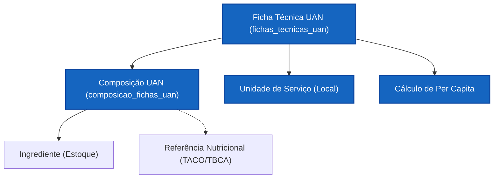

# Domínio: UAN - Fichas Técnicas (Operacional e Hospitalar)

Este documento especifica a arquitetura e as regras de negócio do módulo de **Fichas Técnicas para UAN (Unidade de Alimentação e Nutrição)**. Diferente do módulo Industrial, o foco aqui é a gestão de custos operacionais, planejamento de cardápios e controle de desperdício em larga escala.

---

## 1. Visão Geral (UAN vs. Indústria)

Enquanto o módulo Industrial foca na rotulagem GxP para venda ao consumidor, o módulo UAN foca no **consumo interno** e na eficiência do serviço de refeitórios e hospitais.

| Característica | Propósito na UAN |
| :--- | :--- |
| **Foco Principal** | Custo por refeição (Capitai) e planejamento logístico. |
| **Público Alvo** | Nutricionistas de produção e gestores de contrato (SLA). |
| **Unidade Base** | Prato Pronto / Guarnição / Refeição Completa. |
| **Principais Tabelas** | `fichas_tecnicas_uan` e `composicao_fichas_uan`. |

---

## 2. Mapa Estrutural do Domínio

---

## 3. Regras de Negócio e Lógicas de Produção

### 3.1. O Uso de Referências Nutricionais Locais
Diferente da Indústria, onde o ingrediente é "estático" para o rótulo, na UAN o nutricionista pode alterar a referência nutricional diretamente na composição da ficha:
- **Exemplo:** O ingrediente no estoque é "Arroz Polido Cru". Na ficha técnica de "Arroz Cozido", o nutricionista vincula a referência TACO de "Arroz Polido Cozido" para que o cálculo de nutrientes reflita o estado final do alimento no prato do paciente/cliente, sem precisar criar dois itens no estoque.

### 3.2. Fator de Correção (FC) e Índice de Cocção (IC)
- **Fator de Correção (Peso Bruto / Peso Líquido):** Utilizado para calcular a compra necessária considerando as perdas (cascas, sementes, talos).
- **Índice de Cocção (Peso Cozido / Peso Líquido):** Essencial para o cálculo de rendimento da panela e planejamento de quantas porções serão servidas no balcão.

### 3.3. Planejamento de Custo Per Capita
O sistema calcula o custo exato de cada porção servida:
- `Custo do Ingrediente * Peso Bruto (Per Capita)`.
- Isso permite ao gestor saber exatamente quanto custa servir 100g de proteína no buffet.

---

## 4. Integração com o Ecossistema

- **Estoque:** As fichas de UAN baixam estoque (via Ordem de Produção) baseadas no Peso Bruto.
- **Cardápios:** O módulo de cardápio consome as Fichas de UAN para montar a "Escala de Serviço" semanal.
- **Ingredientes:** Consome a Master Data centralizada em `docs/ingredientes/INGREDIENTES.md`.

---

## 5. Referências e Normativas

A base de conhecimento para este manual e as lógicas de cálculo seguem as diretrizes contidas em:
- `_knowledge/estoque/`: Padrões de movimentação e perdas.
- `_knowledge/boas_praticas/`: Higienização e Manipulação (impacto no FC).
