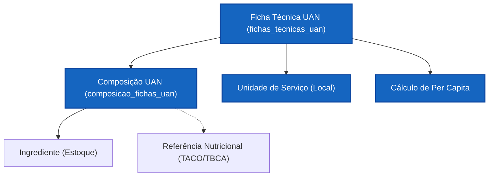

# Fichas Técnicas — UAN (Operacional e Hospitalar)

Este documento especifica a arquitetura e as regras de negócio do módulo de **Fichas Técnicas para UAN (Unidade de Alimentação e Nutrição)**. O foco é a gestão de custos operacionais, planejamento de cardápios e controle de desperdício em larga escala.

> **Nota:** Este módulo é **paralelo** ao `fichas_tecnicas_industrial`, não dependente. Ambos consomem [[ingredientes]], mas servem propósitos distintos: UAN = operação interna; Industrial = rotulagem para consumidor.

---

## 1. Visão Geral (UAN vs. Indústria)

| Característica | Propósito na UAN |
|---|---|
| **Foco Principal** | Custo por refeição (Per Capita) e planejamento logístico. |
| **Público Alvo** | Nutricionistas de produção e gestores de contrato (SLA). |
| **Unidade Base** | Prato Pronto / Guarnição / Refeição Completa. |
| **Principais Tabelas** | `fichas_tecnicas_uan` e `composicao_fichas_uan`. |

---

## 2. Mapa Estrutural do Domínio



---

## 3. Regras de Negócio

### 3.1. Referências Nutricionais Locais (Override)

Diferente da Indústria, onde o ingrediente é "estático" para o rótulo, na UAN o nutricionista pode alterar a referência nutricional diretamente na composição:

> **Exemplo:** O ingrediente no estoque é "Arroz Polido Cru". Na ficha de "Arroz Cozido", vincula-se a referência TACO de "Arroz Polido Cozido" para refletir o estado final no prato do paciente.

### 3.2. Fator de Correção (FC) e Índice de Cocção (IC)

- **FC = Peso Bruto / Peso Líquido** — Calcula compra necessária considerando perdas (cascas, sementes, talos).
- **IC = Peso Cozido / Peso Líquido** — Rendimento da panela, planejamento de porções servidas.

### 3.3. Custo Per Capita

```text
Custo Porção = Custo do Ingrediente × Peso Bruto (Per Capita)
```

Permite ao gestor saber exatamente quanto custa servir 100g de proteína no buffet.

---

## 4. Integração com o Ecossistema

- **Estoque:** Fichas UAN baixam estoque (via Ordem de Produção) baseadas no Peso Bruto.
- **Cardápios:** O módulo de cardápio consome as Fichas UAN para montar a "Escala de Serviço" semanal.
- **Ingredientes:** Consome a Master Data centralizada em [[ingredientes]].

---

## 5. Legislação Aplicável

A UAN **não gera rótulos** para o consumidor final, portanto a RDC 429/IN 75 (tabela nutricional obrigatória) **não se aplica** a este módulo.

| Tema | Referência | Observação |
|------|-----------|------------|
| Boas Práticas de Manipulação | RDC 216/2004 | Controle de higiene e processos |
| Rotulagem (apenas se comercializar) | RDC 429/2020 | Só se aplica se o alimento for vendido embalado ao consumidor |
