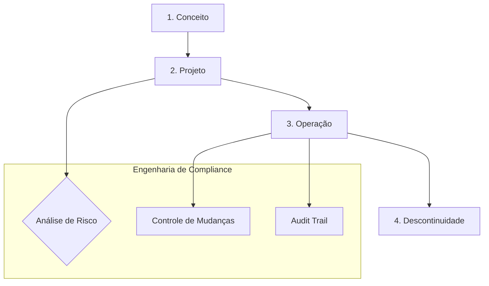
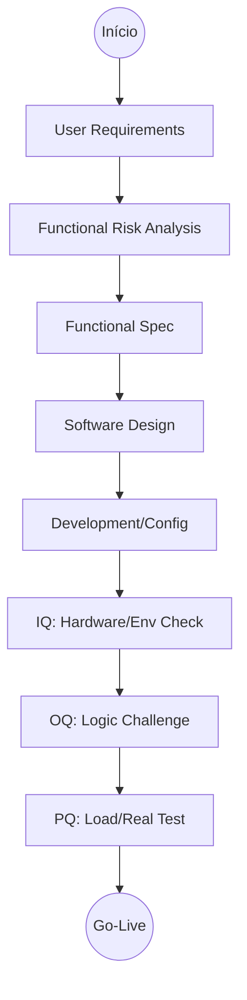
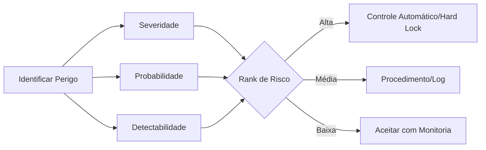

# Guia de Validação de Sistemas (Engenharia-First)

Este documento traduz o [[legislacao/fontes/Guia_Validacao_Sistemas_ANVISA_Original|Guia da ANVISA 2010]] em requisitos técnicos e fluxos de decisão para a engenharia do **SaaS Food Service**.

---

## 1. Matriz de Criticidade (Impacto BPx)

Todo novo módulo ou sistema integrado deve ser avaliado. Se **qualquer** resposta for **SIM**, o módulo entra em escopo de validação GxP.

| Critério de Avaliação | Impacto | Requisito Técnico |
| :--- | :--- | :--- |
| Armazena dados de rastreabilidade de produtos? | Crítico | Audit Trail Ativo |
| Gerencia cálculos nutricionais ou rotulagem (RDC 429)? | Crítico | Testes de Unidade GxP |
| Controla estoque por lotes e validades (FEFO)? | Crítico | Lock de Transação |
| Gerencia assinaturas eletrônicas (Receitas/OPs)? | Crítico | 21 CFR Part 11 |
| Interage com Hardware IoT (Impressoras)? | Crítico | Qualif. Instalação (QI) |

---

## 2. Ciclo de Vida do Sistema (SDLC)

Seguimos a abordagem sistemática orientada a risco.

---

## 3. Estratégia de Validação (Fluxos Mermaid)

### 3.1. Sistemas Novos (Greenfield)
Foco na Qualificação de Desenho (QD) e nos protocolos formais.

### 3.2. Sistemas Legados / Módulos Existentes
Para módulos legados, utilizamos a validação retrospectiva baseada em histórico de operação e análise de gap.

---

## 4. Gestão de Risco & Mitigação

A lógica de mitigação deve ser aplicada em cada deploy crítico.

---

## 5. Requisitos de Qualificação (QI, QO, QD)

| Tipo | O que validar no SaaS | Ferramentas |
| :--- | :--- | :--- |
| **QI (Instalação)** | Variáveis de ambiente, Permissões do Bucket, Conexão DB. | Terraform, CI/CD Check |
| **QO (Operação)** | Rotas de API, Middlewares de Auth, Limites de Campo. | Vitest, Postman |
| **QD (Desempenho)** | Stress test de geração de PDF, Concorrência em OPs. | K6, Stress Testing |

---

## 6. Operações GxP (Audit Trail & Segurança)

### 6.1. Registros Eletrônicos (21 CFR Part 11)
- **Não Repúdio:** Toda ação deve ser vinculada a um `user_id` único via JWT.
- **Audit Trail (Imutável):** Logs armazenados em tabelas de auditoria que só permitem `INSERT`.
- **Soft Delete:** Obrigatório. Nunca use `DELETE`. Use `deleted_at`.

### 6.2. Backup e Disaster Recovery (DR)
- **Frequência:** Diária (Automática via Supabase).
- **Teste de Restore:** Realizar simulação de recuperação a cada 6 meses.
- **Isolamento:** Backups devem ser armazenados em região geográfica distinta da produção.

---

## 7. Tratamento de Desvios
Qualquer erro em cálculo nutricional ou falha em trava de segurança deve ser tratado como um **Desvio GxP**:
1. **Registro:** Logar a exceção com contexto completo.
2. **Avaliação:** Impacto na segurança alimentar.
3. **Ação:** Patch imediato ou Rollback.

---

## 8. Categorização de Software (Framework GAMP)

| Categoria | Descrição | Exemplo | Protocolo |
| :--- | :--- | :--- | :--- |
| **Cat 1** | Infra | PostgreSQL / Next.js | Patch Management |
| **Cat 3** | Off-the-shelf | Bibliotecas MUI | Verificação de Instalação |
| **Cat 4** | Configurado | Workflows Supabase | Config. Record |
| **Cat 5** | Customizado | Lógica de Alergênicos | Validação Full |

---
*Documento consolidado para conformidade ANVISA/GxP. Última revisão: 2026-04-16.*
