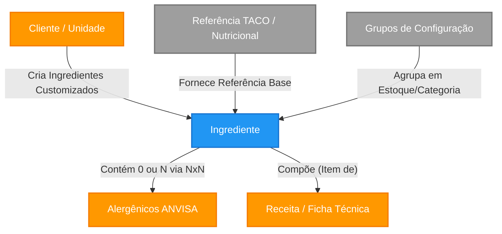

# Ingredientes e Matérias-Primas

Este documento é a **Fonte Canônica** do módulo de Ingredientes. Unifica regras de negócio, modelo de dados, interface do usuário e implementação técnica em um único local de referência.

---

## 1. Topologia de Conceitos (Taxonomia)

No contexto do sistema alimentar, o ingrediente não é apenas um "nome". É uma base científica (nutricional) e um nó de grafo logístico (compras e estoque).

| Entidade | Meta-Tipo | Descrição Regulatória e Sistêmica |
|----------|-----------|-----------------------------------|
| **Ingrediente** | `Entity` | Representa qualquer insumo primário, composto ou aditivo utilizado em uma receita. Possui identidade única, rastreabilidade nutricional (macros e micronutrientes) e taxonomia sanitária (Alergênicos). |
| **Grupo e Subgrupos de Ingredientes** | `Entity` | Classificação hierárquica (ex: Grupo Maior "Farinhas" -> Subgrupo "Farinha de Milho"). Pode possuir `categoria_id` estabelecendo aninhamento lógico para relatórios e inventários. |
| **Alergênico** | `Value Object` | Uma propriedade inerente ao ingrediente, vinculada à ANVISA. Um ingrediente pode conter "zero ou N" alergênicos. |
| **Tabelas de Base Genérica (TACO/TBCA)** | `Value Object/Source` | Fontes de dados oficiais do governo (IBGE/USP). Fornecem a química alimentar exata do insumo quando não há uma especificação exata de marca. |
| **Informação de Fornecedor (Manual)** | `Manual Input` | Tipagem originada de Rótulos Customizados. Quando o cliente compra um produto específico, ele ignora a tabela genérica TACO e digita manualmente a informação contida na embalagem daquele lote/marca. |

---

## 2. Mapa Estrutural (Grafo do Domínio)

Como o módulo de Ingredientes se conecta com as engrenagens ao redor no sistema.

### Relacionamentos no Banco de Dados (Foreign Keys)

**A. Tabelas que o Ingrediente Aponta:**
- `clientes` via campo `cliente_id`: Identifica o dono do insumo (Tenant).
- `ingredientes_grupos` via campos `grupo_estoque_id` e `categoria_produto_id`: Configuração estrutural do cliente para o estoque.
- `referencias_nutricionais` via campos `referencia_id` e `referencia_nutricional_id`: Aponta para as tabelas matriciais governamentais (TACO/IBGE).

**B. Tabelas que Apontam para o Ingrediente (Reverse References):**
- `composicao_fichas_uan` / `composicao_receitas`: Usam o `ingrediente_id` para formar Fichas Técnicas.
- `ingrediente_alergenicos`: Tabela pivô que une o ingrediente ao `anvisa_alergenicos_id`.
- `uan_cardapio_insumos_config`: Mapeia o insumo no controle de margem de erro do Cardápio UAN.

---

## 3. Regras de Negócio (Policies)

### 3.1. Origem da Informação e Isolamento (Multi-Tenant)

**A. Isolamento Sistêmico (Quem Vê O Quê):**
1. **Ingrediente de Sistema**: Campo `cliente_id` é `NULL`. Visível para todos, porém *Read-Only*. Apenas Super Admins gerenciam.
2. **Ingrediente Customizado (Tenant)**: Campo `cliente_id` atrelado ao Tenant. Apenas o próprio cliente vê e edita.

**B. Origem da Tabela Nutricional:**
1. **Fontes Oficiais (TACO / TBCA)**: Insumo puro → dados de `referencias_nutricionais`. Imutável.
2. **Declaração do Fornecedor**: Insumo de marca → digitação manual do rótulo. Usado para todo motor matemático.

> **Expressão Formal da Regra de Busca:**
> `(cliente_id == {tenantAtual}) OR (cliente_id IS NULL)`

### 3.2. Classificação de Tipo (Enum `TipoIngrediente`)

| Valor | Descrição | Impacto na Rotulagem |
|-------|-----------|---------------------|
| `SIMPLES` | Insumo in natura ou minimamente processado (ex: Milho, Farinha) | Nome aparece diretamente na lista de ingredientes. Se transgênico, recebe sufixo com espécie doadora. |
| `COMPOSTO` | Produto industrializado com lista própria de ingredientes (ex: Chocolate Meio Amargo) | Lista de ingredientes do fornecedor (`declaracao_ingredientes_fornecedor`) é inserida entre parênteses. Transgenia NÃO altera o nome (info já vem na lista do fornecedor). |
| `ADITIVO` | Substância com função tecnológica (ex: Lecitina de Soja) | Declarado como "Função Tecnológica (Nome/INS)". Transgenia não se aplica — campo é limpo automaticamente ao salvar. |

### 3.3. Lifecycle e Estados de Completude

Marcado como **Incompleto** se o macro determinante estiver ausente:
`SE (energia_kcal IS NULL OR undefined) ENTÃO estado = INCOMPLETO`

Previne que ingredientes sem rótulos preenchidos arruínem as somas das Fichas Técnicas.

### 3.4. Configuração de Grupos e Subgrupos

O campo `ingredientes_grupos` aceita estruturas aninhadas via `categoria_id`, permitindo macro categorias (Farinhas) e derivados (Farinha de Trigo Nacional).

### 3.5. Estratégia de Omissão de Lactose

> **Regra (Segurança Sanitária):** Se um ingrediente possui o alérgeno "Leite" selecionado, mas `lactose_g` estiver nulo, o motor de cálculo dispara obrigatoriamente **"CONTÉM LACTOSE"**.
> 
> **Legislação:** [[RDC_727_2022]] Art. 18 e 19.

### 3.6. Lógica de Transgênicos (GMO)

A conformidade com o [[Decreto_4680_2003]] é implementada de forma **contextual por tipo de ingrediente**:

| Tipo | Comportamento ao Salvar | Comportamento no Rótulo |
|------|-------------------------|------------------------|
| `SIMPLES` | Campos `is_transgenico`, `especie_transgenica`, `especie_doadora`, `transgenicos[]` são persistidos. | Nome recebe sufixo: `"milho transgênico (doador: Bacillus thuringiensis)"`. Ícone T e aviso "CONTÉM MILHO TRANSGÊNICO(S)." são gerados. |
| `COMPOSTO` | Campos são persistidos, mas a edição na lista de ingredientes é **bloqueada**. | A info já está na `declaracao_ingredientes_fornecedor`. Sistema gera apenas ícone T e aviso obrigatório. |
| `ADITIVO` | Ao salvar, todos os campos GMO são **limpos automaticamente** (`is_transgenico=false`, `transgenicos=[]`, campos nulificados). | Nenhuma referência a transgênico é gerada. |

### 3.7. Soft Delete (Exclusão Rastreável)

Nenhuma matéria-prima é excluída com `DELETE`. O sistema aplica `deleted_at = NOW()`. As listagens filtram por `deleted_at IS NULL`.

---

## 4. Dicionário de Dados

### A. Metadados Essenciais

| Campo | Tipo | Obrigatoriedade | Descrição |
|-------|------|-----------------|-----------| 
| `id` | UUID | Sim | Chave primária. |
| `nome` | String | Sim | Nome comum descritivo do insumo. |
| `cliente_id` | UUID | Não | Se existir, é ingrediente privado do cliente. Se nulo, é do Sistema. |
| `tipo_ingrediente` | Enum | Sim | `SIMPLES`, `COMPOSTO` ou `ADITIVO`. |
| `is_transgenico` | Boolean | Não | Sinaliza transgenia (Alerta T na Rotulagem). |
| `especie_transgenica` | String | Não | Nome da espécie transgênica (ex: "Milho"). |
| `especie_doadora` | String | Não | Organismo doador do gene (ex: "Bacillus thuringiensis"). |
| `transgenicos` | JSONB[] | Não | Array de objetos `{especie, doador}` para múltiplos transgênicos. |
| `declaracao_ingredientes_fornecedor` | String | Não | Lista string de ingredientes quando `COMPOSTO`. |
| `alergenicos_ids` | Array[Int] | Não | Array referenciando IDs de `anvisa_alergenicos`. |

### B. Matriz Nutricional Base (por 100g/100ml)

- `energia_kcal` (Decimal) — Caloria total. Campo crítico para "Completude".
- `carboidrato_g`, `proteina_g` (Decimal)
- `lipideos_g`, `gordura_saturada_g`, `gordura_trans_g` (Decimal)
- `fibra_alimentar_g` (Decimal)
- `sodio_mg` (Decimal — **miligramas**)

### C. Nutrientes Secundários (Lupa ANVISA)

> 🔗 Para regras de disparo da Lupa: [[RDC_429_2020_IN_75_2020]]

- `acucar_adicionado_g` / `acucar_total_g`
- Vitaminas: `vitamina_a_mcg`, `vitamina_c_mg`, `vitamina_d_mcg`, etc.
- Minerais: `ferro_mg`, `calcio_mg`, `zinco_mg`
- Polióis: `xilitol_g`, `eritritol_g`, `maltitol_g`

---

## 5. Interface do Usuário (Frontend)

### 5.1. Listagem de Ingredientes (`app/ingredientes/page.tsx`)

- **Filtro Mestre:** `(cliente_id == tenant) OR (cliente_id IS NULL)`
- **Busca:** Por nome, com debounce de 300ms
- **Indicadores Visuais:** Chips para "Incompleto", "Transgênico", "Sistema"
- **Ações:** Criar novo, editar, visualizar, soft-delete

### 5.2. Editor de Ingredientes (`app/ingredientes/[id]/editar/page.tsx`)

O formulário opera em **seções colapsáveis**:

1. **Dados Básicos:** Nome, Tipo (`SIMPLES`/`COMPOSTO`/`ADITIVO`), Grupo de Estoque
2. **Informação Nutricional:** Macros e micros (per 100g). Fonte: TACO ou Manual
3. **Alergênicos:** Seleção múltipla via checkbox da tabela `anvisa_alergenicos`
4. **Transgênicos:** Condicional — só aparece se `tipo_ingrediente !== 'ADITIVO'`
5. **Fornecedor:** Se `COMPOSTO`, campo `declaracao_ingredientes_fornecedor` habilitado

**Lógica `handleSalvar` (Invariantes de Salvamento):**
- Se `tipo_ingrediente === 'ADITIVO'`: limpa todos os campos GMO.
- Se `is_transgenico === false`: nulifica `especie_transgenica`, `especie_doadora`, define `transgenicos = []`.
- `transgenicos` é **sempre** enviado como Array (nunca `0`, `null` ou `undefined`).

### 5.3. Divisão Arquitetural (UAN vs Indústria)

O sistema possui **dois motores de fichas técnicas**:

| Motor | Tabelas | Foco |
|-------|---------|------|
| **UAN** | `fichas_tecnicas_uan`, `composicao_fichas_uan` | Custo de refeição, per capitas, planejamento hospitalar. Detalhes em [[fichas_tecnicas_uan]]. |
| **Indústria** | `receitas`, `composicao_receitas` | Rotulagem GxP, Lupa ANVISA, validade. Detalhes em [[fichas_tecnicas_industrial]]. |

Ambos consomem ingredientes de `ingredientes`, mas possuem campo `referencia_id` na composição para sobrescrever dados nutricionais (ex: ingrediente "cru" vs "frito") sem alterar o cadastro base.

---

## 6. Legislação Aplicável

| Tema | Spec de Engenharia | Fonte Original |
|------|-------------------|----------------|
| Alergênicos, Lactose, Regras Gerais | [[RDC_727_2022]] | [[RDC_727_Original]] |
| Transgênicos (Selo T) | [[Decreto_4680_2003]] | [[Decreto_4680_Original]] |
| Tabela Nutricional e Lupa | [[RDC_429_2020_IN_75_2020]] | [[RDC_429_IN75_Original]] |
| Glúten | [[Lei_10674_2003]] | [[Lei_10674_Original]] |

---

## 7. Hub de Conformidade

🔗 Para a orquestração completa de todas as legislações: [[CONFORMIDADE_ROTULAGEM_MESTRE]]
