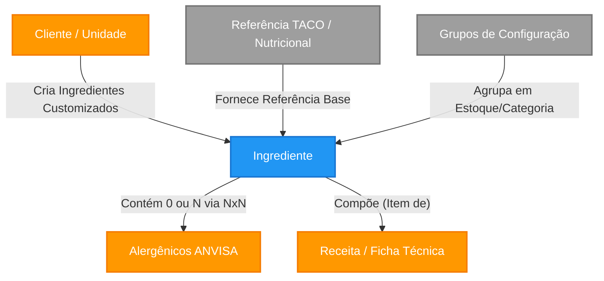

# Domínio: Ingredientes e Matérias-Primas

Este documento especifica a infraestrutura abstrata e as regras de negócio do módulo de **Ingredientes** do sistema. Ele serve como a "Única Fonte de Verdade" para agentes de desenvolvimento, IA e engenheiros ao construírem ou modificarem funcionalidades atreladas a propriedades nutricionais ou cadeia de suprimentos de UANs.

---

## 1. Topologia de Conceitos (Taxonomia)

No contexto do sistema alimentar, o ingrediente não é apenas um "nome". É uma base científica (nutricional) e um nó de grafo logístico (compras e estoque).

| Entidade | Meta-Tipo | Descrição Regulatória e Sistêmica |
|----------|-----------|-----------------------------------|
| **Ingrediente** | `Entity` | Representa qualquer insumo primário ou composto utilizado em uma receita. Possui identidade única, rastreabilidade nutricional (macros e micronutrientes) e taxonomia sanitária (Alergênicos). |
| **Grupo e Subgrupos de Ingredientes** | `Entity` | Classificação hierárquica (ex: Grupo Maior "Farinhas" -> Subgrupo "Farinha de Milho"). Pode possuir `categoria_id` estabelecendo aninhamento lógico para relatórios e inventários. |
| **Alergênico** | `Value Object` | Uma propriedade inerente ao ingrediente, vinculada à ANVISA. Um ingrediente pode conter "zero ou N" alergênicos. |
| **Tabelas de Base Genérica (TACO/TBCA)** | `Value Object/Source` | Fontes de dados oficiais do governo (IBGE/USP). Fornecem a química alimentar exata do insumo quando não há uma especificação exata de marca. |
| **Informação de Fornecedor (Manual)** | `Manual Input` | Tipagem originada de Rótulos Customizados. Quando o cliente compra um produto específico, ele ignora a tabela genérica TACO e digita manualmente a informação contida na embalagem daquele lote/marca. |

---

## 2. Mapa Estrutural (Grafo do Domínio e Relacionamentos no Banco)

Como o módulo de "Ingredientes" se conecta com as engrenagens ao redor dele no sistema. Além do fluxo lógico de negócios ilustrado no grafo abaixo, a entidade de banco de dados `ingredientes` possui chaves estrangeiras (**Foreign Keys**) rigorosas.

### Relacionamentos Estritos no Banco de Dados (Foreign Keys)
Para queries e joins, `ingredientes` interage física e obrigatoriamente com:

**A. Tabelas que o Ingrediente Aponta (Foreign Keys de `ingredientes` para outras tabelas):**
- `clientes` via campo `cliente_id`: Identifica o dono do insumo (Tenant).
- `ingredientes_grupos` via campos `grupo_estoque_id` e `categoria_produto_id`: Configuração estrutural do cliente para o estoque.
- `referencias_nutricionais` via campos `referencia_id` e `referencia_nutricional_id`: Aponta para as tabelas matriciais governamentais (TACO/IBGE).

**B. Tabelas que Apontam para o Ingrediente (Reverse References NxN ou Filhos):**
- `composicao_fichas_uan` / `composicao_receitas`: Usam o `ingrediente_id` para formar Fichas Técnicas (Receituário).
- `ingrediente_alergenicos`: Tabela pivô que une o ingrediente ao `anvisa_alergenicos_id`.
- `uan_cardapio_insumos_config`: Mapeia o insumo no controle de margem de erro do Cardápio UAN.

## 3. Comportamento e Regras de Negócio (Policies)

A criação, listagem e manipulação de ingredientes obedecem estritas *Policies* (Políticas) de locação (Multi-Tenancy) devido ao RLS do banco de dados e filtros de UI.

### 3.1. Origem da Informação e Isolamento (Multi-Tenant)
Um ingrediente possui duas esferas críticas de origem: A origem do **Dado** (Quem digitou) e a origem da **Tabela Nutricional** (A química).

**A. Isolamento Sistêmico (Quem Vê O Quê)**:
1. **Ingrediente de Sistema**: 
   - **Regra**: Campo `cliente_id` é rigorosamente `NULL`.
   - **Limites**: Visível para todos os clientes, porém *Read-Only*. Apenas Super Admins gerenciam.
2. **Ingrediente Customizado (Tenant Próprio)**: 
   - **Regra**: Campo `cliente_id` atrelado ao Tenant. Apenas o próprio cliente vê e pode editar as propriedades e vincular as compras.

**B. Origem da Tabela Nutricional (Triagem Analítica)**:
As especificações (energia, carboidratos, sódio) de um Insumo podem derivar de três formas documentadas:
1. **Fontes Oficiais (TACO / TBCA)**: Se a receita usa um insumo puro (Ex: Arroz Branco Cru), o usuário pode atrelar/copiar os dados de uma Tabela Governamental (presente em `referencias_nutricionais`). O dado matemático é imutável.
2. **Declaração do Fornecedor / Ficha Manual**: Se o restaurante compra um *blend* ou marca específica que desvia da TACO (Ex: Margarina Marca X), o usuário opta por **"Digitação Manual"**. Ele cria o ingrediente de Tenant (`cliente_id`) e preenche manualmente cada linha dos Macros e campo `declaracao_ingredientes_fornecedor` baseando-se no que ele leu no Rótulo da Caixa comprada. O sistema passa a usar esssa digitação para todo o motor matemático da Ficha Técnica.

> **Expressão Formal da Regra de Busca (Frontend):**
> O filtro de leitura mestre (`app/ingredientes/page.tsx`) opera como: `(cliente_id == {tenantAtual}) OR (cliente_id IS NULL)`.

### 3.2. Lifecycle e Estados de "Completude"
Os ingredientes carregam um estado dinâmico na Interface: **Cadastro Incompleto**.

- **Transição: "Completo" versus "Incompleto"**
  Marcado como **Incompleto** se o macro determinante estiver ausente:
  *Fórmula:* `SE (energia_kcal IS NULL OR undefined) ENTÃO estado = INCOMPLETO`.
  Isso previne que ingredientes originados via Fornecedor sem os rótulos preenchidos arruinem as somas das Fichas Técnicas GxP.

### 3.3. Configuração de Grupos e Sub-Grupos
Para facilitar o inventário (Compras) e elaboração do menu, ingredientes são aglutinados.
- O campo referenciado (`ingredientes_grupos`) aceita estruturas aninhadas, permitindo macro categorias (Farinhas) e derivados menores (`categoria_id` secundario = Farinha de Trigo Nacional). Tudo fluindo fisicamente pelos `foreign_keys` já ilustrados.

### 3.4. Soft Delete (Exclusão Rastreável)
Nenhuma matéria-prima é excluída do banco com comandos `DELETE`.
- Devido à natureza de *Auditabilidade* sistêmica, ao excluir um ingrediente, o sistema aplicará a data atual no campo `deleted_at`. As listagens oficiais e selects em ComboBox filtram por `deleted_at IS NULL`. Isso assegura que "Ordens de Produção" antigas não quebrem as referências.

---

## 4. Estratificação de Variáveis (Dicionário de Dados)

O Ingrediente possui uma tipagem monolítica contendo detalhes químicos da Tabela Numérica. Para melhor integração, este é o agrupamento funcional das variáveis de `lib/types.ts`:

### A. Metadados Essenciais
| Campo | Tipo | Obrigatoriedade | Descrição |
|-------|------|-----------------|-----------|
| `id` | UUID | Sim | Chave primária gerada via database. |
| `nome` | String | Sim | Nome comum descritivo do insumo. |
| `cliente_id` | UUID | Não | Se existir, indica que é receita/ingrediente privado do cliente. Se nulo, TACO System. |
| `tipo_ingrediente` | String | Sim | Enum: `SIMPLES` ou `COMPOSTO`. |
| `is_transgenico` | Boolean | Não | Sinaliza a presence de Transgenia (Alerta T na Rotulagem). |
| `declaracao_ingredientes_fornecedor` | String | Não | A lista string de ingredientes quando "Composto" (para rótulos repassados). |
| `alergenicos_ids` | Array[Int] | Não | Array referenciando IDs estáticos de alergênicos na tabela `anvisa_alergenicos`. |

### B. Matriz Nutricional Base (Tabela de Informação Nutricional)
Estes são os valores padronizados que constam no rótulo primário. Devem ser registrados baseando-se em `100g` do insumo sólido ou `100ml` líquido para consistência de conversão em Fichas Técnicas.

- `energia_kcal` (Decimal) : A caloria total (Crucial para "Completude").
- `carboidrato_g` (Decimal)
- `proteina_g` (Decimal)
- `lipideos_g` / `gordura_saturada_g` / `gordura_trans_g` (Decimais)
- `fibra_alimentar_g` (Decimal)
- `sodio_mg` (Decimal - Note a unidade: *Miligramas*)

### C. Nutrientes Secundários e Adicionados (Nova Frente Lupa Anvisa)
Estes minerais e adições sintéticas requerem preenchimento de acordo com a RDC para gerar a "LUPA" frontal de rótulos.
> 🔗 Para a aplicação visual e de negócio desses campos, leia: [Legislação ANVISA: Rotulagem RDC 429 / IN 75](../legislacao/ROTULAGEM_RDC_ANVISA.md).

- `acucar_adicionado_g` / `acucar_total_g`
- Micronutrientes vitamínicos (`vitamina_a_mcg`, `vitamina_c_mg`, `vitamina_d_mcg`, etc.)
- Minerais complexos (`ferro_mg`, `calcio_mg`, `zinco_mg`)
- Polióis (`xilitol_g`, `eritritol_g`, `maltitol_g`)

---

## 5. Divisão Arquitetural de Consumo (UAN versus Indústria)

O sistema hoje possui **dois motores de fichas técnicas** rodando em paralelo, cada um com um propósito de negócio distinto, o que justifica a separação de tabelas no ecossistema de uso dos Ingredientes.

### 5.1. Módulo UAN (Foco Logístico e Hospitalar)
- **Tabelas:** `fichas_tecnicas_uan` e `composicao_fichas_uan`
- **Foco:** Controle de custo de refeição ("prato base", "guarnição"), cálculo de perda (Fator de Correção) e planejamento diário para refeitórios corporativos e hospitais.
- **Relação Dinâmica de Nutrientes:** Na tabela `composicao_fichas_uan`, existe a Foreign Key `referencia_id`. Isso possibilita a exata regra de negócio que você propôs: *Você pode adicionar um ingrediente base na ficha, mas forçar o recálculo pontual usando o TBCA de um preparo diferente (ex: "Cozido", "Frito") diretamente na ficha sem alterar o cadastro do insumo base do estoque!*

### 5.2. Módulo Indústria (Foco em Rotulagem GxP)
- **Tabelas:** `receitas` e `composicao_receitas`
- **Foco:** Formulação de produtos fechados (envasados), geração de Tabela Lupa da ANVISA, peso de embalagem e validade de prateleira (Shelf-life). Aceita "sub-receitas" dentro da receita principal.
- **Relação Dinâmica de Nutrientes:** A tabela `composicao_receitas` possui o campo polimórfico (`item_id` e `item_type`) E AGORA possui o campo opcional `referencia_id`. Isso garante que a funcionalidade presente nas fichas UAN também atenda a Indústria. O chef pode trocar no modo preparo o estado físico do insumo em cada linha da receita.

### 5.3. Integração e Fluxo de Dados (Frontend & Edge Functions)
O frontend e o backend interagem para viabilizar as sobreposições dinâmicas (*Overrides*) de forma robusta e persistente:
- **Editor de Receitas/Fichas (`app/receitas/criar/page.tsx`)**: O preenchimento do campo `referencia_id` ocorre independentemente em cada linha da composição. O frontend garante que esse ID (`UUID` ou `null`) persista na transição entre o estado de edição da linha, a lista local e o payload enviado ao Supabase. O *State Management* do React mapeia ativamente strings vazias e `undefined` para um `null` explícito, respeitando a integridade referencial da base de dados.
- **Feedback Visual (UI)**: Ingredientes com referência vinculada exibem rapidamente um indicador visual (`Chip` informativo) na listagem da composição da ficha, oferecendo rastreabilidade em "bater de olhos" sem necessidade de reabertura da edição do insumo.
- **Componente em Nuvem (`Edge Function: calcular-nutrientes`)**: É o cérebro das tabelas. Ao processar os macros, se detecta a presença de um `referencia_id`, ele performa um "Overwriting" dos dados numéricos bases em benefício da referência designada (TACO/TBCA). Variáveis imutáveis de saúde sanitária, como 'Alergênicos' e 'Transgênicos', continuam sendo passadas avante a partir do ingrediente raiz da composição (Tabela `ingredientes`), evitando lapsos de segurança. O motor resolve divergências técnicas de nomenclatura mapeando as colunas em tempo de runtime.
