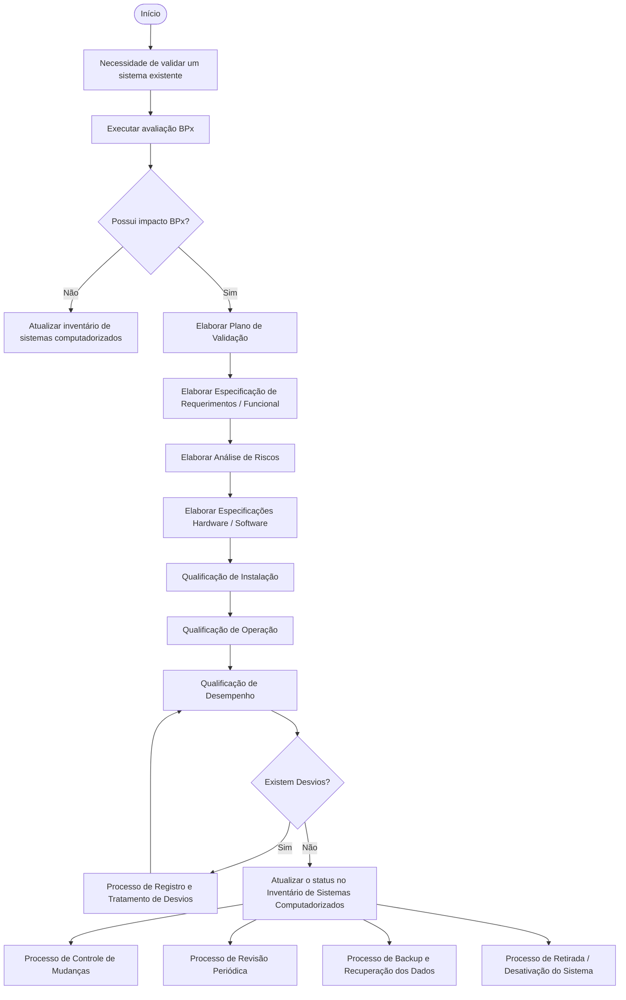
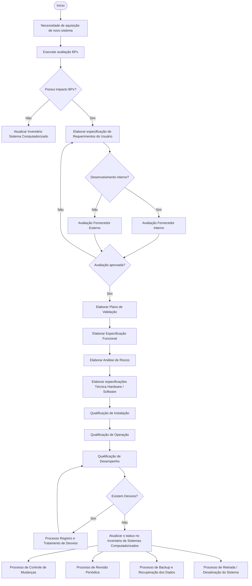
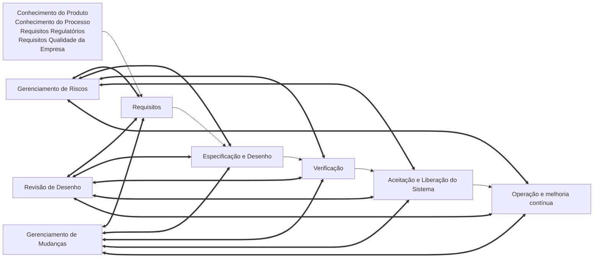
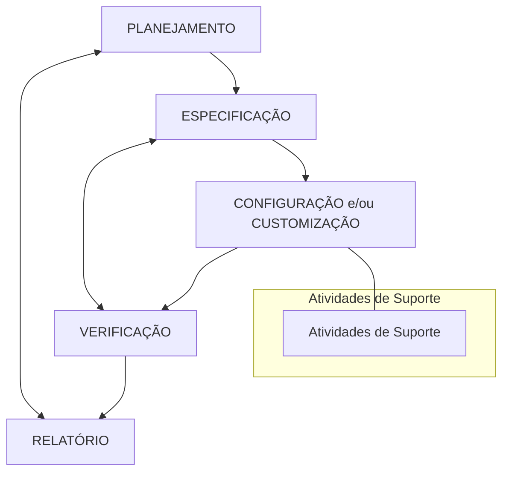
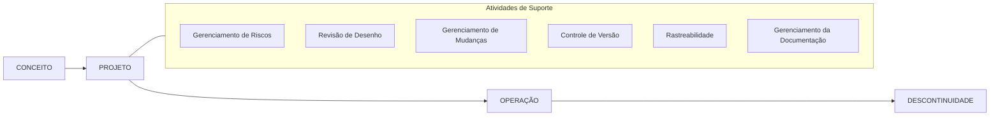
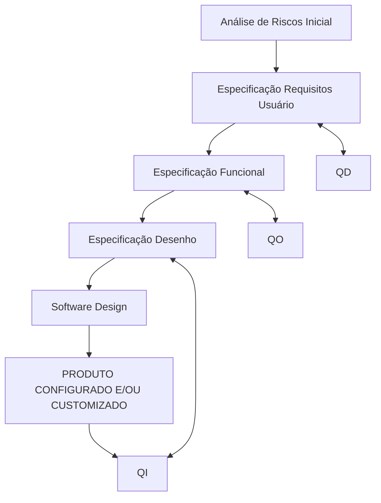
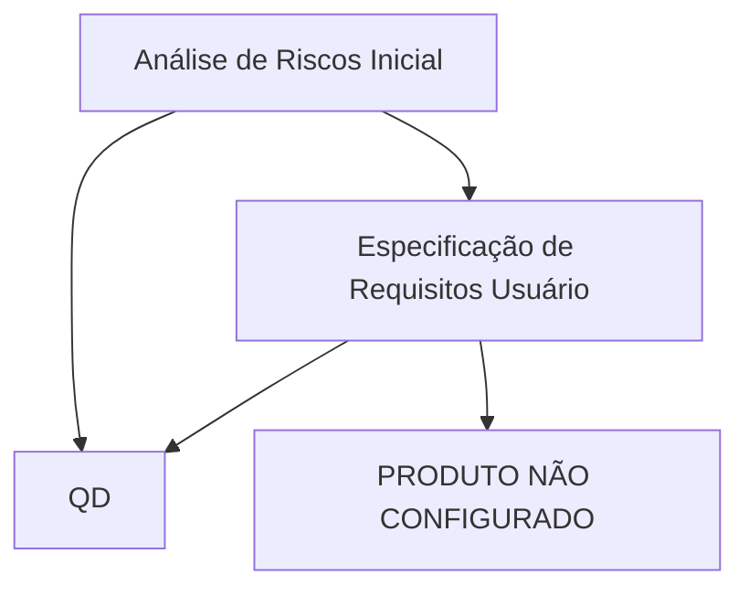

<!-- Página 1 -->
# AGÊNCIA NACIONAL DE VIGILÂNCIA SANITÁRIA

# GUIA DE VALIDAÇÃO DE SISTEMAS COMPUTADORIZADOS

**Brasília, Abril de 2010**

---

<!-- Página 2 -->
## Colaboradores

- Alessandra Tomazzini Bastos (ISPE- Brasil)
- Andre Tagliari (ISPE- Brasil)
- Camilo Mussi (ANVISA)
- Carlos César dos Santos (ANVISA)
- Edinaldo Fernando Ferreira (ISPE- Brasil)
- Ivan Amorim Sanchez (ISPE- Brasil)
- Jacqueline Condack Barcelos (ANVISA)
- Joselene Lima Ferreira Farias (ISPE- Brasil)
- Jozie Azevedo de Souza (ISPE- Brasil)
- Juan Sanchez Corriols (ISPE- Brasil)
- Kleber Costa (ISPE- Brasil)
- Lúcia Eichenberg Surita (ANVISA)
- Luiz Alberto dos Santos Lima (ISPE- Brasil)
- Marcia de Oliveira Fernandes (ANVISA)
- Mário Brenga Giampietro (ISPE- Brasil)
- Neriton Ribeiro de Souza (ANVISA)
- Rodrigo Alvarez (ISPE- Brasil)
- Rosimeire Pereira Alves da Cruz (ANVISA)
- Silvia Regina da Silva Martins (ISPE- Brasil)
- Svetlana Costa de Carvalho (ANVISA)
- Tatiana Ferreira Marques (ISPE- Brasil)
- Thais Mesquita de Couto Araújo (ANVISA)

---

<!-- Página 3 -->
## Índice

1. Introdução ....................................................................................................................................................... 6
1.1 Objetivo ................................................................................................................................................. 6
1.2 Abrangência .......................................................................................................................................... 6
2. Avaliação de Criticidade dos Sistemas Computadorizados ........................................................................... 7
3. Sistema Validável ........................................................................................................................................... 9
3.1 Avaliação da Possibilidade de um Sistema ser Validado ...................................................................... 9
4. Ciclo de Vida................................................................................................................................................. 15
4.1 Fases do Ciclo de Vida ........................................................................................................................ 17
4.2 Operação ............................................................................................................................................. 24
4.3 Descontinuidade .................................................................................................................................. 24
5. Inventário de Sistemas Computadorizados .................................................................................................. 25
6. Plano Mestre de Validação ........................................................................................................................... 26
7. Plano de Validação ........................................................................................................................................ 30
8. Gerenciamento de Risco ............................................................................................................................... 32

---

<!-- Página 6 -->
## 1. Introdução

Este guia foi elaborado para auxiliar no gerenciamento e validação de sistemas computadorizados que tenham impacto em BPx. A exatidão e a integridade dos registros de dados são essenciais para o ciclo de vida do produto, desde a área de pesquisa, passando por estudos pré-clínicos e clínicos, produção e controle de qualidade até a área de armazenamento e distribuição.

Este guia não deve ser adotado como regulamento, portanto, o seu cumprimento não é de caráter compulsório pelo setor regulado. Cada empresa deverá avaliar o conteúdo do guia e verificar sua aplicabilidade. A Vigilância Sanitária tampouco deverá exigir o cumprimento do conteúdo do guia por parte das empresas. A interpretação do conteúdo deste documento é de inteira responsabilidade das empresas que o utilizarem.

### 1.1 Objetivo
O objetivo do guia é descrever atividades e responsabilidades relacionadas à validação de sistemas computadorizados proporcionando a otimização das atividades envolvidas nesta atividade.

### 1.2 Abrangência
Este guia se aplica a sistemas computadorizados utilizados em empresas que executem atividades de fabricar insumos farmacêuticos e medicamentos observando o cumprimento do preconizado nas Boas Práticas de Fabricação e Boas Práticas de Laboratório. Este guia também pode ser aplicado a empresas distribuidoras de medicamentos e insumos farmacêuticos, no contexto das Boas Práticas de Distribuição.

A utilização de funções padrão dos sistemas é recomendável, uma vez que quanto maior o nível de customização, maiores serão os esforços de validação.

Nem todas as atividades definidas neste guia são aplicáveis a todos os tipos de sistemas computadorizados. A abordagem pode variar, de acordo com sua criticidade e complexidade. A decisão deve ser tomada pela empresa baseando-se no conhecimento dos riscos envolvidos na utilização de sistema computadorizados.

---

<!-- Página 7 -->
## 2. Avaliação de Criticidade dos Sistemas Computadorizados

A empresa deve possuir uma lista contendo todos os sistemas computadorizados instalados e suas respectivas avaliações de criticidade. A necessidade de validação deve ser estabelecida de acordo com os critérios abaixo.

Caso qualquer resposta às questões abaixo seja "SIM", o sistema deve ser validado por ter impacto em BPx.

- O sistema armazena dados que impliquem na rastreabilidade de produtos?
- O sistema gerencia:
    - a operação automatizada de equipamentos produtivos críticos ou de laboratórios individualmente (ex. compressoras, secadores de leito fluidizado, HPLC, dissolutores, etc.)?
    - a operação automatizada da geração de utilidades críticas (ex. água purificada, ar condicionado, ar puro, água para injetáveis, etc.)?
    - cadastramento de apresentações, dosagens, matérias primas, embalagens, potências, tamanho de lotes, etapas de produção, fórmulas mestras, etc.?
    - planejamento de Produção (ex. ordens de produção, números de lote, matérias primas, embalagens, etc.)?
    - processo de compras de materiais (ex. qualificação de fornecedores, controle de pedidos de fornecedores previamente qualificados, quantidades, potências, especificações, etc.)?
    - recebimento de materiais (ex. número de lotes, plano de amostragem, condições físicas, registro de avarias, etc.)?
    - armazenamento de materiais (ex. status, endereçamento, movimentações e transferências, recolhimentos, etc.)?
    - central de pesagem (ex. ordens de pesagem, potências, fracionamento, recipientes, balanças, etiquetas e lacres, resultados das pesagens, operadores, lotes de produtos, lotes de materiais, etc.)?
    - controle de produção (ex. ordens de fabricação, controles em processo, registros, operadores, materiais, números de lotes, equipamentos utilizados, sequências de utilização e operação, alarmes, amostras, etc.)?
    - serviço de atendimento ao cliente (ex. reclamações, ações, eventos adversos, etc.)?
    - documentação (ex. emissão, distribuição, revisão, controle de versões obsoletas, treinamento, etc.)?

<!-- Página 8 -->
    - sistemas de qualidade (ex. resultados fora de especificação, auto-inspeção, desvios, controle de mudanças, registros de resultados de análise de matéria prima, embalagem ou produtos, revisão periódica, etc.)?
    - programa de treinamento (ex. escopo, instrutores, listas de presença, certificados, etc.)?
    - equipamentos (ex. plano e execução de manutenção, plano e execução de calibração, plano e execução de qualificação, etc.)?

---

<!-- Página 9 -->
## 3. Sistema Validável

### 3.1 Avaliação da Possibilidade de um Sistema ser Validado

A comprovação da qualidade e segurança de um sistema computadorizado não deve se restringir a realização de testes. Para confirmar o correto funcionamento de um software, e suas interações com o hardware, devem ser contemplados aspectos relacionados a infra-estrutura, segurança, manutenção de dados, dentre outros.

**Sistemas novos:**
É necessária uma avaliação formal do sistema, de forma a assegurar a qualidade e garantir que o mesmo seja validável desde o seu desenvolvimento.

**Sistemas legados:**
É necessária uma avaliação formal para identificar se o sistema é validável ou não. Caso não exista documentação necessária para comprovação da adesão às BPx, deverá ser verificada a viabilidade de desenvolvimento desta documentação.

Todo sistema que substituir operações manuais e que tenha sido classificado como relevante em relação às BPx deve atender, no mínimo, aos seguintes requisitos para ser considerado como validável:
- possuir documentação que descreva as necessidades do usuário em relação ao negócio – fornece informações dos requisitos do usuário para avaliação dos riscos;
- possuir Especificação Técnica/Funcional – fornece informações da funcionalidade do sistema para avaliação dos riscos atendendo aos requisitos do usuário;
- descrição do sistema;
- análise de riscos e avaliação de criticidade do sistema;
- avaliação documentada do histórico do sistema.

Todo sistema que substituir registros manuais ou impressos e que tenha sido classificado como relevante em relação às BPx deve atender, no mínimo, aos seguintes requisitos para ser considerado como validável:
- capacidade de armazenamento de dados críticos de operações ou controles com relevância em relação às BPx;
- controle para que entradas e modificações de dados sejam realizadas apenas por pessoas autorizadas (devem ser utilizadas medidas de segurança, tais como utilização de senhas, código pessoal, chaves ou acesso restrito aos terminais);
- capacidade de registrar tentativas de acesso por pessoas não autorizadas;
- capacidade de registrar os acessos autorizados, incluindo usuário, hora e data;

<!-- Página 10 -->
- manutenção dos registros de todas as entradas e alterações quando houver alteração de dados;
- possibilidade de impressão dos dados armazenados eletronicamente;
- inviolabilidade e proteção dos dados históricos, tanto de processo ou operações, quanto de rastreabilidade de modificações feitas pelo operador do sistema (por meios eletrônicos contra danos acidentais ou intencionais);
- possibilidade de realização de backup em intervalos regulares. Os dados de backup devem ser armazenados por um tempo definido e em local separado e seguro.

Se algum item acima não for atendido pelo sistema legado a ser validado, este deverá passar pelo processo de mitigação. Caso a mitigação ou upgrade não seja possível, a troca do sistema deve ser considerada.

---

<!-- Página 11 -->
## 4. Ciclo de Vida

A abordagem do ciclo de vida detalha e define atividades de uma maneira sistemática desde concepção, atendimento aos requisitos, incluindo o desenvolvimento, liberação e uso, até sua retirada de operação (descontinuidade).

As figuras 001 e 002 apresentam exemplos de fluxogramas pra validação de sistemas legados e sistemas novos, respectivamente.

**Fluxograma de processo de validação de sistemas legados**

*Figura 001 (Adaptada)*

---

<!-- Página 13 -->
**Fluxograma de processo de validação de sistemas novos**

*Figura 002 (Adaptada)*

---

<!-- Página 15 -->
**Abordagem do ciclo de vida**

*Figura 003 (Adaptada)*

O ciclo de vida para qualquer sistema consiste em quatro fases principais:
- conceito;
- projeto;
- operação;
- descontinuidade.

<!-- Página 16 -->
**Diagrama de Ciclo de Vida de Sistema**

*Figura 004 (Adaptada)*

---

<!-- Página 17 -->
### 4.1 Fases do Ciclo de Vida

#### 4.1.1 Conceito
As atividades desta fase dependem da estrutura organizacional. Cada empresa tem um processo distinto de gerenciamento de projetos. Geralmente, estas atividades estão fora do escopo de validação de sistemas, entretanto, quanto mais formalizada for esta fase, mais recursos apropriados existirão para suportar todas as fases do ciclo de vida do sistema.

**Abordagem geral do ciclo de vida**

*Figura 005 (Adaptada)*

#### 4.1.2 Projeto
As fases do projeto são:
- planejamento;
- especificação, parametrização e configuração;
- verificação;
- relatório e liberação para uso.

As principais atividades de suporte são gerenciamento de riscos, gerenciamento da configuração e mudança, revisão do projeto e rastreabilidade.

<!-- Página 18 -->
**Estágios de projeto e suas atividades de suporte**

*Figura 006 (Adaptada)*

---

<!-- Página 21 -->
### 4.1.4 Classificação de Software

A classificação de software pode ser usada juntamente com a avaliação de risco e avaliação do fornecedor para determinar uma estratégia adequada para o ciclo de vida. Geralmente os riscos de falhas ou defeitos aumentam com a customização do software.

**Classificação do software:**
- **Classificação 1 - Software de Infraestrutura:** constitui-se por elementos de infraestrutura ligados para formar um ambiente integrado. Exemplos: sistemas operacionais, gerenciadores de banco de dados, antivírus, planilhas.
- **Classificação 2 - Produtos Não Configurados:** softwares padrões que não podem ser alterados (softwares de prateleira).

<!-- Página 22 -->
- **Classificação 3 - Produtos Configuráveis ou Customizados:** consiste por softwares com funções que são configuráveis, desenvolvidos e/ou customizados para usos específicos. Esta classificação geralmente envolve a abordagem de ciclo de vida e avaliação de fornecedores.

**Produtos Configuráveis e Customizados**

*Figura 008 (Adaptada)*

*Figura 007 (Adaptada)*

---

<!-- Página 25 -->
## 5. Inventário de Sistemas Computadorizados

O objetivo de um Inventário de Sistemas Computadorizados é identificar todos os sistemas existentes na empresa. Durante o processo de levantamento dos sistemas, todas as áreas devem identificar se possuem ou não sistemas.

Deve ser identificada também a existência de planilhas eletrônicas que controlem informações relacionadas às BPx e as mesmas devem fazer parte do inventário. O inventário deve ser revisado periodicamente ou sempre que ocorra adição ou retirada de sistemas, incluindo aprovação formal.

O inventário de Sistemas Computadorizados deverá conter as seguintes informações:
- identificação, descrição e versão do sistema;
- identificação do dono do sistema;
- equipamento – identificar o equipamento que possua sistema computadorizado;
- avaliação do impacto em BPx;
- estado do sistema (validado, não validado, etc.);
- número do relatório de validação;
- interfaces com outros sistemas.

As seguintes informações devem ser disponibilizadas, quanto à infraestrutura:
- servidores e seus componentes;
- estações de usuários;
- impressoras;
- comunicações entre plantas;
- componentes de rede;
- geradores e No-Break.

<!-- Página 45 -->
## 9. Especificação de Requisitos do Usuário (ERU)

A Especificação de Requisitos (ou Requerimentos) do Usuário define de forma clara e objetiva todos os requisitos necessários que um sistema computadorizado deve atender e pode ser utilizado como um documento contratual.

Geralmente é elaborado pelo usuário, porém pode ser elaborado em conjunto com o fornecedor, sendo revisado e aprovado pelos usuários envolvidos, incluindo a Garantia da Qualidade. Quando se trata de sistemas computadorizados já implementados na empresa (legados), este documento poderá ser elaborado no formato de uma Especificação Funcional de forma a integrar os requisitos dos usuários, conforme histórico de sua operação do sistema.

Durante a elaboração deste documento devem ser estabelecidas todas as necessidades da empresa em relação à instalação, operação e desempenho do sistema, inclusive equipamentos e utilidades que o suportam. Também devem ser consideradas todas as necessidades do usuário em termos de capacidade tecnológica, segurança dos dados e informações, requisitos de engenharia, interfaces, manutenção e atendimento às BPx.

### 9.1 Conteúdo do Documento
Segue abaixo a relação dos principais itens que poderão ser considerados durante a elaboração de uma ERU:

#### 9.1.1 Introdução
Esta seção deve conter as seguintes informações:
- descrição das responsabilidades;
- lista de referências cruzadas (relacionamento com outros documentos).

<!-- Página 46 -->
#### 9.1.2 Objetivo e Escopo
Este item deve descrever de forma resumida o objetivo e escopo dos itens requeridos para um determinado projeto, orientando o fornecedor sobre o que o sistema deverá contemplar.

#### 9.1.3 Considerações Gerais
Recomenda-se que esta seção contemple os seguintes itens:
- objetivos-chave;
- benefícios;
- funções principais e interfaces;
- requisitos BPx aplicáveis;
- outros requisitos aplicáveis;
- normas e guias a serem atendidas.

#### 9.1.4 Mapeamento dos Processos
Este item descreve ou referencia o mapeamento de processos e/ou sub-processos relacionado ao sistema computadorizado a ser requerido ou implementado. Este item poderá ser elaborado através da descrição dos processos envolvidos ou através de fluxogramas que demonstrem uma visão geral de todas as atividades, processos, sub-processos, tomadas de decisão, resultados e interfaces do respectivo sistema.

#### 9.1.5 Requisitos Funcionais
Este item deve descrever todas as funcionalidades requeridas no sistema pelos usuários. Cada requisito deve ter um único número de referência.
Durante o levantamento dos requisitos funcionais, os seguintes parâmetros podem ser considerados:
- requisitos do usuário / requisitos funcionais;
- funcionalidades específicas derivadas de requisitos regulatórios (por exemplo: assinatura eletrônica e trilha de auditoria);
- funções de cálculos;
- requisitos da Interface com o usuário (por exemplo: layout, consultas, alarmes, relatórios, linguagem utilizada, etc.);
- interfaces com outros sistemas ou equipamentos;

<!-- Página 47 -->
- requisitos de hardware, sistemas operacionais e base de dados;
- requisitos de desempenho (número de usuários, capacidade de armazenamento, tempo de resposta);
- requisitos de segurança de usuário incluindo níveis de acesso;
- requisitos de acesso ao sistema; quando este for acessado à distância;
- requisitos de backup e restauração dos dados;
- requisitos para migração de dados;
- requisitos de ciclo de vida – lista de documentos;
- disponibilidade de recursos;
- outros requisitos técnicos.

#### 9.1.6 Classificação dos Requisitos do Usuário
É recomendável realizar a classificação dos itens requeridos pelos usuários:
- **Informativo:** informação que será dada aos fornecedores para auxiliá-los na elaboração de suas propostas comerciais;
- **Importante:** requisito que obrigatoriamente será verificado durante o desenvolvimento, mas que não será necessariamente avaliado durante a validação por não ter impacto em BPx;
- **Regulatório e/ou Mandatório:** requisito que obrigatoriamente deverá ser considerado durante o desenvolvimento e obrigatoriamente será avaliado durante o processo de validação por ter impacto em BPx;
- **Desejável:** requisito que se deseja no desenvolvimento do sistema, porém o mesmo não obrigatoriamente poderá ser considerado.

<!-- Página 48 -->
#### 9.1.7 Ambiente Físico
Esta seção irá definir o ambiente físico no qual o sistema deverá operar:
- layout físico das instalações;
- condições físicas e ambientais (sujeira, poeira ou ambientes estéreis);
- condições atmosféricas (gases inflamáveis, soluções ácido-básicas);
- infraestrutura física (redes, ambientes).

#### 9.1.8 Requisitos Não Operacionais
Esta seção deve contemplar, no mínimo:
- treinamentos;
- documentação exigida;
- manutenção do sistema;
- atualização de versões / correções de defeitos e/ou falhas.

---

<!-- Página 49 -->
## 10. Especificação Funcional

A especificação funcional deve definir clara e completamente o que o sistema computadorizado faz e quais funções e instalações são fornecidas para atender as necessidades descritas nos Requisitos do Usuário. A especificação funcional tipicamente é produzida por um fornecedor e deve ser revisada e aprovada pelo contratante.

### 10.2 Requisitos Básicos
- detalhes dos aspectos funcionais e de dados;
- todas as limitações do sistema;
- todas as funções do sistema;
- descrição das interfaces internas e externas.

<!-- Página 50 -->
#### 10.4.2 Funções
Os seguintes aspectos geralmente são descritos:
- objetivo de cada função ou instalação;
- desempenho: resposta, tamanho, processamento;
- segurança: falhas do software/hardware, checagens automáticas, redundância, restrições de acesso e recuperação de dados;
- funções parametrizáveis/configuráveis;
- rastreabilidade para requisitos do usuário;
- condições de erro e ações para falhas.

#### 10.4.3 Dados
- dados e parâmetros críticos;
- requisitos e configurações de acesso;
- faixas permitidas de valores;
- campos requeridos;
- checagens de validação de dados;
- relacionamentos de dados;
- capacidades dos dados, tempo de retenção e arquivamento;
- integridade dos dados e segurança.

<!-- Página 51 -->
#### 10.4.4 Interfaces
- interfaces com usuários (regras, periféricos, telas, relatórios);
- modos para entrada do usuário (teclado, mouse, touch);
- interface com equipamentos (sensores);
- interface com outros sistemas (modos, métodos, tempo).

<!-- Página 52 -->
#### 10.4.5 Ambiente Operacional
Define qualquer requerimento lógico ou físico, infraestrutura de comunicação, condições ambientais, especificações de hardware.

---

<!-- Página 53 -->
## 11. Desenho de Software (Software Design)

Fornece detalhe técnico do sistema sendo uma expansão da especificação funcional. Descreve como o sistema atenderá cada uma das funções definidas na especificação funcional. De maneira geral especificações de desenho são produzidas pelo desenvolvedor do sistema.

É altamente recomendável o uso de diagramas e tabelas para ilustrar o sistema e configurações.

### 11.3.1 Descrição do Sistema
Os módulos ou as partes que compõem o sistema devem ser descritos individualmente de forma resumida. A lista de todas as interfaces entre os módulos e sistemas externos deve ser incluída.

<!-- Página 54 -->
### 11.3.2 Dados do sistema
Os dados e objetos do sistema devem ser definidos de forma hierárquica: banco de dados, pacotes de arquivos, registros.
A descrição inclui tipos de dados (inteiros, caracteres, booleanos) e formatos.

### 11.3.3 Descrição dos módulos
Para cada módulo e subprograma: operação do módulo (código ou fluxograma), interfaces, verificação de dados e tratamento de erros, algoritmos, linguagem, descrição de telas.

---

<!-- Página 55 -->
## 12. Especificação Técnica (Hardware Design)

Deve detalhar o desenho e os requisitos relacionados aos componentes de infraestrutura tecnológica. Deve contemplar as especificações previstas e apropriadas, incluindo hardware e software.

### 12.1.2 Requerimentos Técnicos
- requerimentos para configuração de funções e parâmetros (set up);
- descrição do hardware (computadores, CPU, memorias, capacidade);
- especificações de cabeamento e conectores;
- diagramas elétricos;
- entradas/saídas de dados (analógicos/digitais);
- temperatura e umidade do ambiente;
- interferências externas;
- segurança física.

---

<!-- Página 57 -->
## 13. Testes de Qualificação (QI, QO e QD)

### 13.1 Protocolo de Qualificação de Instalação (QI)
A Qualificação de Instalação (QI) visa verificar e documentar as condições de instalação do sistema e se este cumpre satisfatoriamente com os requisitos previamente aprovados na especificação técnica.

#### 13.1.2 Alcance
- comprovar a sua instalação;
- controlar possíveis atualizações de componentes e versões;
- comprovar que toda a infraestrutura necessária seja qualificada.
- Comprovar existência de procedimentos para: backup e recuperação, controle de acesso, controle de mudanças, desvios de qualidade, plano de contingência.

<!-- Página 58 -->
#### 13.1.5 Procedimentos para a Execução dos Testes
- Desvios, não-conformidades devem ser registrados, investigados e controlados.

<!-- Página 60 -->
### 13.2 Protocolo de Qualificação de Operação (QO)
A Qualificação de Operação (QO) tem com objetivo referenciar, verificar e documentar as condições de operação do Sistema e se este cumpre satisfatoriamente com os requisitos pré-definidos para sua operação.

#### 13.2.2 Alcance
- comprovar o atendimento à especificação funcional;
- comprovar a existência de procedimentos aprovados para as funcionalidades com impacto em BPx;
- comprovar a compatibilidade de seus componentes;
- possibilitar a verificação da capacidade tecnológica;
- possibilitar a verificação de conformidade com as normas de BPx e outras normas técnicas aplicáveis;
- demonstrar que o sistema encontra-se funcionando corretamente através de desafios documentados com base na análise de riscos.

<!-- Página 61 -->
#### 13.2.7 Preenchimento e execução dos testes
- registro de todo colaborador diretamente envolvido;
- resultado final de todos os passos do teste executado (aprovado/reprovado);
- cópia de tela, relatórios emitidos pelo sistema;
- registro de desvio, falha, não-conformidade ou resultado inaceitável no próprio teste.

<!-- Página 62 -->
#### 13.2.11 Manutenção do Estado Validado
Após a conclusão da Qualificação de Operação, devem-se manter Planos e Procedimentos Operacionais de forma a assegurar que seja mantido o estado validado do sistema.

<!-- Página 63 -->
### 13.3 Protocolo de Qualificação de Desempenho (QD)
A Qualificação de Desempenho (QD) tem como objetivo referenciar, verificar e documentar que o sistema computadorizado, após ser instalado no ambiente de produção e estar adequadamente parametrizado, cumpre satisfatoriamente com os requisitos pré-definidos.

#### 13.3.2 Alcance
- comprovar o atendimento aos requisitos do usuário e/ou especificação funcional;
- comprovar a existência de procedimentos aprovados para as funcionalidades com impacto em BPx;
- possibilitar o gerenciamento de segurança.

---

<!-- Página 66 -->
## 14. Matriz de Rastreabilidade

A Matriz de Rastreabilidade estabelece a relação entre dois ou mais documentos que são desenvolvidos durante o processo de validação. A Matriz assegura que:
- requisitos sejam atendidos e possam ser rastreados às respectivas configurações;
- requisitos sejam verificados e possam ser rastreados para testar ou verificar atividades.

---

<!-- Página 68 -->
## 15. Relatório Final de Validação

O Relatório de Validação deve conter no mínimo os seguintes itens:
- indicação do projeto, escopo e objetivo;
- menção aos documentos gerados (análise de riscos, protocolos, desvios, matriz);
- conclusão da validação do sistema com base nos resultados obtidos.

---

<!-- Página 69 -->
## 16. Operação

### 16.1 Controle de Mudanças
Controles de mudanças devem fornecer um mecanismo eficaz e confiável para a rápida implementação de tecnologias e melhorias, abordando especificações e desenvolvimentos.

### 16.2 Administração do Sistema
Deve haver um responsável por assegurar o planejamento, supervisão e/ou execução de todas as atividades administrativas do sistema.

### 16.3 Administração da Segurança (Segurança Lógica)
- segurança física: impedir o acesso físico não autorizado;
- segurança lógica: identificação do usuário e controle de senhas.
- exclusão lógica: o ID do usuário não poderá ser reutilizado.
- log-out automático: interromper automaticamente estações deixadas ligadas.

<!-- Página 71 -->
### 16.6 Backup e Restauração
O objetivo é proteger contra a perda física ou lógica dos dados do sistema. O processo de backup deve ser documentado e testado.

<!-- Página 72 -->
### 16.8 Revisão Periódica
Garantir que possíveis mudanças de processo ou manutenção não tenham impactado no estado validado. A frequência de revisão deve ser baseada na criticidade.

---

<!-- Página 74 -->
## 17. Particularidades de Validação por Tipo de Sistema

### 17.1.1 Sistemas do tipo ERP
Sistemas que integram um grande número de dados e processes. É recomendável seguir todo o ciclo de vida e contemplar o processo de migração de dados.

### 17.1.4 Sistemas do Tipo WMS (Warehouse Management System)
Devem ser considerados o fluxo de materiais e produtos, inventário de estoques, gerenciamento e controle das movimentações e rastreabilidade.

### 17.1.5 Sistemas do tipo GED (Gerenciamento Eletrônico de Documentos)
Visam assegurar a integridade e controle das informações documentadas.

---

<!-- Página 76 -->
## 18. Particularidades para sistemas de controle e execução

### 18.1 Sistemas do tipo MES (Manufacturing Execution System)
Integram desde a automação no chão-de-fábrica até o gerenciamento de informação. Devem ser documentados os controles e equipamentos que interagem com o sistema.

### 18.2 Sistemas do tipo LIMS (Laboratory Information Management System)
Sistemas de laboratório responsáveis pela coleta e gerenciamento do fluxo dos dados analíticos.

---

<!-- Página 78 -->
## 19. Sistemas de chão de fábrica

Englobam sistemas embarcados (embedded) e sistemas individuais (stand alone). A estrutura de validação é a mesma descrita no guia, com foco em hardware de automação.

---

<!-- Página 80 -->
## 20. Descontinuidade

Abrange a retirada, descomissionamento, disposição e migração dos dados necessários. Deve haver verificação do processo de migração.

---

<!-- Página 81 -->
## 21. Tratamento de Registros Eletrônicos, assinaturas eletrônicas e Controle de Acesso

### 21.1 Controle de Acesso
O controle de acesso é uma das partes mais importantes do processo de validação de sistemas computadorizados. Deve ser entendido que nenhum sistema estará devidamente habilitado se o controle de acesso for feito de forma inadequada.

Todos os sistemas com impacto em BPx devem ter um rigoroso controle de acesso que deverá contar no mínimo com os requisitos abaixo:
- procedimento operacional padrão que defina a forma de concessão de acessos;
- fluxo de aprovação envolvendo tanto as áreas solicitantes, quanto as áreas envolvidas ou afetadas;
- auditoria periódica para avaliação do cumprimento do procedimento operacional padrão;
- arquivamento de comprovação das requisições e aprovações;
- acessos individualizados por nome;
- os privilégios de acesso devem ser documentados e parametrizados.

<!-- Página 82 -->
### 21.2 Assinaturas Eletrônicas
A assinatura eletrônica é uma forma de assinatura que substitui a manuscrita, desde que tenha a sua veracidade e validação devidamente executada, assegurando inequivocamente que seja inviolável, intransferível e adequadamente segura. Em nenhuma hipótese deve ser permitida a utilização de nomes de usuários e senhas coletivas.

- senhas individuais devem ser compostas por letras, números e caracteres especiais;
- senhas expiradas deverão impedir o acesso;
- após um determinado número de tentativas frustradas, o sistema deve bloquear o acesso;
- as senhas devem ser armazenadas no banco de dados de forma encriptada.

<!-- Página 83 -->
### 21.3 Registros Eletrônicos com impacto em BPx
O Registro eletrônico é a forma que permite a substituição dos registros impressos. O registro eletrônico deverá atender aos seguintes preceitos:
- possibilidade de recuperação das informações registradas;
- garantia de recuperação ao menos pelo período de retenção, mesmo após descontinuidade;
- segurança e inviolabilidade dos dados;
- criação de trilha de auditoria.

**Trilha de auditoria (Audit Trail):** capacidade do sistema de detectar e registrar qualquer alteração nos dados, incluindo data, hora, usuário, campo alterado, parâmetro original e novo.

---

<!-- Página 84 -->
## 22. Glossário / Siglário

| Sigla | Descrição |
| :--- | :--- |
| **Aplicativo** | Sistema informatizado. |
| **Backup** | Cópia de uma base de dados ou do software efetuado em uma mídia externa. |
| **BMS** | Building Management System: Sistema de controle predial e utilidades. |
| **BPx** | Sigla de Boas Práticas (Fabricação, Laboratório, Distribuição, etc.). |
| **Ciclo de Vida** | Período entre a concepção e a descontinuidade. |
| **CLP** | Controlador Lógico Programável. |
| **CPU** | Unidade Central de Processamento. |
| **CRM** | Customer Relationship Management. |
| **DCS** | Distributed Control System. |
| **ERU** | Especificação de Requisitos do Usuário. |
| **FAT** | Factory Acceptance Test. |
| **Firmware** | Sistema operacional interno de um equipamento. |
| **GED** | Gerenciamento Eletrônico de Documentos. |
| **LIMS** | Laboratory Information Management System. |
| **MES** | Manufacturing Execution System. |
| **PLC** | Programmable Logic Controller. |
| **QD** | Qualificação de Desempenho. |
| **QI** | Qualificação de Instalação. |
| **QO** | Qualificação de Operação. |
| **SCADA** | Supervisory Control and Data Acquisition. |
| **WMS** | Warehouse Management System. |

---

<!-- Página 86 -->
## 23. Referências Bibliográficas

### 23.1 Guias
- ISPE GAMP5 A Risk-Based Approach to Compliant GxP Computarized Systems;
- PIC/S Guidance on Good Practices for Computarized Systems in Regulated “GxP” Environments (PI 011-3) September 2007;
- Good Manufacturing Practice Guide for Active Pharmaceutical Ingredients – Q7, (ICH);
- Quality Risk Management – Q9, (ICH);
- FDA Guidance for Industry Part11, Electronic Records; Electronic Signatures (August 2003);

### 23.2 Norma
- ANSI/ISA-95.00.01-2000, Enterprise-Control System Integration Part 1;

### 23.3 Regulamento
- FDA 21 CFR Part11 – Electronic Records, Electronic Signatures.

---
© ANVISA, 2010. Reprodução integral para fins de governança sistêmica.
