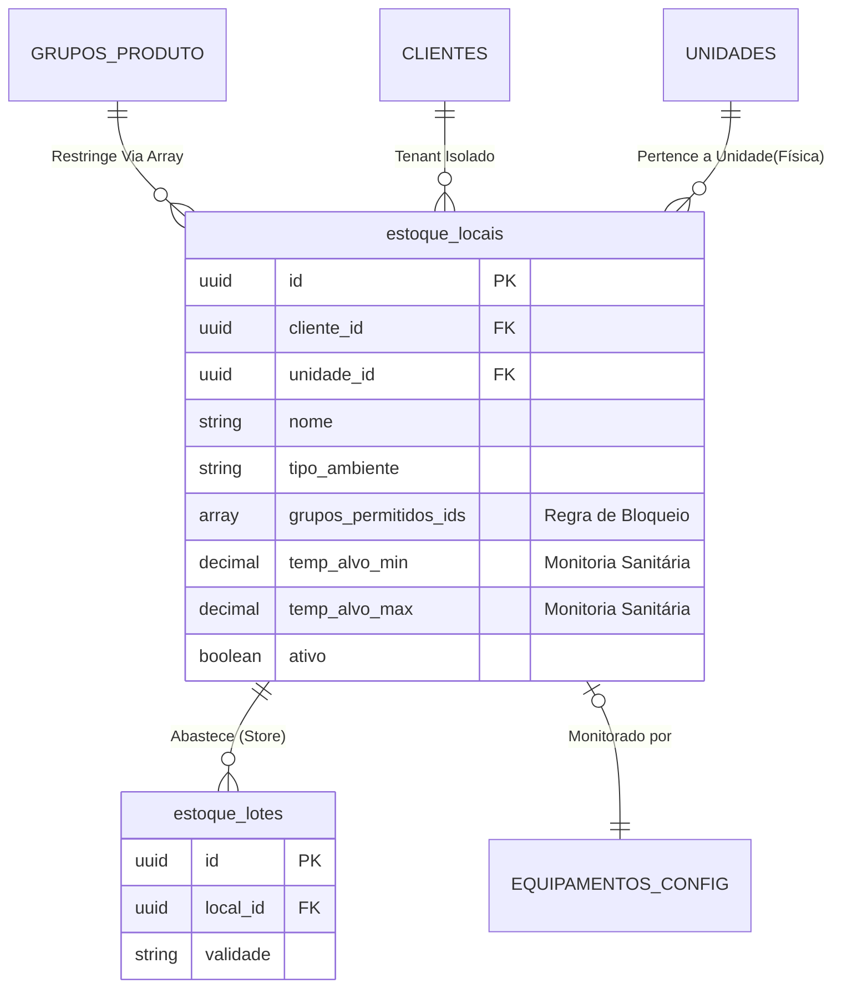

# Locais de Estoque (Armazenamento Físico)

O módulo de `estoque_locais` (anteriormente *cliente_estoque_locais*) opera como a grade topológica do sistema corporativo. Ele demarca rigorosamente toda a infraestrutura física (Almoxarifados, Câmaras Frias, Prateleiras, Estoques Secos) onde insumos, embalagens, equipamentos de EPI e materiais gerais repousam antes de serem alocados e empenhados na produção diária.

A sua essência no sistema vai além do "Cadastro de Prateleiras", operando ativamente como uma barreira sanitária (ANVISA GxP) e térmica, validando restrições cruzadas durante as contagens de inventário cego ou alocação fiscal (NFe).

---

## 1. Topologia da Infraestrutura (Mermaid Flow)

O diagrama abaixo elucida a relação intrínseca do Local de Estoque com a temperatura do equipamento de refrigeração, as regras restritivas do Grupo do Produto e o Repositório de Estoque em si.



---

## 2. Paradigma do Array Híbrido (`grupos_permitidos_ids`)

Diferente de tabelas abertas, esta entidade exige amarração estrita contra contaminações cruzadas. Para conciliar o peso analítico de restrições por local **vs.** a usabilidade ágil de cadastro (evitando 3.000 registros em tabelas-ponte relacionais `locais_grupos`), o software adota nativamente o tipo **Array Híbrido do PostgreSQL (`string[]`)**.

A matriz `grupos_permitidos_ids` suporta dois níveis de declaração:
1. **Pelo Nome da Modalidade (Nível Master):** Aceita injetar e cadastrar as Strings cruas das modalidades (ex: `"ALIMENTOS"`, `"LIMPEZA"`). Isso abre a prateleira para todos os elementos das respectivas Modalidades.
2. **Pelo UUID do Grupo (Nível Granular):** Aceita injetar os UUIDs explícitos oriundos da [Tabela de Grupos de Produto](categorias.md) (ex: `8a5fba0b...` para "Farinhas e Grãos"). 

**Exemplo Prático (Estado JSON Real):**
```json
// O Almoxarifado Principal de Secos possui as restrições:
"grupos_permitidos_ids": [
  "EMBALAGENS", // Macro-Classe: Libera todo e qualquer tipo de Embalagem.
  "UTENSILIOS", // Macro-Classe: Libera todas bandejas, rolos e caixas plasticas.
  "8a5fba0b-33c9-4673-a178-00ad142d711c" // Grupo Específico: Permite apenas "Farinhas e Grãos", mas PROÍBE o resto do universo de 'ALIMENTOS'.
]
```

Esse arranjo híbrido garante que as queries React consigam desenhar o componente `<Select / Dropdown>` filtrando recursivamente Modalidades e Grupos de forma impecável, isolando itens alérgenos ou tóxicos no momento do recebimento.

---

## 3. Implicações com a Taxonomia Master

O Local de Estoque obedece inerentemente a hierarquia documentada em [Categorias](categorias.md) através da checagem inteligente no ciclo de vida de um produto:

1. **Na Entrada Fiscal (Recebimento de Lote):** Ao cadastrar que o Lote *D. Benta* está adentrando a empresa, a Dropdown de "Prateleira / Local de Destino" limpa automaticamente do mapa opções onde o Grupo de "Farinhas" (ou a Modalidade "ALIMENTOS") não figurem afirmativamente no array `grupos_permitidos_ids`.
2. **Transferências Internas:** Requisições de transferência entre cozinhas ou entre a Câmara 01 e a Câmara 02 são validadas contra essa mesma matriz, impedindo transações incorretas e perdas de prateleiras.

---

## 4. Regras de Negócio (Policies & GxP)

### 4.1. Isolamento Multi-Unit e Multi-Tenant (RLS Hardened)
Todas as queries submetem tanto o `cliente_id` (Nível de Assinatura B2B) quanto o `unidade_id` (Nível de Cozinha Física). Este isolamento é agora **fortalecido via Row Level Security (RLS)** no Supabase, garantindo que usuários sem o membership adequado na unidade sejam bloqueados diretamente pela camada de banco de dados. Uma Unidade C nunca poderá visualizar ou estocar itens na Câmara Fria da Unidade A.

### 4.2. A Interseção (Diagrama de Venn): Equipamento vs. Estoque

Para prevenir overhead logístico no chão da cozinha, a arquitetura distingue rigorosamente **Equipamentos de Refrigeração** de **Locais de Estoque**. Eles são entidades separadas que *podem* se unir, gerando 3 cenários operacionais possíveis:

1. **Apenas Equipamento Operacional (Monitoria Sem Estoque):**
   *Exemplo: Geladeira da Cozinha, Geladeira de Degelo.*
   A máquina é cadastrada em `equipamentos_config` (para bater as metas de APPCC/HACCP e aferir a temperatura três vezes ao dia). Contudo, ela **não é um Local de Estoque**. Por girarem frações ínfimas (ex: tirar 2 potes de molho para a praça), o sistema isenta essas geladeiras de exigirem "Transferência de Lotes" ou "baixas de sistema". 
   
2. **Apenas Local de Estoque (Estoque Sem Monitoria Termal):**
   *Exemplo: Despensa Principal, Prateleiras de Secos, Almoxarifado EPI.*
   São locais que recebem Lotes de 500kg da NFe, porém não correm risco térmico. O Local nasce com `equipamento_config_id = null` e lida apenas com matemática financeira e lotes (FIFO/FEFO).

3. **Interseção Total (Estoque + Equipamento):**
   *Exemplo: Câmara Fria de Laticínios, Câmara de Congelamento.*
   É um hub massivo que unifica ambas as naturezas. Possui um cadastro em `estoque_locais` que aponta as chaves primárias de `equipamentos_config`. Ao armazenarmos 1 tonelada de Margarina aqui, o sistema cruza as amarrações operacionais: se o termômetro apontar pane no *Equipamento*, o módulo de qualidade trava sumariamente o *Local de Estoque* amarrado a ele, exigindo o remanejamento imediato dos Lotes para proteger a Custo de Mercadoria Vendida (CMV).

### 4.3. Soft Delete Inegociável
Não é concebível rodar um comando `DELETE` físico num Local de Estoque. Como Lotes de entrada, saída, e Balanços Operacionais de meses atrás apontavam para "Prateleira F", deletar a prateleira corromperia R$ milhões do inventário reportado na DRE. Logo, o `estoque_locais` admite puramente `ativo = false`, varrendo a opção das dropdowns futuras, mas cimentando o histórico inabalável do banco da empresa.

---

## 5. Dicionário de Dados Estático

### Tabela: `estoque_locais`
| Campo | Tipo | Null | Unique | Descrição Técnica |
|-------|------|------|--------|-------------------|
| `id` | UUID | Não | Sim | Chave primária. |
| `cliente_id` | UUID | Não | Não | Restrição de Tenancy B2B (RLS). |
| `unidade_id` | UUID | Não | Não | **Isolamento de Unidade Física (RLS).** |
| `nome` | String | Não | Não | Identificação (ex: "Despensa 1", "Câmara Resfriados"). |
| `tipo_ambiente` | String | Sim | Não | Metadata de domínio ("Seco", "Refrigerado"). |
| `temp_alvo_max` | Decimal| Sim | Não | Teto termal tolerável. Acionamento de alerta crítico. |
| `temp_alvo_min` | Decimal| Sim | Não | Fundo termal tolerável. Útil p/ congeladores. |
| `equipamento_config_id` | UUID | Sim | Não | FK para rastreio de paradas de motor e manutenção preventiva. |
| `grupos_permitidos_ids` | String[] | Sim | Não | Pilastra do fluxo logístico de Restrição. Se omitido/null, o local possui **Acesso Livre**. |
| `ativo` | Boolean| Não | Não | Soft delete padrão, assumido de nascença como `true`. |

