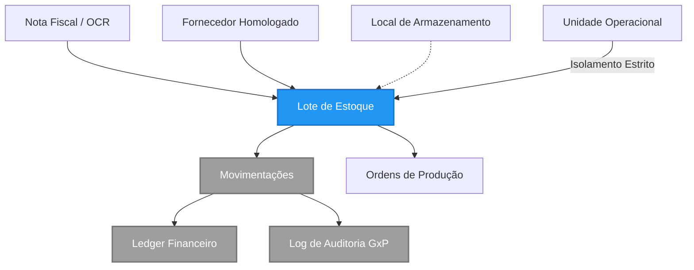

# Módulo de Estoque (WMS)

Este documento é a **Fonte Canônica** do módulo de Estoque. Ele orquestra a rastreabilidade de insumos, o controle físico de lotes e a conformidade regulatória (GxP) em todo o ecossistema.

---

## 1. Topologia de Conceitos (Taxonomia)

O sistema de estoque não é apenas uma contagem numérica; é um grafo de rastreabilidade que conecta a Nota Fiscal ao prato final.

| Entidade | Meta-Tipo | Descrição Regulatória e Sistêmica |
|----------|-----------|-----------------------------------|
| **Lote (`estoque_lotes`)** | `Entity/Ledger` | A unidade fundamental de rastreabilidade. Contém validade, temperatura de entrada e saldo atual. |
| **Local (`estoque_locais`)** | `Value Object` | Endereço físico (Ex: Câmara Fria 01, Prateleira A). |
| **Movimentação (`estoque_movimentacoes`)** | `Event` | Registro imutável de qualquer alteração de saldo (Entrada, Saída, Transferência). |
| **Inventário (`estoque_inventarios`)** | `Audit` | Processo de reconciliação entre o estoque do sistema e o estoque físico. |

---

## 2. Mapa Estrutural (Grafo do Domínio)



---

## 3. Regras de Negócio (Policies)

### 3.1. Isolamento e Segurança (Multi-Tenancy)
O módulo utiliza o modelo **Strict Unit Isolation**:
- **Regra:** Um colaborador da "Unidade A" jamais visualiza o estoque da "Unidade B". 
- **Enforcement:** Row Level Security (RLS) no banco de dados baseado na coluna `unidade_id`.

### 3.2. Rastreabilidade GxP (Good Practices)
Para conformidade com normas sanitárias (ANVISA/SIVISA), o sistema exige:
1. **Identidade Única:** Todo produto deve pertencer a um Lote com validade e fabricante.
2. **Imutabilidade:** Movimentações passadas não podem ser editadas, apenas estornadas via nova movimentação de ajuste.

### 3.3. Integração Financeira Automática
Toda entrada de estoque gera uma previsão no contas a pagar (Passivo), e toda saída por descarte gera um lançamento de custo de desperdício, garantindo CMV (Custo de Mercadoria Vendida) em tempo real.

---

## 4. Implementação Técnica (How it Works)

### 4.1. Arquitetura de Dados
O coração do módulo reside na separação entre **Master Data** (compartilhado pelo cliente) e **Transaction Data** (isolado por unidade):
- `ingredientes` e `grupos_produto`: Escopo de `cliente_id`.
- `estoque_lotes` e `estoque_movimentacoes`: Escopo de `unidade_id`.

### 4.2. Segurança Database-Level
Todas as tabelas possuem RLS habilitado. Exemplo de política para `estoque_lotes`:
```sql
CREATE POLICY "Unidade Isolation" ON estoque_lotes
FOR ALL USING (
  unidade_id IN (
    SELECT m.unidade_id FROM app_user_memberships m 
    WHERE m.usuario_id = auth.uid()
  )
);
```

### 4.3. Interface do Usuário
Localização dos arquivos principais:
- **Painel Geral:** `app/estoque/page.tsx`
- **Registro de Entrada:** `app/estoque/entrada/page.tsx`
- **Configurações Físicas:** `app/config/estoque/page.tsx`

---

## 5. Sub-Módulos Especializados

Para detalhes técnicos e operacionais profundos, consulte os documentos específicos:

1. **[[estoque.lotes]]**: Gestão de Lotes, Validade e Etiquetas ZPL.
2. **[[estoque.movimentacoes]]**: Registro de Fluxos (Entradas/Saídas) e Financeiro.
3. **[[estoque.inventarios]]**: Auditorias Físicas e Reconciliação.
4. **[[estoque.recebimento]]**: Protocolos de Logística e OCR de Notas Fiscais.

---

## 6. Histórico de Auditoria
- **2026-04-19:** Hardening de RLS para isolamento de unidades concluído.
- **2026-04-20:** Unificação da documentação técnica e estruturação do Hub WMS.

