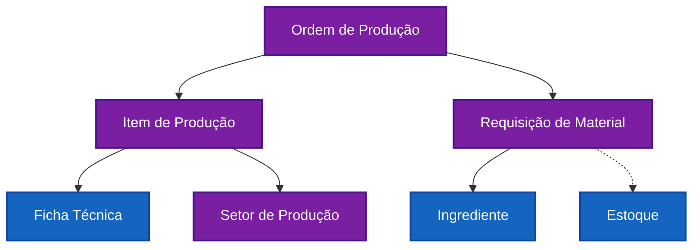
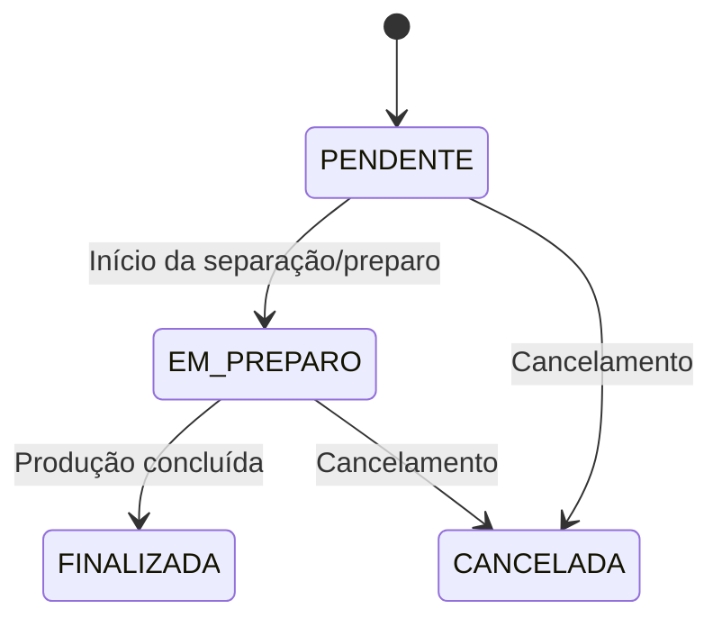

# Produção Industrial (Controle de Ordens)

> Este documento especifica a arquitetura e regras de negócio do módulo de **Produção**. Ele gerencia o ciclo de vida das Ordens de Produção (OPs), desde o planejamento até a conclusão, organizando a execução por setores e rastreando requisições de materiais.

---

## 1. Connections

| Document | Type | Description |
| :--- | :--- | :--- |
| [[fichas_tecnicas_industrial]] | `queries` | A OP consome dados de rendimento e composição das fichas técnicas. |
| [[ingredientes]] | `queries` | A requisição de materiais referencia a base de ingredientes. |
| `app/producao/page.tsx` | `implements` | Página principal do dashboard de produção. |
| [[sistema.registry]] | `derives-from` | Registra as entidades `producao.OrdemProducao` e `producao.StatusOP`. |

---

## 2. Topologia de Conceitos (Meta-Concepts)

| Entidade | Meta-Tipo | Descrição |
|----------|-----------|-----------|
| **Ordem de Produção (`producao_ordens`)** | `Entity` | Documento mestre que agrupa um conjunto de itens a serem produzidos. |
| **Item de Produção (`producao_ordens_itens`)** | `Entity` | Linha individual vinculando receita a um setor com quantidades. |
| **Setor de Produção (`cliente_setores_producao`)** | `Entity` | Divisão física/lógica da fábrica (ex: Confeitaria). |
| **Requisição de Material** | `Value Object` | Lista de insumos gerada automaticamente para execução. |
| **StatusOP** | `Enum` | Estados possíveis da ordem: PENDENTE, EM_PREPARO, FINALIZADA, CANCELADA. |

---

## 3. Mapa Estrutural (Grafo de Domínio)

---

## 4. State Machine: Lifecycle da OP

Este comportamento segue o padrão **State** de design.

| Estado | Terminal? | Descrição |
|--------|-----------|-----------|
| `PENDENTE` | Não | OP criada, aguardando início da execução. |
| `EM_PREPARO` | Não | Materiais sendo separados e produção em andamento. |
| `FINALIZADA` | Sim | Produção concluída com sucesso. |
| `CANCELADA` | Sim | OP cancelada antes da conclusão. |

---

## 5. Regras de Negócio

### 5.1. Organização por Setor (`enforces` Dashboard)
- Cada item da OP é vinculado a um `setor_producao_id`.
- Dashboard agrupa itens por setor, mostrando progresso consolidado.

### 5.2. Cálculo de Requisição (`calculates` Requisicao)
A partir da composição da [[fichas_tecnicas_industrial]], o sistema calcula:
`Quantidade Necessária = Peso Líquido na Ficha × Quantidade Planejada`

### 5.3. Multi-Tenant (`applies` Policy)
- Filtro obrigatório por `cliente_id` e `unidade_id` em todas as queries.

---

## 6. Interface do Usuário (Frontend)

- **Dashboard Principal**: `app/producao/page.tsx`
- **View do Setor**: `app/producao/setor/[id]/page.tsx`
