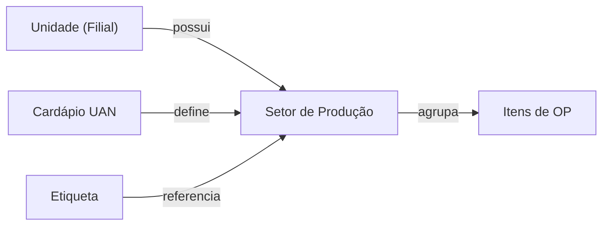

# Setores de Produção (`setores_producao`)

Os Setores de Produção representam a divisão física ou lógica da área produtiva (ex: Confeitaria, Açougue, Cozinha Quente). Eles são fundamentais para a organização do Dashboard de Produção e para a rastreabilidade logística via etiquetas.

## 1. Topologia da Entidade (Dicionário de Dados)

Diferente de Locais de Estoque, os Setores são entidades de **agregação operacional**. Eles não possuem saldo financeiro, mas organizam o fluxo de trabalho.

| Campo | Tipo | Null | Descrição Técnica |
|-------|------|------|-------------------|
| `id` | UUID | Não | Chave primária. |
| `cliente_id` | UUID | Não | Multi-tenancy B2B. |
| `unidade_id` | UUID | Não | **Isolamento de Unidade.** Garante que cada filial gerencie seus próprios setores. |
| `nome` | String | Não | Ex: "Padaria", "Cozinha Central", "Pantry". |
| `capacidade_producao` | Decimal | Sim | (Opcional) Metadata para futuros módulos de APS (Advanced Planning and Scheduling). |
| `ativo` | Boolean | Não | Soft delete para manter histórico de OPs retroativas. |

---

## 2. Regras de Negócio e Isolamento

### 2.1. Política de Unidade (Unit-Level Isolation)
A partir da revisão 2026-04-19, os setores deixaram de ser globais ao cliente e passaram a ser **exclusivos de cada unidade**. 

#### 2.1.1. Implementação Técnica (Row Level Security)
O isolamento é garantido pela camada de banco de dados (Supabase RLS), impedindo que usuários emitem requisições para `unidade_id` que não possuam permissão.

```sql
-- Política de Segurança (RLS)
CREATE POLICY "Setores Isolados por Unidade" ON setores_producao
FOR ALL TO authenticated
USING (
  unidade_id IN (
    SELECT m.unidade_id FROM app_user_memberships m 
    WHERE m.usuario_id = auth.uid()
  )
);
```

- **Impacto**: Ao criar uma Ordem de Produção na Unidade A, apenas os setores vinculados a essa unidade estarão disponíveis para seleção.
- **Migração**: Dados legados sem `unidade_id` foram vinculados à unidade principal do cliente durante a migração técnica.

### 2.2. O Papel no Dashboard de Produção
O status de uma Ordem de Produção (OP) é visualizado de forma fragmentada por setor:
- O sistema agrupa `producao_ordens_itens` por `setor_producao_id`.
- Isso permite que o líder da "Confeitaria" veja apenas o que compete ao seu setor, mesmo que a OP global envolva outros departamentos.

### 2.3. Rastreabilidade e Etiquetas
Ao finalizar uma produção ou gerar sobras, o setor de origem é impresso na etiqueta como metadado de rastreabilidade. Isso permite identificar exatamente onde um subproduto foi processado em caso de auditoria sanitária.

---

## 3. Conexões do Sistema



## 4. Diferenciação: Setor vs. Local de Estoque

| Característica | Setor de Produção | Local de Estoque |
|----------------|-------------------|------------------|
| **Propósito** | Fluxo de Trabalho | Saldo e CMV |
| **Entidade** | `setores_producao` | `estoque_locais` |
| **Termometria**| Não nativo | Sim (via Equipamentos) |
| **Exemplo** | Cozinha Fria | Câmara 01 |

---

## 5. Interface e Endpoints
- **Configuração**: `app/config/estoque/page.tsx` (Seção: Parâmetros de Produção)
- **Visualização**: `app/producao/page.tsx` (Filtro por Setor)

