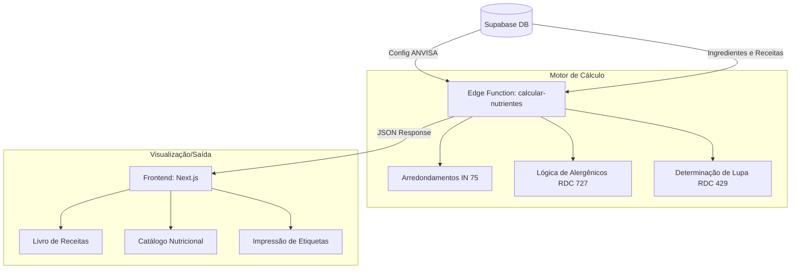
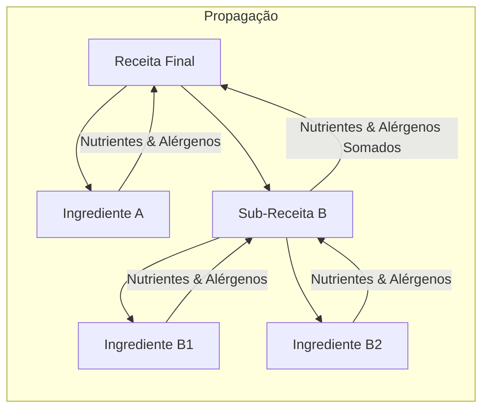

# Arquitetura e Mapeamento de Relatórios (NutriDev)

Este documento centraliza a visão técnica e funcional do fluxo de dados para os relatórios: **Livro de Receitas** e **Catálogo Nutricional**.

> [!TIP]
> Para detalhes profundos sobre as fórmulas matemáticas, DDLs e compliance, consulte o [[sistema.calc.rotulagem|Manual Técnico de Rotulagem]].

---

## 1. Fluxo Geral de Dados

O diagrama abaixo ilustra a jornada desde a entrada de ingredientes até a renderização.

---

## 2. Lógica de Cálculo Recursivo

O sistema resolve árvores de receitas complexas através de agregação recursiva.

---

## 3. Descrição dos Relatórios

### 3.1. Livro de Receitas (Ficha Técnica)
Focado na operacionalização e rastreabilidade. Consome o objeto `ReceitaRelatorio`.

### 3.2. Catálogo Nutricional (Compliance)
Focado no cumprimento das normas ANVISA. Consome o objeto `ResultadoCalculo` da Edge Function.
Regras aplicadas:
- **Arredondamento Matemático**: Anexo IV da RDC 429.
- **Harmonização de Porção**: Art. 10 (§2º) tolerância de +/- 30%.
- **Selo de Lupa (FOP)**: Alertas automáticos.
- **Alegações Nutricional (Claims)**: "Fonte de...", "Alto teor de..." com resolução de conflitos.
- **Hierarquia de Blocos**: "Denominação de Venda" ancorada no topo das declarações, seguida pela tabela e fechando com "Peso Líquido".

---

## 2. Livro de Receitas (Ficha Técnica de Produção)

O foco deste relatório é a **operacionalização da cozinha** e a **rastreabilidade interna**.

### Componentes de Dados
*   **Identificação**: Nome da Receita, Categoria (`tipos_receita`), Rendimento Total.
*   **Composição**: Lista recursiva de ingredientes e sub-receitas.
*   **Medidas Caseiras**: Conversão automática baseada no `peso_unitario_g` do ingrediente.

---

## 3. Catálogo Nutricional (Rotulagem e Compliance)

O foco deste relatório é o **cumprimento das normas da ANVISA** e a **comunicação com o consumidor**.

### Lógica de Cálculo (RDC 429/2020 e IN 75/2020)
O motor de cálculo (`calcular-nutrientes`) realiza as seguintes operações críticas:

1.  **Arredondamento Matemático**: Aplica as regras do Anexo IV da RDC 429.
2.  **Significância Cruzada**: Determina se um nutriente deve ser declarado como "0".
3.  **Harmonização de Porção**: Aplica o Art. 10 (§2º) para ajustar a porção declarada.
4.  **Lupa Frontal (FOP)**: Calcula automaticamente os alertas de "Alto em..."

### Arquitetura de Impressão e Layout (A4)
Para garantir a fidelidade visual na geração de PDFs, o sistema utiliza:
- **Display Flexbox**: O container principal utiliza `flexDirection: 'column'` com `minHeight: '297mm'` (padrão A4).
- **Ancoragem de Rodapé**: O bloco de dados de fabricação (Endereço, CNPJ, SAC) utiliza `mt: 'auto'`. Isso força as informações para a base da página, independentemente do volume de conteúdo acima.
- **Margens Padrão**: Configuração via CSS `@page { size: A4; margin: 15mm; }` para evitar cortes de conteúdo.
- **Prevenção de Quebra**: Uso de `break-inside: 'avoid'` em componentes críticos como a Tabela Nutricional e o Bloco de Declarações.

### Mapeamento de Peso Líquido (Fallback)
A declaração de Peso Líquido segue a precedência:
1. `conteudo_liquido`: Valor manual inserido na ficha técnica.
2. `peso_embalagem_g`: Valor extraído do campo "Peso do Produto (g)" na tabela `receitas` (mapeamento automatizado caso o manual seja nulo).

---

## 4. Controle de Versões e Históricos

Para garantir a rastreabilidade (GxP), o sistema permite a seleção de versões específicas de cada receita.

### Mecanismo de Snapshots (`receitas_versoes`)
Ao selecionar uma versão diferente da "Atual":
- **Fonte de Dados**: O sistema ignora a tabela mestre (`receitas`) e a árvore atual (`composicao_receitas`).
- **Composição**: Os ingredientes são carregados do `composicao_snapshot`.
- **Nutrientes**: A tabela nutricional é lida do `tabela_nutricional_snapshot` (gerado no momento da aprovação), garantindo que o relatório reflita exatamente o que foi aprovado, mitigando o drift de dados por alteração posterior de insumos.

---

## 5. Atribuição de Marca (Brand Attribution)

Conforme requisitos operacionais, os insumos no **Livro de Receitas** exibem a marca correspondente.
- **Origem**: Coluna `fonte` da tabela `ingredientes`.
- **Exibição**: Subscrito discreto abaixo do nome do ingrediente.
- **Escopo**: Exclusivo para Fichas Técnicas (Livro de Receitas). No Catálogo Nutricional, as marcas são omitidas para manter a conformidade com o padrão de rotulagem ANVISA.

---

## 4. Matriz de Tabelas Relacionadas

| Tabela | Função no Relatório |
| :--- | :--- |
| `receitas` | Tabela mestre (Nome, Foto, Rendimento, Instruções). |
| `receitas_versoes` | Armazena snapshots históricos (Composição e Tabela Nutricional). |
| `composicao_receitas` | Define a "árvore" da receita (versão atual). |
| `ingredientes` | Dados nutricionais base, flags de alérgenos e **Marcas (`fonte`)**. |

---
*Este documento implementa a taxonomia definida em [[sistema.taxonomy]].*
